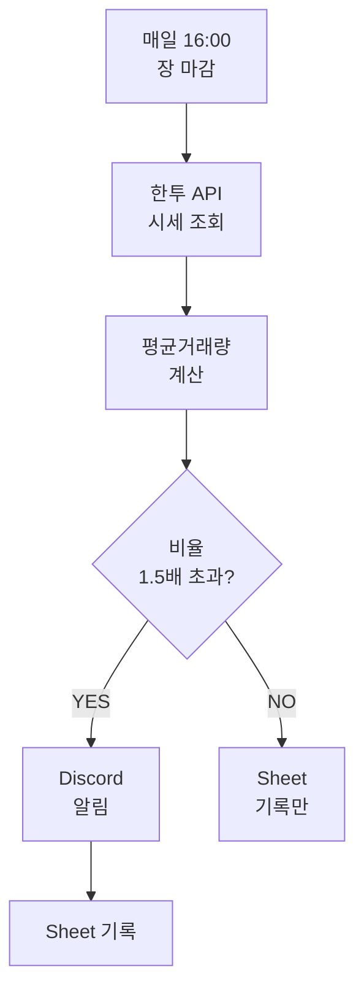
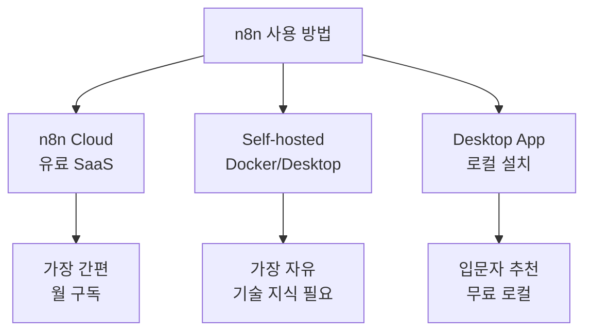
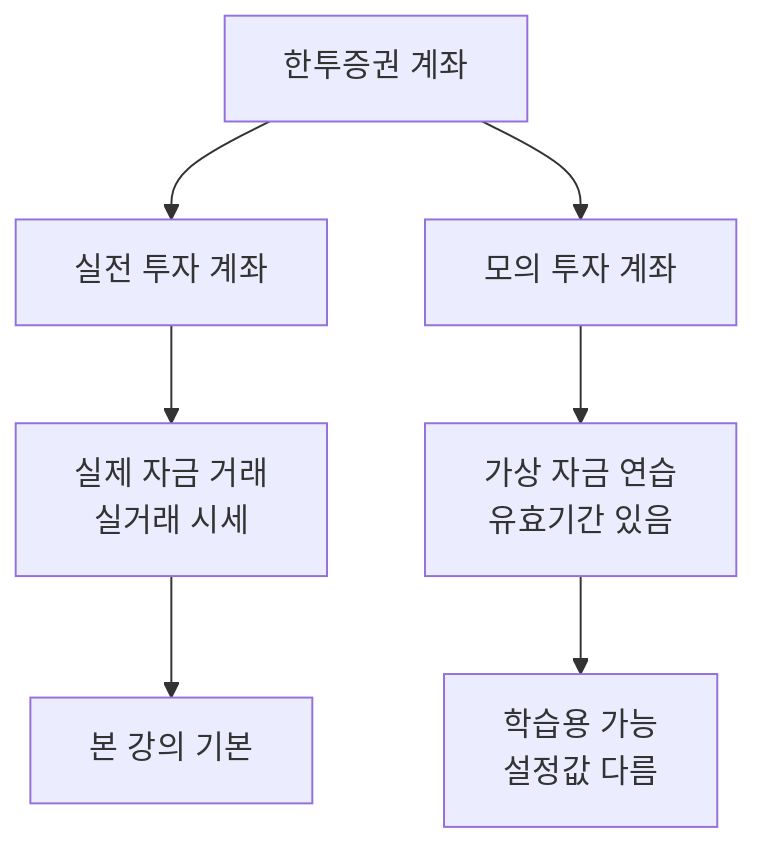
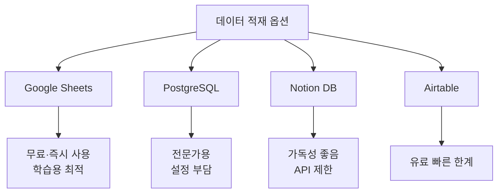
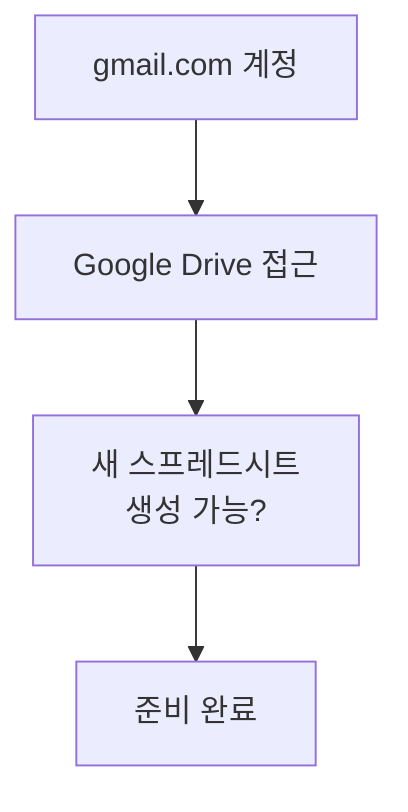
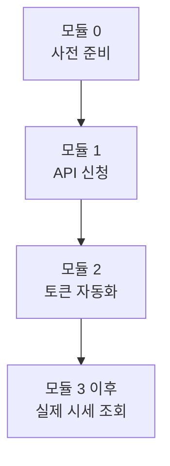

# 모듈 0 — 사전 준비

> **이 모듈에서 할 일**
> 강의 전체 실습에 필요한 4가지 환경(한투증권 계좌·n8n·디스코드·구글)을 미리 갖춥니다. **계정만 만들면 됩니다.** 실제 API 신청·서버 생성은 다음 모듈부터 함께 진행합니다.

---

## 0. 먼저 큰 그림부터

이 강의가 끝나면 여러분 손에 어떤 시스템이 남는지 다시 한 번 확인합시다.

이 시스템을 만들려면 **5개의 외부 서비스**가 등장합니다. 각각 어떤 역할인지 먼저 이해해두면, 본 강의 중에 "내가 왜 지금 이 페이지에 있지?" 하는 혼란이 줄어듭니다.

| # | 서비스 | 역할 | 비용 |
|---|--------|------|------|
| 1 | n8n | 워크플로 실행 엔진 (전체 두뇌) | 무료~유료 |
| 2 | 한국투자증권 KIS Developers | 시세 데이터 제공 API | 무료 |
| 3 | Discord | 알림 수신 채널 | 무료 |
| 4 | Google Sheets | 데이터 적재 저장소 | 무료 |
| 5 | (선택) DART | 공시 정보 (확장 과제용) | 무료 |

---

## 1. 준비물 ① — n8n 환경

### 1.1 n8n이 설치되어 있어야 합니다

이 강의는 **n8n 기본 사용법은 익혔다는 전제**로 진행됩니다. 노드 추가, 연결, Execute Step 정도는 무리 없이 할 수 있어야 합니다.

n8n을 사용하는 방법은 크게 3가지입니다.

| 방식 | 장점 | 단점 | 추천 대상 |
|------|------|------|-----------|
| n8n Cloud | 즉시 사용, 항상 켜져 있음 | 월 구독료 | 본격 운영자 |
| Desktop App | 무료, 클릭 한 번 설치 | PC 켜져 있어야 실행됨 | 학습·실습용 |
| Docker Self-host | 완전한 제어, 무료 | 서버 지식 필요 | 개발자 |

### 1.2 학습용 권장: Desktop 또는 Docker

매일 16:00에 자동 실행되는 워크플로를 만들 예정이지만, **학습 단계에서는 수동(Execute) 실행이 대부분**입니다. 따라서 PC가 항상 켜져 있을 필요는 없습니다. 학습용으로는 무료 옵션이면 충분합니다.

> 💡 **체크포인트 0-1**
> n8n에 로그인한 상태에서 새 워크플로를 만들고, **Schedule Trigger 노드**를 캔버스에 올릴 수 있나요? 가능하면 이 모듈은 통과입니다.

### 1.3 만약 n8n이 처음이라면

이 강의보다 한 단계 앞서는 입문 콘텐츠를 먼저 보시길 권합니다. 최소한 다음 5가지 노드는 익숙해야 합니다.

| 노드 | 본 강의에서의 역할 |
|------|---------------------|
| Schedule Trigger | 매일 16:00 자동 실행 |
| HTTP Request | 한투 API 호출 (POST·GET) |
| Edit Fields | 응답에서 필요한 필드만 추리기 |
| IF | 거래량 비율로 분기 |
| Code (JavaScript) | 평균거래량 계산 |

---

## 2. 준비물 ② — 한국투자증권 계좌

### 2.1 두 종류의 계좌

한국투자증권 API는 **계좌가 있어야** 신청할 수 있습니다. 계좌는 두 종류입니다.

| 항목 | 실전 투자 계좌 | 모의 투자 계좌 |
|------|----------------|----------------|
| 비용 | 계좌 개설 무료 (입금은 본인 자유) | 무료 |
| 시세 | 실시간 실제 시세 | 실시간 실제 시세 (거래만 가상) |
| 유효기간 | 없음 | 일정 기간 만료 시 재신청 |
| 학습용 적합성 | ✅ | ✅ |

### 2.2 두 환경 모두 학습 가능합니다

본 강의는 **실전·모의 두 환경 모두**를 지원합니다. 모듈 2·3·4의 핵심 단계마다 **[실전 / 모의] 양쪽 URL을 병기**하므로, 본인 환경에 맞는 줄만 따라가면 됩니다. URL이 다를 뿐 워크플로 구조와 매개변수는 동일합니다.

> 💡 **모의 계좌의 특징**
> 모의투자 계좌는 일정 기간 후 만료됩니다. 만료되면 새 계좌를 개설하고 API도 다시 신청해야 합니다. 토큰 발급 방식·헤더·매개변수는 두 환경이 동일하므로 워크플로 자체는 그대로 재사용 가능합니다.

### 2.3 계좌가 아직 없다면

한국투자증권 홈페이지(`securities.koreainvestment.com`)에서 비대면으로 계좌를 개설할 수 있습니다. 본인 인증과 신분증 촬영이 필요하며, 보통 10~20분이면 끝납니다.

> 💡 **시간 절약 팁**
> 학습 목적만으로 가입한다면 **모의투자 계좌**가 더 빠릅니다(신분증 인증 불필요). 모듈 2·3·4에서 본인 환경에 맞는 URL을 선택해 진행하면 됩니다.

> 💡 **체크포인트 0-2**
> 한투증권 홈페이지에 로그인한 상태에서 [트레이딩] 메뉴가 보이고, 그 아래 [Open API] 항목이 보이나요? 이 메뉴가 보이면 계좌 준비는 완료입니다.

---

## 3. 준비물 ③ — 디스코드 계정

### 3.1 왜 디스코드인가?

알림 채널은 카카오톡·텔레그램·슬랙·이메일 등 여러 선택지가 있지만, 본 강의는 **디스코드**를 씁니다. 이유는 단순합니다.

| 항목 | 디스코드 | 카카오톡 | 텔레그램 | 슬랙 |
|------|----------|----------|----------|------|
| 무료 | ✅ | ❌ (비즈니스) | ✅ | ⚠️ 제한 |
| Webhook URL | ✅ 즉시 발급 | ❌ 별도 심사 | ⚠️ Bot 필요 | ✅ |
| n8n 기본 노드 | ✅ | ❌ | ✅ | ✅ |
| 학습 부담 | 낮음 | 매우 높음 | 중간 | 중간 |

> 💡 **Webhook**이란?
> 외부 서비스가 메시지를 보낼 수 있는 **전용 URL**입니다. 디스코드는 이 URL만 있으면 누구나 채널에 메시지를 올릴 수 있습니다. OAuth 인증·토큰 갱신 같은 복잡한 절차가 없어 입문자에게 가장 친절한 방식입니다.

### 3.2 지금 해둘 것

디스코드 서버 생성과 웹훅 발급은 **모듈 6에서 함께 진행**합니다. 지금 해둘 것은 단 하나입니다.

> ✅ **discord.com**에 가입해 로그인 가능한 계정을 준비합니다.

브라우저에서 사용하는 것이 가장 편하며, 별도 데스크톱 앱은 필수가 아닙니다.

> 💡 **체크포인트 0-3**
> `discord.com`에 들어가 [Log In]이 통과되어 메인 화면(친구 목록 또는 직접 메시지 화면)이 보이면 통과입니다.

---

## 4. 준비물 ④ — 구글 계정

### 4.1 왜 구글 시트인가?

매일 수집한 시세·거래량을 어딘가에 쌓아두어야 사후 분석이 가능합니다. 본격적으로 하려면 데이터베이스를 써야 하지만, 학습 단계에서는 **구글 시트**가 가장 가성비 좋은 선택입니다.

| 항목 | 구글 시트 |
|------|-----------|
| 비용 | 무료 (개인 계정) |
| 행 수 한도 | 1천만 셀 (학습용 충분) |
| n8n 노드 | 공식 지원 |
| 협업 공유 | 링크 한 번으로 가능 |
| 차트·피벗 | 시트 자체에서 가능 |

### 4.2 지금 해둘 것

> ✅ Gmail 계정으로 로그인된 상태에서 `sheets.google.com`에 접속해 빈 스프레드시트를 새로 만들 수 있어야 합니다.

스프레드시트의 헤더 행 설계와 n8n 연동은 **모듈 6에서** 함께 진행합니다.

> 💡 **체크포인트 0-4**
> `sheets.google.com`에서 [+ 새 스프레드시트] 버튼이 클릭되어 빈 시트가 열리면 통과입니다.

---

## 5. 보안 — 시작 전에 한 번만 읽고 넘어가기

이 강의에서는 **App Key·App Secret**이라는 매우 중요한 자격증명을 다룹니다. 본 모듈에서 미리 마음가짐을 정해두지 않으면, 나중에 무심코 키를 노출하는 사고가 잘 일어납니다.

### 5.1 절대 하지 말 것

| 금지 행위 | 위험 |
|-----------|------|
| GitHub 공개 저장소에 업로드 | 봇이 즉시 스캔해 무단 사용 |
| 블로그·노션 공개 페이지에 붙여넣기 | 검색 엔진 색인 |
| 카톡·메일로 동료에게 텍스트 전송 | 캐시·로그에 남음 |
| 스크린샷에 키가 보이는 채로 공유 | 흔한 사고 |

### 5.2 권장 보관 방식

| 방식 | 적합도 |
|------|--------|
| n8n Credentials (강의 중 사용) | ✅ 권장 |
| 1Password·Bitwarden 같은 비밀번호 관리자 | ✅ 권장 |
| OS 키체인 / Windows 자격증명 관리자 | ✅ 사용 가능 |
| 환경변수 (.env) | ⚠️ .gitignore 필수 |
| 메모장에 평문 저장 | ❌ |

### 5.3 만약 노출되었다면

KIS Developers 사이트에서 즉시 키를 **재발급**할 수 있습니다. 기존 키는 자동 무효화됩니다. 망설이지 마세요. 노출이 의심되면 일단 재발급 먼저, 원인 파악은 그 다음입니다.

---

## 6. 30초 점검 — 모듈 1로 넘어갈 자격

다음 4가지가 모두 ✅이면 모듈 1로 진행해도 좋습니다.

| # | 체크 항목 | ✅/❌ |
|---|-----------|------|
| 0-1 | n8n에서 새 워크플로를 만들고 Schedule Trigger를 추가할 수 있다 | |
| 0-2 | 한투증권에 로그인해 [트레이딩 → Open API] 메뉴가 보인다 | |
| 0-3 | discord.com에 로그인할 수 있다 | |
| 0-4 | sheets.google.com에서 빈 스프레드시트를 만들 수 있다 | |

---

## 7. 자주 묻는 질문

**Q1. n8n 대신 Make.com이나 Zapier로 따라할 수 있나요?**
원리는 동일하지만 노드·표현식 문법이 달라 화면 그대로 따라하긴 어렵습니다. 본 강의는 n8n 전용입니다.

**Q2. 모의투자 계좌 vs 실전 계좌, 학습용으론 어느 쪽이 좋나요?**
본 강의는 두 환경 모두를 지원합니다. 모의는 신분증 인증 없이 빠르게 시작할 수 있고, 실전은 별도 만료 걱정 없이 장기 운영에 적합합니다. 워크플로 구조는 완전히 동일하며, 모듈 2·3·4에서 환경별 URL을 양쪽 병기하므로 본인 줄만 따라가면 됩니다.

**Q3. Mac에서도 됩니까?**
모두 됩니다. 본 강의는 브라우저만 있으면 OS 무관입니다.

**Q4. 시세 데이터는 실시간인가요?**
한투 Open API는 REST 호출 시점의 시세를 반환합니다. 본 강의의 워크플로는 **장 마감 후(16:00) 일 1회** 호출이므로 그날 종가 기준입니다. 실시간 틱 데이터는 별도의 웹소켓 API가 필요하며, 본 강의 범위 밖입니다.

**Q5. 키를 발급받았는데 즉시 못 쓰나요?**
발급 직후부터 사용 가능합니다. 단, 한 번 발급된 토큰은 **24시간**만 유효하므로 매일 갱신이 필요합니다(모듈 2에서 자동화).

---

## 다음 모듈 미리보기

**모듈 1 — 한국투자증권 API 신청과 인증 이해**

다음 모듈에서는 한투증권 KIS Developers 사이트에서 실제로 API를 신청하고, **App Key**와 **App Secret**을 발급받습니다. 또한 한투 API가 사용하는 **OAuth 2-legged 인증 방식**을 이해해, 왜 매일 토큰을 새로 발급해야 하는지 그 원리를 학습합니다.

준비가 되었다면 모듈 1로 이동하세요.
