# 모듈 1 — 한국투자증권 API 신청과 인증 이해

> **이 모듈에서 할 일**
> 한국투자증권 KIS Developers 사이트에서 Open API를 신청하고, **App Key**와 **App Secret**을 발급받아 안전하게 보관합니다. 또한 한투 API가 사용하는 **OAuth 2.0 Client Credentials** 인증 방식의 원리를 이해해, 다음 모듈에서 토큰을 자동 발급할 때 무슨 일이 벌어지는지 머릿속에 그려둡니다.


<!-- INFOGRAPHIC -->
<div class="infographic-wrap">
  
  <p class="infographic-caption">API 인증 4단계와 토큰 라이프사이클</p>
</div>


---

## 0. 이 모듈의 흐름

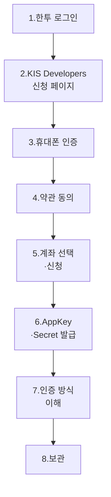

총 7단계의 신청 절차 + 인증 원리 학습 + 안전 보관까지 진행합니다. 이미 신청해본 분도 **7단계(인증 방식 이해)**는 꼭 읽어주세요. 다음 모듈을 이해하는 핵심입니다.

---

## 1. 한투증권 홈페이지 로그인

### 1.1 어디로 가나요?

> 🌐 **한국투자증권 홈페이지**: `securities.koreainvestment.com`

본인 ID로 로그인합니다. 모의투자 계좌든 실전 계좌든 동일한 사이트입니다.

### 1.2 어디를 클릭하나요?

상단 메뉴에서 다음 경로를 따라갑니다.

```
[트레이딩] → [Open API] → [KIS Developers] → [KIS Developers 서비스 신청/조회]
```

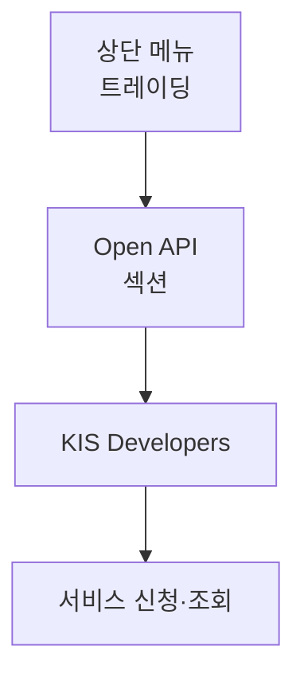

### 1.3 무엇을 확인하나요?

> ✅ 페이지 제목이 **"KIS Developers 서비스 신청/조회"**이고, 우측 상단에 단계 표시(1·2·3)가 보이면 정확한 페이지입니다.

> ⚠️ **함정**: 이미 다른 API(주문·체결 등)를 신청한 적이 있다면 메뉴 위치가 살짝 달라질 수 있습니다. 그래도 **"Open API"** 단어가 들어간 메뉴를 찾으면 됩니다.

---

## 2. KIS Developers 서비스 신청 — 1단계 휴대폰 인증

### 2.1 페이지 구성 이해하기

신청 페이지는 **3단계로 진행**됩니다. 페이지 우측 상단의 진행 표시가 늘 현재 위치를 알려줍니다.

| 단계 | 페이지명 | 핵심 작업 |
|------|---------|-----------|
| 1 | 휴대폰 인증 | 본인 확인 |
| 2 | 유의사항 확인 | 약관 동의 |
| 3 | 신청정보 | App Key·Secret 발급 |

### 2.2 1단계 화면에서 할 일

| 필드 | 입력값 | 비고 |
|------|--------|------|
| 고객명 | (자동 표시) | 로그인 정보로 자동 |
| 고객ID | (자동 표시) | HTS ID. 변경하지 않음 |
| 휴대폰 | 본인 번호 | 인증번호 요청 → 입력 → 인증 |

[고객ID] 옆에 **[HTS ID 변경하기]**, **[ID 변경 전 신청정보 삭제]** 같은 버튼이 보일 수 있는데, **건드리지 마세요**. 기존 ID로 그대로 진행합니다.

> ⚠️ **함정 — 안내 문구의 의미**
> "HTS ID 변경 후 오픈 API 호출 시 '처리계좌의 ID와 사용자정보가 상이하여 주문처리 불가합니다' 메시지가 표시되면, 'ID 변경 전 신청정보 삭제' 후 API 재신청하시면 정상 이용 가능합니다." — 이 문구는 **HTS ID를 변경한 사람**에게만 해당됩니다. 처음 신청하는 분은 무시하세요.

### 2.3 인증 후

휴대폰 인증이 완료되면 화면 하단의 **[다음]** 버튼이 활성화됩니다.

> ✅ **체크포인트 1-1**
> 휴대폰 인증 후 [다음] 버튼이 클릭 가능한 상태가 되었나요? 그렇다면 1단계 통과입니다.

---

## 3. 2단계 — 유의사항 확인 (약관 동의)

### 3.1 무엇을 보게 되나요?

**개인(신용)정보 수집·이용 동의서**가 표시됩니다. 핵심 내용은 다음 두 가지입니다.

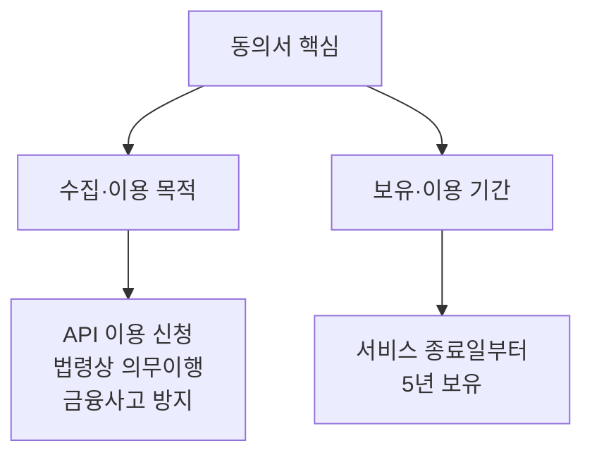

### 3.2 동의 절차

화면 하단의 라디오 버튼에서 **[동의]**를 선택합니다.

| 항목 | 선택 |
|------|------|
| 개인(신용)정보 수집·이용 | ✅ 동의 |
| 동의하지 않음 | ❌ |

> 💡 **동의하지 않으면**? API를 이용할 수 없습니다. 사실상 필수 동의입니다.

> ✅ **체크포인트 1-2**
> [동의]를 선택한 뒤 다음 화면(3단계 신청 페이지)으로 이동했나요?

---

## 4. 3단계 — 계좌 선택과 신청

### 4.1 화면 구성

3단계 화면은 크게 두 영역으로 나뉩니다.

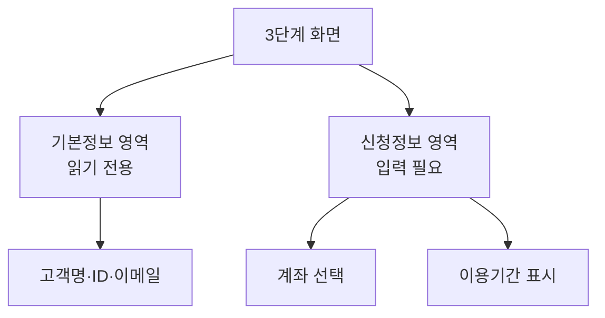

| 영역 | 내용 |
|------|------|
| **기본정보** | 고객명, 고객ID, 이메일 — 읽기 전용 |
| **신청정보** | 어떤 계좌로 API를 쓸지 선택 |

### 4.2 계좌 선택 — 이 부분이 중요합니다

본인이 가진 계좌 목록 중에서 **API를 연결할 계좌**를 선택합니다.

| 계좌 종류 | 표시 | 본 강의 호환성 |
|-----------|------|----------------|
| 실전투자계좌 | "실전투자계좌" | ✅ |
| 모의투자계좌 | "모의투자계좌" | ✅ |

> 💡 **두 환경 모두 지원**
> 한 사람이 실전·모의 계좌를 모두 가지고 있을 수 있습니다. 본인이 학습할 환경의 계좌를 선택하세요. 모듈 2·3·4에서 **[실전 / 모의] 양쪽 URL을 양쪽 병기**하므로, 어느 환경이든 따라할 수 있습니다. 신청은 무료이며, 계좌 잔고가 0원이어도 API 신청은 가능합니다.

### 4.3 이용기간 확인

신청 페이지 하단에 이용기간이 표시됩니다.

```
이용기간: 신청일 ~ 신청일+1년
예) 2025.12.14 ~ 2026.12.13
```

| 안내 사항 | 의미 |
|-----------|------|
| 사용 가능 시점 | 신청일 즉시부터 |
| 이용기간 | 신청일로부터 **1년** |
| 거래내역 없을 시 | 3개월 후 자동 차단 가능 |

> 💡 **3개월 무거래 차단 룰**
> 3개월 동안 API를 한 번도 호출하지 않으면 서비스가 자동 차단될 수 있습니다. 본 강의 워크플로는 매일 호출하므로 자연히 해결됩니다.

### 4.4 [신청] 버튼 클릭

> ✅ **체크포인트 1-3**
> [신청] 버튼을 누른 후 "신청이 완료되었습니다" 류의 메시지가 떴나요?

---

## 5. 신청 현황 조회 — App Key·Secret 받기

### 5.1 신청 완료 후 어디로 가나요?

신청이 완료되면 **같은 메뉴**(KIS Developers 서비스 신청/조회)에서 이번에는 **신청 현황 페이지**가 보입니다. 이 페이지에 **App Key**와 **App Secret**이 있습니다.

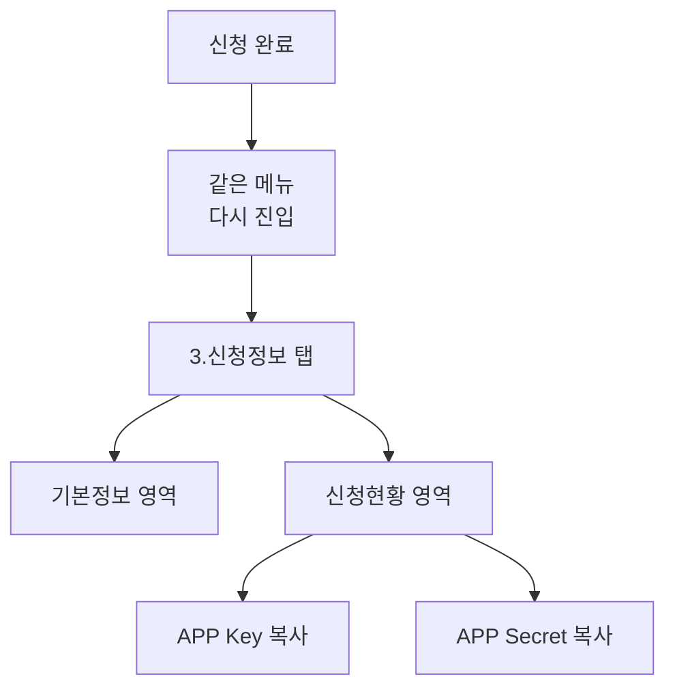

### 5.2 신청현황 표 구성

| 컬럼 | 내용 |
|------|------|
| 계좌주 | 본인 이름 |
| 구분 | "실전투자계좌" 또는 "모의투자계좌" |
| 계좌번호 | 연결된 계좌 |
| 신청일자 | 오늘 날짜 |
| 만료일 | 신청일 + 1년 |
| 갱신 | [갱신] 버튼 — 만료 30일 전부터 활성화 |
| 해지 | [해지] 버튼 |
| **APP Key** | **[복사] 버튼** |
| **APP Secret** | **[복사] 버튼** |

### 5.3 두 키의 차이

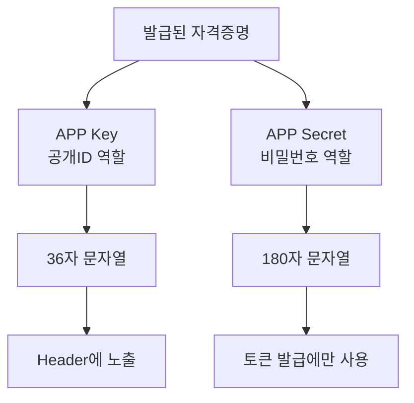

| 항목 | App Key | App Secret |
|------|---------|------------|
| 길이 | 36자 | 180자 |
| 역할 | 누가 호출하는지 식별 | 본인 인증 |
| 노출 | 모든 API 호출 헤더에 들어감 | 토큰 발급 단계에서만 사용 |
| 비유 | 아이디 | 비밀번호 |

둘 다 노출되면 안 되지만, **App Secret은 특히 위험**합니다. 토큰을 무단 발급해 거래까지 시도할 수 있는 자격증명이기 때문입니다.

### 5.4 즉시 안전한 곳에 보관

> ✅ **체크포인트 1-4**
> 두 키를 [복사] 버튼으로 클립보드에 담아 다음 중 하나에 즉시 저장했나요?
> - 1Password / Bitwarden 같은 비밀번호 관리자
> - 로컬 텍스트 파일 (단, **GitHub에 올라갈 위험이 없는 폴더**)
> - 메모지 → 잠금 가능한 서랍 (디지털 노출 우려가 가장 적음)

> ⚠️ **절대 금지**
> - 카카오톡 "나에게 보내기"로 평문 저장
> - 네이버 메모 / 구글 킵에 평문 저장
> - 데스크톱 바탕화면에 .txt 파일

---

## 6. 한국투자 Open API 개발자센터 둘러보기

### 6.1 왜 둘러봐야 하나요?

다음 모듈부터 토큰 발급·시세 조회·기간별 시세 등 여러 API를 호출합니다. 이때마다 **각 API의 URL·필수 파라미터·응답 형식**을 확인해야 하는데, 그 정보는 모두 개발자센터 사이트에 있습니다.

> 🌐 **한국투자 Open API 개발자센터**: `apiportal.koreainvestment.com/about-devcenter`

이 URL은 **본 강의 내내 옆에 띄워두는** 사이트가 됩니다.

### 6.2 사이트 구조

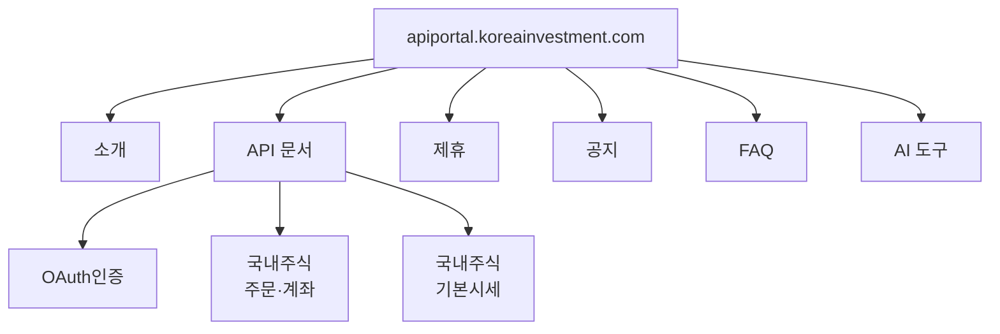

본 강의에서 자주 보게 될 메뉴는 **[API 문서]**입니다. 좌측 트리에서 다음 항목들을 미리 위치만 확인해두세요.

| 항목 | 위치 | 본 강의 사용 모듈 |
|------|------|-------------------|
| 접근토큰발급(P) | OAuth인증 | 모듈 2 |
| 주식현재가 시세 | [국내주식] 기본시세 | 모듈 3 |
| 국내주식기간별시세(일/주/월/년) | [국내주식] 기본시세 | 모듈 4 |

---

## 7. 인증 방식 이해 — 왜 매일 토큰을 새로 받아야 하나?

이 절은 **반드시 읽어주세요**. 다음 모듈에서 만들 워크플로의 설계 의도를 좌우합니다.

### 7.1 한투 Open API의 인증 방식

한투는 **OAuth 2.0**을 사용합니다. OAuth는 가입자별로 두 가지 방식을 제공하는데, 본 강의 대상자(개인)는 **2-legged 방식**을 씁니다.

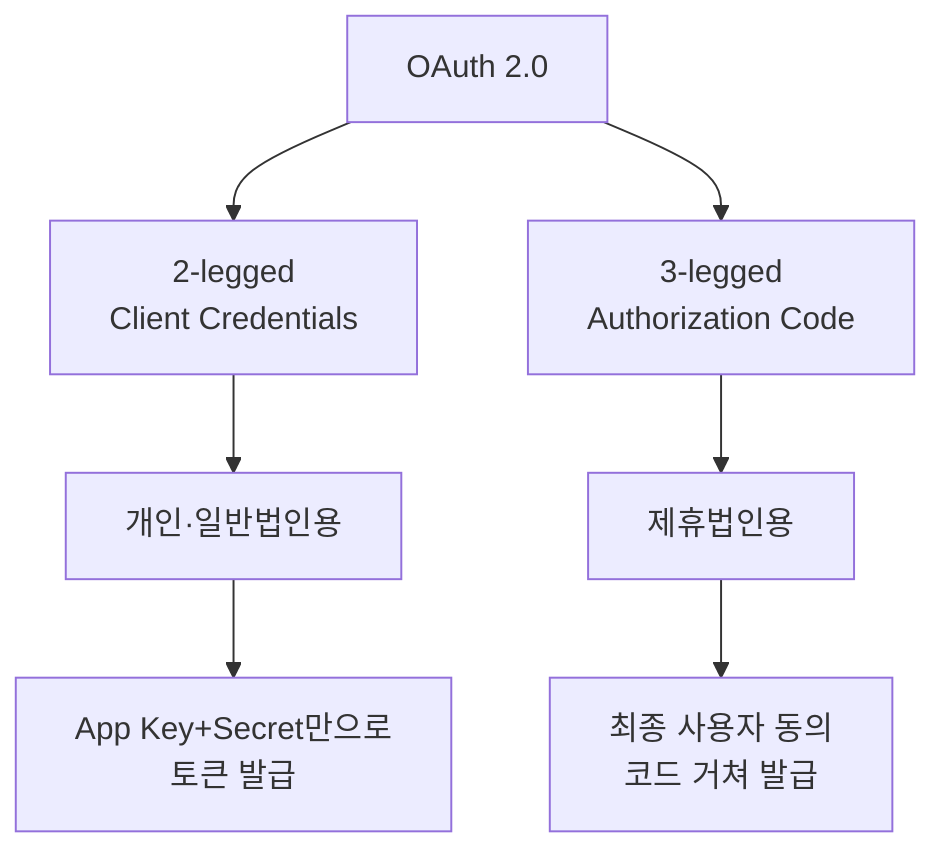

| 구분 | 2-legged | 3-legged |
|------|----------|----------|
| 대상 | 개인·일반법인 | 제휴법인 |
| 사용자 동의 단계 | 없음 (앱 인증만) | 있음 (사용자 승인 코드) |
| Access Token 유효기간 | **24시간** | 3개월 |
| Refresh Token | 없음 | 1년 |
| 본 강의 사용 | ✅ | ❌ |

### 7.2 토큰이란 무엇인가?

직관적인 비유로 설명하면 다음과 같습니다.

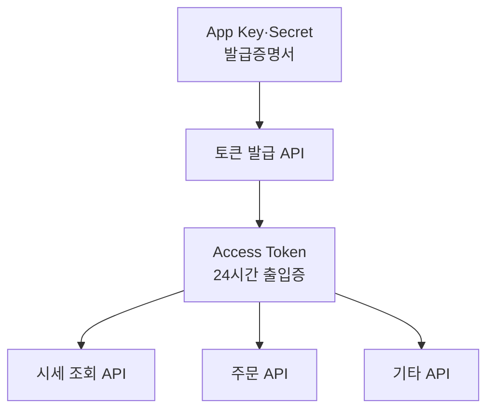

| 비유 | 실제 |
|------|------|
| 회원증 (영구) | App Key·Secret |
| 일일 출입증 (24시간) | Access Token |
| 출입증 발급 창구 | `/oauth2/tokenP` 엔드포인트 |
| 출입 게이트 | 각 API 엔드포인트 |

API를 호출할 때마다 매번 회원증(App Secret)을 들이미는 것은 위험하므로, **하루 한 번 출입증을 받아두고 그 후로는 출입증만 보여주는** 방식입니다.

### 7.3 24시간 유효기간 + 6시간 룰

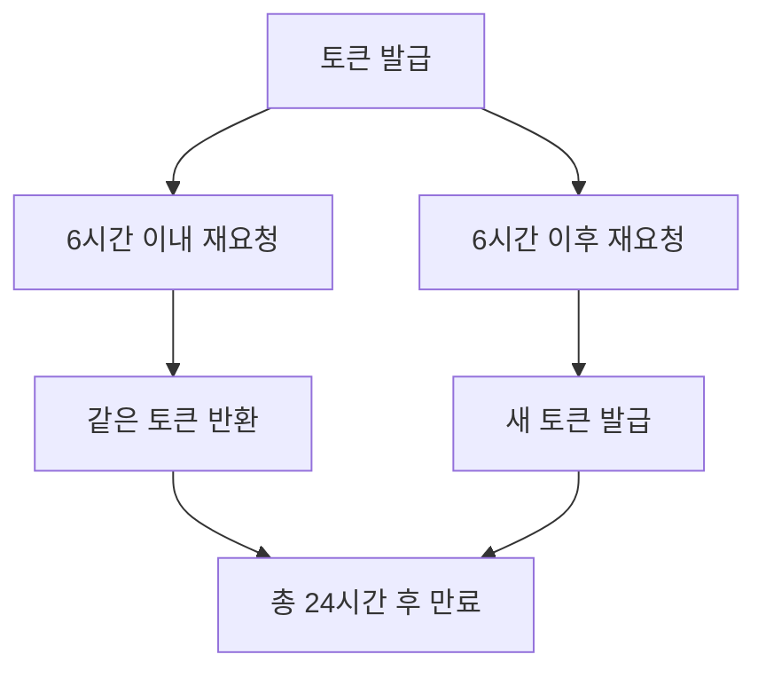

| 시점 | 동작 |
|------|------|
| 발급 직후 | Access Token 유효 |
| 6시간 이내 재발급 요청 | **이전 토큰을 그대로 반환** |
| 6시간 경과 후 재발급 요청 | 새 토큰 발급, 이전 토큰 무효화 |
| 24시간 경과 | 자동 만료 |

> 💡 **6시간 룰의 실용적 의미**
> 워크플로를 테스트하느라 하루에 토큰을 5번 호출하더라도, 실제론 같은 토큰이 반환됩니다. 따라서 **요청 한도 걱정은 거의 없습니다**. 단, 24시간이 지난 토큰을 그대로 쓰면 401 Unauthorized 오류가 납니다.

### 7.4 본 강의 워크플로의 토큰 전략

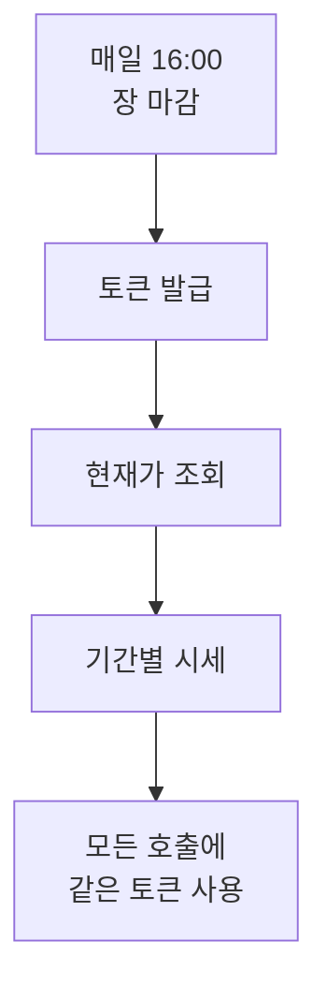

매일 1회 발급 → 그날 모든 API 호출에 사용 → 다음 날 다시 발급. **단순하고 안전한 패턴**입니다.

### 7.5 토큰 사용 시 주의 — `Bearer ` 접두사

> ⚠️ **가장 흔한 함정**
> 발급된 토큰을 API 호출 시 헤더에 넣을 때, **반드시 앞에 `Bearer ` (Bearer 다음에 공백 한 칸)**을 붙여야 합니다.
>
> ✅ 올바름: `Bearer eyJ0eXAiOiJKV1Qi...`
> ❌ 틀림: `eyJ0eXAiOiJKV1Qi...`
>
> 이 한 칸 공백을 빠뜨려 401 오류로 헤매는 경우가 매우 많습니다.

`Bearer`는 **"이 토큰을 가진 사람을 인증된 사용자로 간주한다"**는 OAuth 표준 용어입니다.

---

## 8. n8n에서 자격증명을 어떻게 보관할까?

### 8.1 일반적인 n8n 인증 패턴

평소 다른 API(슬랙·구글·노션 등)를 n8n에 연동할 때는 **Credentials** 메뉴에서 OAuth 로그인 한 번이면 끝납니다. 토큰 갱신도 n8n이 알아서 합니다.

### 8.2 한투 Open API는 왜 다른가?

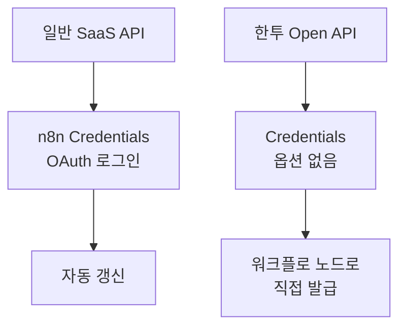

| 항목 | 일반 SaaS (Slack 등) | 한투 Open API |
|------|----------------------|---------------|
| n8n Credentials 메뉴에 등록? | ✅ | ❌ |
| 토큰 갱신 방식 | n8n 자동 | 워크플로 노드로 직접 |
| 매일 호출 시 | 신경 쓸 필요 없음 | Schedule 노드로 매일 새 토큰 |

이유는 한투 API가 **n8n 빌트인 통합 대상이 아니기** 때문입니다. 따라서 다음 모듈에서 다음 패턴을 만듭니다.

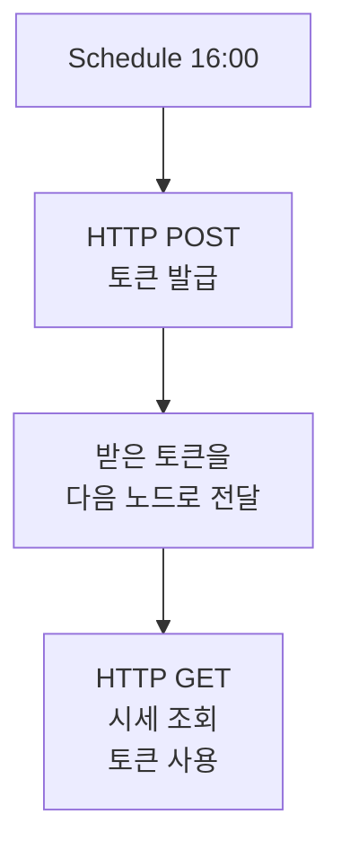

### 8.3 App Key·Secret은 어디에 적나요?

다음 모듈에서 HTTP Request 노드의 **Body 필드**에 직접 입력하게 됩니다. 매번 키를 텍스트 파일에서 복붙하지 않으려면, n8n의 **Credentials 메뉴 → Header Auth**나 **환경변수**로 관리하는 방법도 있습니다. 본 강의는 가장 단순한 직접 입력 방식으로 진행하되, 8.4의 보안 권장사항을 따라주세요.

### 8.4 운영 단계의 권장사항

학습 단계가 끝나고 실제 운영에 들어가면 다음을 검토하세요.

| 단계 | 권장 보관 방식 |
|------|----------------|
| 학습·실습 | n8n Body 필드 직접 입력 (편의성) |
| 개인 운영 | n8n Credentials Header Auth 또는 환경변수 |
| 팀 운영 | n8n External Secrets (Vault·AWS Secrets Manager 연동) |

---

## 9. 30초 점검 — 모듈 2로 넘어갈 자격

| # | 체크 항목 | ✅/❌ |
|---|-----------|------|
| 1-1 | KIS Developers 서비스 신청 페이지에서 휴대폰 인증을 통과했다 | |
| 1-2 | 약관 동의 후 3단계 신청 페이지에 도달했다 | |
| 1-3 | 계좌를 선택해 [신청] 버튼을 눌러 신청을 완료했다 | |
| 1-4 | App Key와 App Secret을 안전한 곳에 보관했다 | |
| 1-5 | OAuth 2-legged 방식의 흐름과 24시간 유효기간을 설명할 수 있다 | |
| 1-6 | API 호출 시 토큰 앞에 `Bearer ` 접두사를 붙여야 함을 안다 | |

---

## 10. 자주 발생하는 문제

### 10.1 신청 단계 트러블슈팅

| 증상 | 원인 | 해결 |
|------|------|------|
| 휴대폰 인증 실패 | 등록된 번호와 다름 | 한투 고객센터에서 휴대폰번호 갱신 후 재시도 |
| [다음] 버튼 비활성 | 인증번호 미입력 | 인증번호 입력 후 [확인] 클릭 |
| 계좌 목록이 비어있음 | 계좌가 아직 개통되지 않음 | 비대면 계좌개설 완료 후 재방문 |
| 신청 버튼 클릭 후 오류 | 동시 진행 중인 신청 존재 | 기존 신청 해지 또는 갱신 메뉴 사용 |

### 10.2 발급 후 트러블슈팅 (다음 모듈에서 만나게 될 문제 미리보기)

| 증상 | 원인 | 해결 |
|------|------|------|
| 발급 화면이 안 보임 | 신청만 하고 조회 페이지로 안 옴 | 메뉴 재진입 후 [신청 현황] 영역 확인 |
| App Key·Secret 복사가 안 됨 | 브라우저 보안 설정 | 수동 드래그 후 Ctrl+C |
| 키가 노출되었을 가능성 | 실수로 공개 저장소 업로드 | 즉시 [해지] 후 재신청 (새 키 발급) |

---

## 11. 자주 묻는 질문

**Q1. 신청 즉시 사용 가능한가요?**
네. [신청] 완료 직후부터 App Key와 App Secret이 표시되며, 토큰 발급 API를 호출하면 즉시 토큰이 발급됩니다.

**Q2. 키를 잃어버렸어요.**
신청 현황 페이지에서 다시 [복사]할 수 있습니다. 다만 페이지에서도 일정 마스킹이 있을 수 있으니, 받은 즉시 안전한 곳에 별도 보관하는 것이 좋습니다.

**Q3. 1년 후 어떻게 되나요?**
이용기간 만료 30일 전부터 [갱신] 버튼이 활성화됩니다. 갱신해도 키는 동일하게 유지되는 것이 일반적입니다(정확한 동작은 한투 안내 문구 확인).

**Q4. 모의투자 계좌는 1년 갱신이 안 된다고요?**
모의투자 계좌는 투자기간이 3개월 이내이면 갱신이 불가합니다. 모의 계좌가 만료되면 새로 개설하고 API도 재신청해야 합니다.

**Q5. 한 사람이 여러 API를 신청할 수 있나요?**
같은 계좌에 대한 동일 서비스 중복 신청은 불가하지만, 계좌가 여러 개라면 계좌별로 각각 신청할 수 있습니다.

**Q6. 호출 횟수 제한이 있나요?**
한투 Open API는 초당·분당·일당 호출 제한이 있습니다. 본 강의 워크플로는 하루 4~5회 호출 수준이라 한도에 거의 영향을 주지 않습니다. 다만 다종목 모니터링으로 확장할 때는 한도 확인이 필요합니다.

---

## 12. 다음 모듈 미리보기

**모듈 2 — OAuth 토큰 자동 발급 워크플로**

다음 모듈에서는 방금 발급받은 App Key와 App Secret을 사용해, **n8n 워크플로에서 매일 자동으로 토큰을 발급받는 시스템**을 만듭니다. Schedule Trigger와 HTTP Request 노드 두 개로 시작합니다.

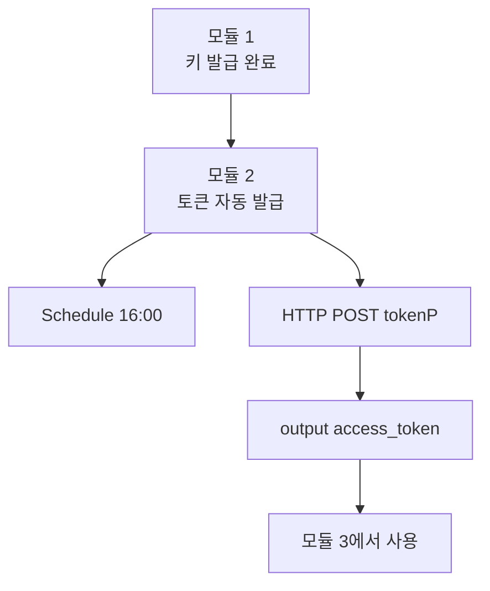

준비가 되었다면 모듈 2로 이동하세요.


