# 모듈 2 — OAuth 토큰 자동 발급 워크플로

> **이 모듈에서 할 일**
> n8n에서 새 워크플로를 만들고, **Schedule Trigger**와 **HTTP Request** 두 노드만으로 매일 16:00에 자동으로 한투 API 토큰을 발급받는 시스템을 완성합니다. 결과로 받은 `access_token`은 다음 모듈부터 모든 시세 조회의 출입증이 됩니다.


<!-- INFOGRAPHIC -->
<div class="infographic-wrap">
  
  <p class="infographic-caption">n8n 4개 노드로 완성하는 토큰 자동발급</p>
</div>


---

## 0. 이 모듈의 흐름

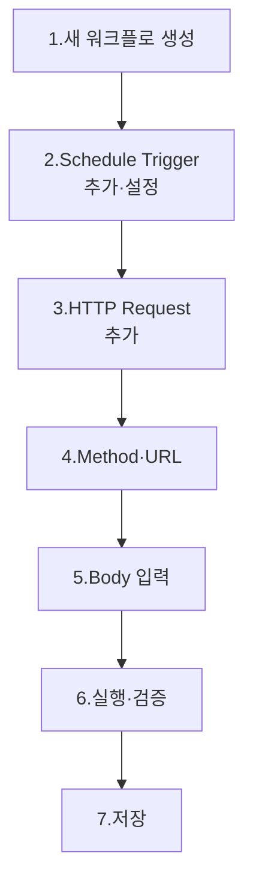

이번 모듈에서 만들 워크플로는 단 2개의 노드로 구성됩니다.

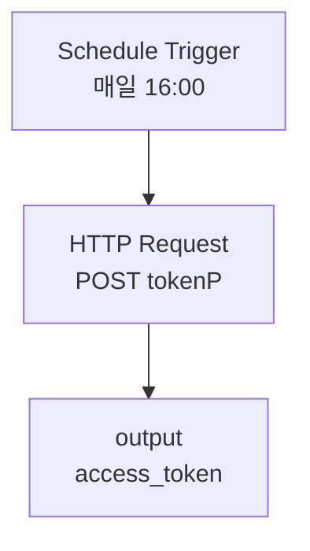

다음 모듈에서 이 뒤에 시세 조회 노드를 계속 붙여나갑니다.

---

## 1. 새 워크플로 생성

### 1.1 어디서 시작하나요?

n8n 메인 화면(Workflows 목록) 우측 상단에서 **[+ Add Workflow]** 또는 **[+ Create Workflow]** 버튼을 클릭합니다. 빈 캔버스가 열립니다.

### 1.2 워크플로 이름 정하기

캔버스 좌측 상단의 **"My workflow"** 같은 기본 이름을 클릭해 변경합니다. 본 강의 권장 이름은 다음과 같습니다.

> 📝 **권장 이름**: `한투 주식 모니터링`

이름은 자유이지만, 나중에 이 워크플로를 여러 개 복제해 종목별로 운영할 가능성이 있으므로 **종목명·날짜를 포함하지 않는** 이름이 좋습니다.

> ✅ **체크포인트 2-1**
> 빈 캔버스가 열렸고, 좌측 상단에 본인이 정한 워크플로 이름이 표시되나요?

---

## 2. Schedule Trigger 노드 추가

### 2.1 트리거란 무엇인가?

n8n 워크플로는 반드시 **트리거 노드 1개**로 시작합니다. 트리거가 "언제 워크플로를 실행할지"를 결정합니다.

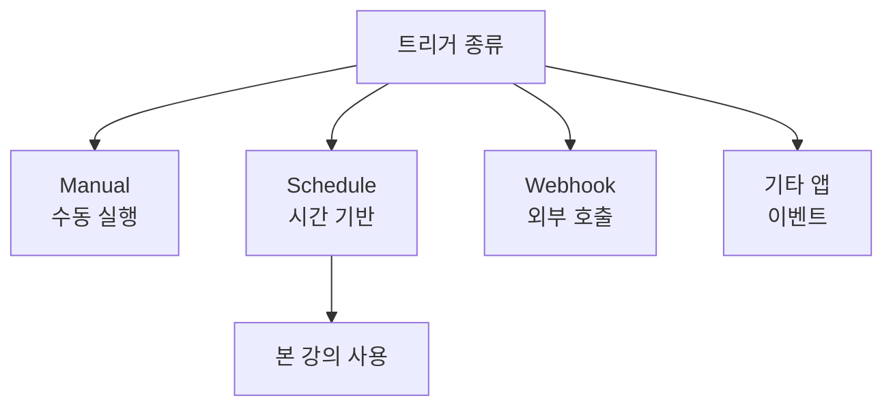

### 2.2 Schedule Trigger 추가하기

캔버스 중앙의 **[+ Add first step]**를 클릭하면 트리거 선택 메뉴가 나옵니다.

```
검색창에 "schedule" 입력 → [Schedule Trigger] 선택
```

### 2.3 매개변수 설정

Schedule Trigger 노드를 클릭하면 우측 패널에 설정 화면이 열립니다. 다음 4개 필드를 채웁니다.

| # | 필드 | 값 | 의미 |
|---|------|-----|------|
| 1 | Trigger Interval | `Days` | 며칠 간격으로 실행할지 |
| 2 | Days Between Triggers | `1` | 매일 |
| 3 | Trigger at Hour | `4pm` | 오후 4시 (장 마감 시각) |
| 4 | Trigger at Minute | `0` | 정각 |

### 2.4 왜 16:00인가?

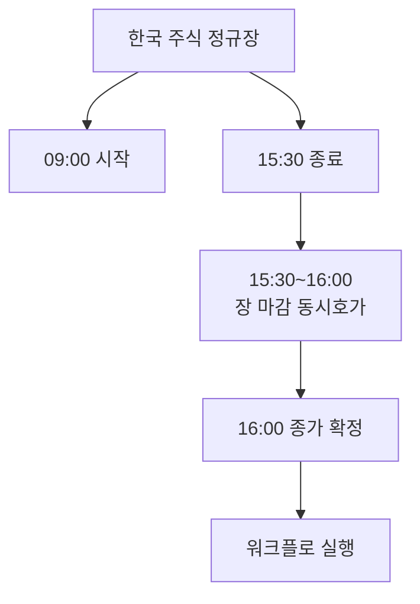

| 시점 | 상태 |
|------|------|
| 15:30 | 정규장 종료, 동시호가 시작 |
| 15:40 | 종가 결정 |
| 16:00 | 데이터 안정화, 워크플로 실행 적기 |

> 💡 **다른 시간대로 바꾸고 싶다면**
> 미국 시장 모니터링이라면 한국 시간 새벽 5시(미국 동부 마감 16:00 ET 기준)로 설정합니다. 본 강의는 KOSPI 기준으로 16:00을 사용합니다.

### 2.5 시간대(Timezone) 확인

n8n 인스턴스의 시간대 설정에 따라 16:00의 의미가 달라집니다.

| n8n 환경 | 기본 시간대 |
|----------|-------------|
| n8n Cloud | UTC |
| Desktop App | OS 시간대 |
| Self-hosted Docker | 컨테이너 환경변수 |

> ⚠️ **함정 — UTC 사용 시**
> n8n이 UTC로 동작 중이라면, 한국 시간 16:00은 **UTC 07:00**입니다. 워크플로 우측 상단 [Settings] → [Timezone]에서 워크플로 단위로 시간대를 `Asia/Seoul`로 변경하면 직관적인 16:00 입력이 가능합니다.

> ✅ **체크포인트 2-2**
> Schedule Trigger 패널 상단에 다음 안내가 표시되나요?
> *"This workflow will run on the schedule you define here once you activate it."*
> 보이면 설정 통과입니다.

### 2.6 학습 단계에서는 수동 실행이 더 자주 필요합니다

매일 16:00을 기다릴 수 없으므로, 강의 중에는 캔버스에서 워크플로를 수동으로 실행하면서 진행합니다. Schedule Trigger를 추가했다고 즉시 자동 실행되는 것은 아니며, **워크플로가 [Active] 상태**가 되어야 자동 실행됩니다.

---

## 3. HTTP Request 노드 추가 — 토큰 발급용

### 3.1 노드 추가하기

Schedule Trigger 노드 우측의 **[+]** 아이콘을 클릭합니다. 노드 추가 메뉴에서 다음을 선택합니다.

```
검색창에 "http" 입력 → [HTTP Request] 선택
```

### 3.2 HTTP Request 노드란?

이 노드는 n8n에서 가장 강력한 도구 중 하나입니다. **REST API를 호출하는 만능 도구**로, 웹 브라우저가 하는 일(URL 호출·헤더 전송·Body 전송·응답 수신)을 노드 한 개에서 모두 수행합니다.

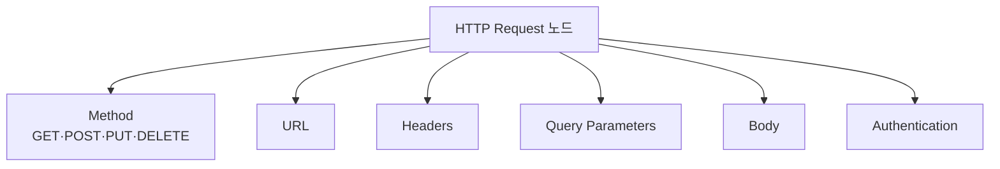

본 강의에서 한투 API 호출은 모두 이 노드로 이루어집니다.

---

## 4. Method와 URL 설정

### 4.1 Method를 POST로

토큰 발급은 **새 자원(토큰)을 생성**하는 동작이므로 **POST**를 사용합니다.

| Method | 의미 | 본 강의 사용 모듈 |
|--------|------|-------------------|
| GET | 데이터 조회 | 모듈 3, 4 (시세 조회) |
| **POST** | **데이터 생성·전송** | **모듈 2 (토큰 발급)** |
| PUT | 데이터 갱신 | (사용 안 함) |
| DELETE | 데이터 삭제 | (사용 안 함) |

n8n 패널에서 **Method** 드롭다운을 **POST**로 변경합니다.

### 4.2 URL 입력

본인 환경에 맞는 URL을 **URL** 필드에 붙여넣습니다.

> 🔀 **여기서부터 환경별로 갈립니다**
> 본인이 모듈 1에서 신청한 환경(실전/모의)에 맞는 줄을 선택하세요. 한 번 선택한 환경은 모듈 4까지 일관되게 사용합니다.

| 환경 | URL |
|------|-----|
| 🟢 **실전** | `https://openapi.koreainvestment.com:9443/oauth2/tokenP` |
| 🟡 **모의** | `https://openapivts.koreainvestment.com:29443/oauth2/tokenP` |

### 4.3 URL 구조 분해

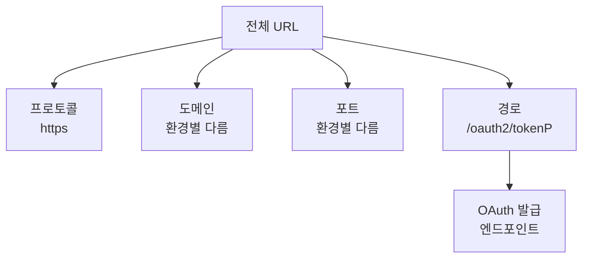

| 부분 | 실전 값 | 모의 값 | 의미 |
|------|---------|---------|------|
| 프로토콜 | `https://` | `https://` | 암호화 통신 |
| 도메인 | `openapi.koreainvestment.com` | `openapi**vts**.koreainvestment.com` | 한투 API 서버 |
| 포트 | `:9443` | `:29443` | 별도 명시 포트 |
| 경로 | `/oauth2/tokenP` | `/oauth2/tokenP` | 토큰 발급 엔드포인트 (동일) |

> 💡 **모의 도메인의 vts**
> 모의 도메인은 `openapi` 뒤에 **vts**(Virtual Trading System)가 붙습니다. 두 글자 차이로 완전히 다른 시스템에 접속하므로 오타에 주의하세요.

> ⚠️ **함정 — 포트 누락**
> URL에서 포트(`:9443` 또는 `:29443`)를 빠뜨리면 연결 실패합니다. 한투 API는 **반드시 명시 포트**가 필요합니다.

### 4.4 어디서 이 URL을 확인했나?

이 URL은 한국투자 Open API 개발자센터의 다음 경로에서 확인할 수 있습니다.

```
[API 문서] → [개요] → [OAuth인증] → [접근토큰발급(P)]
```

해당 페이지의 표에서 **실전 Domain**과 **모의 Domain** 값을 확인할 수 있습니다.

| 필드 | 값 |
|------|-----|
| Method | POST |
| 실전 Domain | `https://openapi.koreainvestment.com:9443` |
| 모의 Domain | `https://openapivts.koreainvestment.com:29443` |
| URL 경로 | `/oauth2/tokenP` |
| Format | JSON |
| Content-Type | application/json; charset=UTF-8 |

도메인 끝에 `/oauth2/tokenP`를 붙여 전체 URL을 만들면 됩니다.

---

## 5. Authentication 설정

### 5.1 None을 선택하는 이유

HTTP Request 노드의 **Authentication** 필드는 기본적으로 None입니다. 이대로 둡니다.

> 🤔 "토큰 발급인데 인증이 None?"

맞습니다. **이 호출 자체가 인증을 만들기 위한 호출**입니다. 닭과 달걀처럼 보이지만, 인증의 첫 단계는 인증되지 않은 상태에서 시작합니다. App Key·App Secret을 Body에 담아 보내는 방식으로 본인 확인을 합니다.

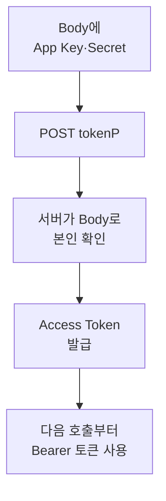

다음 모듈부터의 시세 조회 호출은 Authentication None을 유지하되 **Header에 토큰을 직접 넣는** 방식이 됩니다.

| 필드 | 값 |
|------|-----|
| Authentication | `None` |

---

## 6. Body 설정

### 6.1 Send Body 토글 활성화

기본적으로 Body는 비활성 상태입니다. **Send Body** 토글을 ON으로 바꿉니다.

### 6.2 Body Content Type

| 필드 | 값 |
|------|-----|
| Body Content Type | `JSON` |

JSON은 한투 API 문서에 명시된 포맷입니다.

### 6.3 Specify Body 방식

JSON Body를 작성하는 방식은 두 가지입니다.

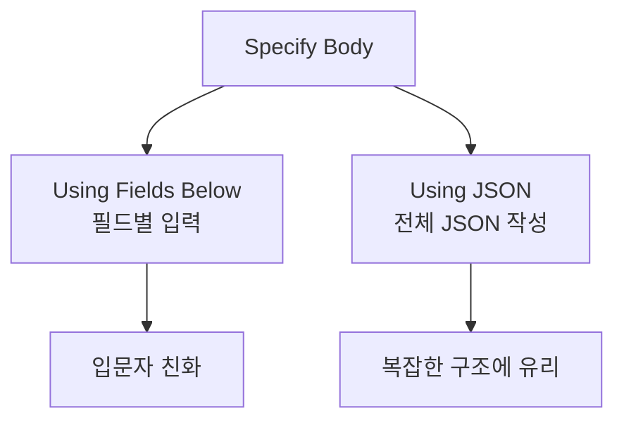

본 강의는 **Using Fields Below**로 진행합니다. Name·Value 쌍을 폼처럼 입력하므로 오타 위험이 적습니다.

| 필드 | 값 |
|------|-----|
| Specify Body | `Using Fields Below` |

### 6.4 Body Parameters 입력

**[Add Parameter]** 버튼을 3번 눌러 필드를 3개 만들고, 다음과 같이 채웁니다.

| # | Name | Value |
|---|------|-------|
| 1 | `grant_type` | `client_credentials` |
| 2 | `appkey` | (모듈 1에서 발급받은 App Key) |
| 3 | `appsecret` | (모듈 1에서 발급받은 App Secret) |

### 6.5 각 필드의 의미

| 필드 | 의미 |
|------|------|
| grant_type | OAuth 표준 용어. **어떤 방식으로 인증할지**를 서버에 알림 |
| client_credentials | 2-legged 방식 (앱 자체 인증, 사용자 동의 없음) |
| appkey | 어떤 앱이 호출하는지 식별 |
| appsecret | 그 앱의 비밀번호 |

> ⚠️ **함정 — 키 앞뒤 공백**
> App Key·Secret을 복사할 때 앞뒤에 공백이 따라붙는 경우가 있습니다. 인증이 실패하면 가장 먼저 의심해야 할 부분입니다. Value 필드를 클릭해 끝까지 드래그해 공백 유무를 확인하세요.

> ⚠️ **함정 — 키 본인 확인**
> 두 계좌(실전·모의)에 모두 API를 신청한 사람은 키도 두 쌍입니다. **지금 호출하는 URL과 같은 환경의 키**를 사용해야 합니다. 실전 URL에 모의 키를 넣으면 인증 실패합니다.

> ✅ **체크포인트 2-3**
> Body Parameters 영역에 3개의 Name-Value 쌍이 모두 채워졌고, App Key·Secret 값에 시각적으로 공백이나 줄바꿈이 없는가?

---

## 7. 노드 실행과 결과 검증

### 7.1 [Execute step] 클릭

노드 패널 우측 상단의 **[Execute step]** 버튼을 클릭합니다. 정상이라면 1~2초 안에 응답이 돌아옵니다.

### 7.2 OUTPUT 패널 확인

응답은 노드 패널 우측에 OUTPUT으로 표시됩니다. **Schema** 탭에서 다음 4개 필드를 확인하세요.

| 필드 | 예시 값 | 의미 |
|------|---------|------|
| `access_token` | `eyJ0eXAi...` (350자) | 핵심 결과물 — 출입증 |
| `access_token_expired` | `2025-12-28 11:46:35` | 만료 시각 |
| `token_type` | `Bearer` | 토큰 유형 |
| `expires_in` | `86400` | 유효 초 (24시간) |

### 7.3 토큰의 모양

```
eyJ0eXAiOiJKV1QiLCJhbGciOiJIUzI1NiJ9.eyJzdWIi...
```

- `eyJ`로 시작하는 긴 문자열입니다.
- 형식은 **JWT(JSON Web Token)**입니다.
- 구분자 `.`로 3개 부분으로 나뉘는데, 각 부분은 Base64로 인코딩된 메타정보·본문·서명입니다.
- 본 강의에서는 토큰을 **분해할 필요 없이** 그대로 다음 노드에 전달하면 됩니다.

> 💡 **expires_in = 86400의 의미**
> 60초 × 60분 × 24시간 = 86,400초. 즉 24시간 후 만료입니다. `access_token_expired` 필드가 사람이 읽기 쉬운 만료 시각을 알려줍니다.

### 7.4 결과 검증 체크리스트

> ✅ **체크포인트 2-4**
> 다음 4가지가 모두 충족되면 토큰 발급은 완벽합니다.
> - [ ] OUTPUT에 `access_token`이 존재한다
> - [ ] `access_token` 값이 `eyJ`로 시작한다
> - [ ] `token_type` 값이 `Bearer`이다
> - [ ] `expires_in` 값이 `86400`이다

---

## 8. 워크플로 저장

### 8.1 [Save] 버튼

캔버스 우측 상단의 **[Save]** 버튼(또는 `Ctrl+S` / `Cmd+S`)을 클릭합니다.

### 8.2 활성화는 아직 하지 마세요

워크플로 상단 우측의 **[Inactive ↔ Active]** 토글이 보입니다.

| 상태 | 의미 |
|------|------|
| Inactive | Schedule Trigger가 자동 실행되지 않음 (수동 실행만 가능) |
| Active | Schedule Trigger가 자동 실행됨 |

학습 단계에서는 **Inactive**를 유지합니다. 모든 모듈을 다 마친 후 마지막에 Active로 전환합니다.

> ⚠️ **함정 — 너무 일찍 활성화**
> 미완성 워크플로를 Active로 두면, Schedule이 16:00에 실행되며 의도치 않은 부분 호출이 일어날 수 있습니다. 학습 중에는 반드시 Inactive로 유지하고, 노드 실행은 [Execute step]으로 직접 하세요.

---

## 9. 6시간 룰 실험 (선택)

이미 모듈 1에서 학습한 6시간 룰을 직접 확인해보고 싶다면 다음을 시도해보세요.

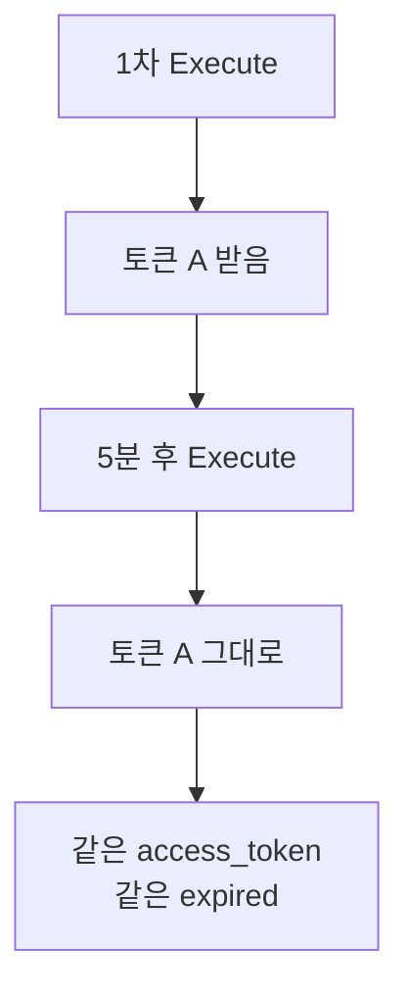

| 실험 | 결과 |
|------|------|
| 발급 직후 즉시 재발급 | 같은 `access_token` 반환 |
| 1시간 뒤 재발급 | 같은 `access_token` |
| 6시간 1분 뒤 재발급 | **새 access_token** 반환 |

이 동작 덕분에 학습 중 [Execute step]을 수십 번 눌러도 한투 측에서 부담을 느끼지 않습니다.

---

## 10. 워크플로 현재 상태

이 모듈을 완료하면 워크플로는 다음 모양입니다.

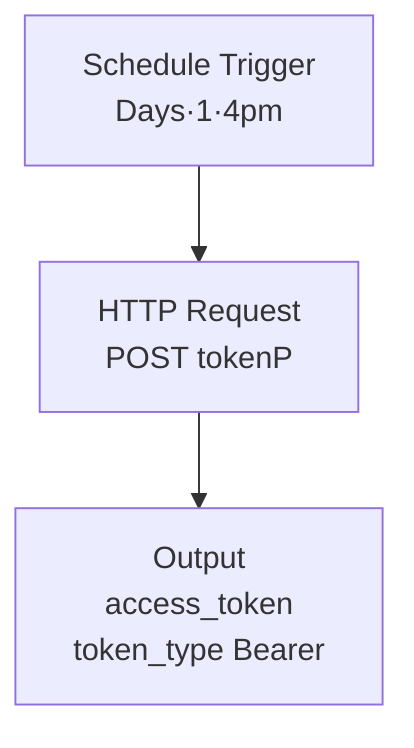

다음 모듈에서 이 뒤에 **HTTP Request1** 노드를 붙여 시세 조회를 시작합니다.

---

## 11. 자주 발생하는 오류

| 증상 | 원인 | 해결 |
|------|------|------|
| `403 Forbidden` | URL 도메인 오타, 포트 누락 | URL 끝 `:9443` 확인 |
| `401 Unauthorized` | App Key·Secret 잘못 입력 | 앞뒤 공백 제거 후 재입력 |
| `400 Bad Request` | grant_type 오타 | `client_credentials` 정확히 입력 |
| `EAI_AGAIN` 또는 DNS 오류 | n8n 인스턴스 인터넷 연결 문제 | 네트워크·방화벽 확인 |
| 응답이 1분 넘게 안 옴 | Body Content Type이 JSON이 아님 | Body Content Type을 `JSON`으로 |
| `access_token`이 없는 응답 | grant_type 또는 키가 다름 | 모든 Body 필드 재확인 |
| Authentication을 Generic Auth로 잘못 설정 | n8n이 자체 인증을 시도해 충돌 | None으로 변경 |

### 11.1 401이 나오는 경우 — 5단계 진단

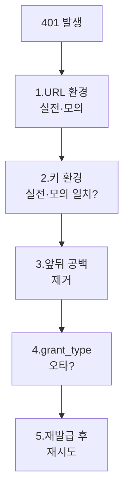

대부분 1~3단계에서 해결됩니다.

---

## 12. 30초 점검 — 모듈 3으로 넘어갈 자격

| # | 체크 항목 | ✅/❌ |
|---|-----------|------|
| 2-1 | 새 워크플로를 생성하고 이름을 지정했다 | |
| 2-2 | Schedule Trigger를 Days·1·4pm·0으로 설정했다 | |
| 2-3 | HTTP Request 노드의 Method=POST, URL이 정확하다 | |
| 2-4 | Body에 grant_type·appkey·appsecret 3개 필드를 채웠다 | |
| 2-5 | [Execute step] 후 OUTPUT에 `access_token`이 표시되었다 | |
| 2-6 | 토큰이 `eyJ`로 시작하고 token_type이 `Bearer`이다 | |
| 2-7 | 워크플로를 저장했고, Active 토글은 Inactive 상태로 두었다 | |

---

## 13. 자주 묻는 질문

**Q1. 토큰을 변수처럼 어딘가 저장해두고 싶어요.**
n8n에서 노드 간 데이터 전달은 자동입니다. HTTP Request 노드의 출력은 다음 노드에서 `{{ $json.access_token }}` 식으로 참조 가능합니다(모듈 3에서 사용). 별도 저장은 불필요합니다.

**Q2. n8n이 켜져 있지 않은데 16:00이 되면 어떻게 되나요?**
Desktop App·Self-hosted라면 n8n 프로세스가 꺼져 있는 동안은 트리거가 동작하지 않습니다. n8n Cloud는 항상 켜져 있어 정상 트리거됩니다. 운영 환경에서는 항상 켜져 있는 환경(Cloud·서버)이 필요합니다.

**Q3. 16:00 외에 다른 시간에도 실행하고 싶어요.**
Schedule Trigger는 한 노드에 여러 시간을 설정할 수 있습니다. 또는 Schedule Trigger 노드를 여러 개 만들어 같은 워크플로를 다른 시간에도 트리거할 수 있습니다.

**Q4. App Key·Secret을 직접 Body에 넣지 않고 더 안전하게 관리하려면?**
n8n의 **Credentials → Header Auth**를 사용하거나, **환경변수**(`$env.HANTU_APPKEY` 등)로 참조하는 방법이 있습니다. 본 강의는 단순화를 위해 직접 입력하지만, 운영 환경에서는 분리 보관을 권장합니다.

**Q5. 갑자기 토큰 발급이 거부됩니다.**
다음을 순서대로 확인하세요. (1) 모듈 1에서 신청한 API의 만료일이 지나지 않았는지, (2) 3개월 무거래로 자동 차단되었는지, (3) 한투 사이트에서 키를 재발급해야 하는지.

**Q6. Body 값에 `client_credentials`를 입력했는데 따옴표가 같이 들어갔어요.**
Using Fields Below 모드에서는 Value에 값을 그대로 입력하면 n8n이 알아서 따옴표를 붙입니다. `"client_credentials"`처럼 쌍따옴표를 같이 쓰면 오류가 납니다. 따옴표 없이 `client_credentials`만 입력하세요.

---

## 14. 다음 모듈 미리보기

**모듈 3 — 주식 현재가 시세 조회**

다음 모듈에서는 방금 발급받은 토큰을 사용해, **삼성전자(또는 원하는 종목)의 현재가·등락률·거래량**을 조회하는 GET 호출을 만듭니다. 이전 노드의 토큰을 다음 노드 헤더에 전달하는 표현식 패턴(`{{ $json.access_token }}`)을 본격적으로 사용합니다.

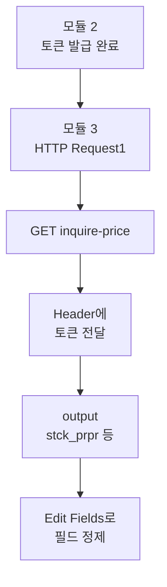

준비가 되었다면 모듈 3으로 이동하세요.


