# 모듈 3 — 주식 현재가 시세 조회

> **이 모듈에서 할 일**
> 모듈 2에서 발급받은 토큰을 사용해 **삼성전자(또는 원하는 종목)의 현재가·등락률·거래량**을 조회하고, 응답 JSON에서 필요한 필드만 추려 다음 모듈에서 쓰기 좋은 형태로 정리합니다. 이 모듈에서 처음으로 **노드 간 데이터 전달 표현식**이 등장합니다.


<!-- INFOGRAPHIC -->
<div class="infographic-wrap">
  
  <p class="infographic-caption">현재가 시세 API 요청·응답 구조</p>
</div>


---

## 0. 이 모듈의 흐름

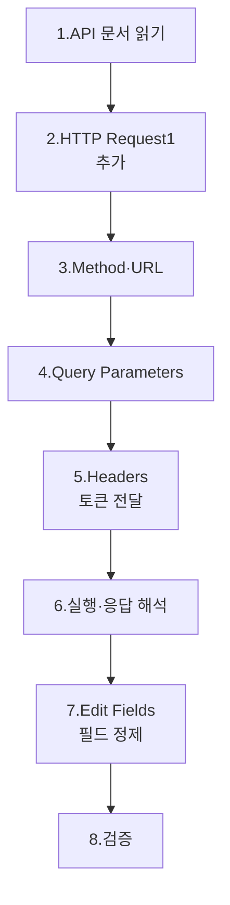

이번 모듈을 마치면 워크플로는 4개 노드가 됩니다.

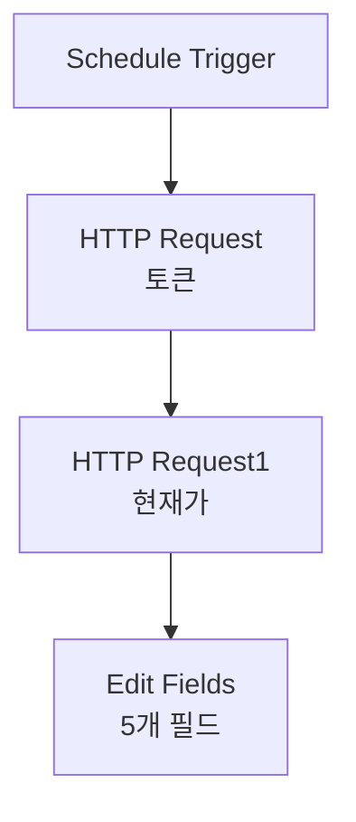

---

## 1. API 문서 읽기 — 호출하기 전에 먼저 알아야 할 것

### 1.1 왜 문서를 먼저 읽어야 하나요?

API 호출은 **빈칸 채우기 시험**과 비슷합니다. URL·헤더·쿼리·바디 각 칸에 정확한 값을 채워야 정상 응답이 옵니다. 어떤 칸이 있는지, 무엇이 필수인지는 **API 문서**에만 적혀 있습니다.

### 1.2 어디로 가나요?

> 🌐 한국투자 Open API 개발자센터: `apiportal.koreainvestment.com`

다음 경로로 들어갑니다.

```
[API 문서] → [국내주식] 기본시세 → [주식현재가 시세]
```

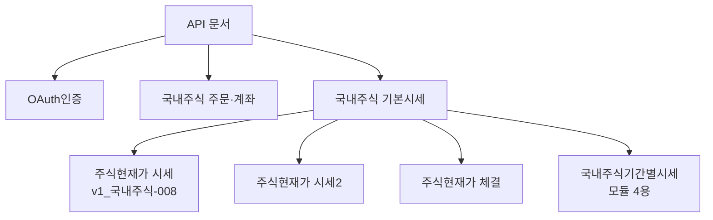

**[주식현재가 시세]** 페이지를 클릭하면 호출에 필요한 모든 정보가 표 형태로 정리되어 있습니다.

### 1.3 문서에서 확인할 4가지 영역

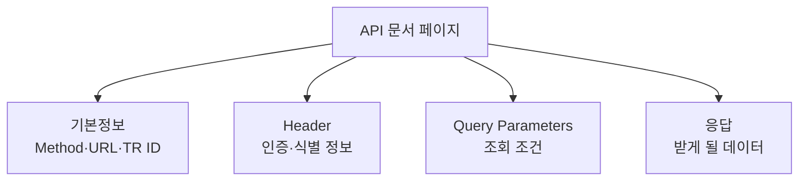

| 영역 | 확인할 것 | 본 모듈에서 사용 |
|------|----------|-------------------|
| 기본정보 | Method, URL, TR ID, Format | URL과 TR ID가 핵심 |
| Header | content-type·authorization·appkey 등 6개 필수 | 모두 입력 |
| Query Parameters | 시장 코드·종목 코드 2개 | 모두 입력 |
| 응답 (Body) | 어떤 필드로 데이터가 오는지 | Edit Fields 단계에서 사용 |

### 1.4 문서에서 본 모듈 핵심 정보

| 항목 | 값 |
|------|-----|
| Method | `GET` |
| 실전 URL | `/uapi/domestic-stock/v1/quotations/inquire-price` |
| 실전 Domain | `https://openapi.koreainvestment.com:9443` |
| 모의 Domain | `https://openapivts.koreainvestment.com:29443` |
| 실전 TR ID | `FHKST01010100` |
| 모의 TR ID | `FHKST01010100` (동일) |
| Format | JSON |
| Content-Type | `application/json; charset=utf-8` |

> 💡 **TR ID란?**
> 한투 API가 **어떤 거래(Transaction)를 처리하는지 구분하는 코드**입니다. 같은 URL이라도 TR ID에 따라 처리 로직이 달라질 수 있습니다. 본 강의에서 사용하는 시세 조회 TR ID는 실전·모의가 같지만, **주문 API는 실전·모의 TR ID가 다릅니다**.

> ⚠️ **함정 — Required 컬럼**
> 문서의 Header·Query Parameters 표에 **Required** 컬럼이 있습니다. **Y**로 표시된 항목은 필수입니다. 본 강의는 필수 항목만 입력합니다(N 항목은 선택).

---

## 2. HTTP Request1 노드 추가

### 2.1 어디에 추가하나요?

캔버스에서 모듈 2의 HTTP Request 노드(토큰 발급용) 우측 **[+]** 아이콘을 클릭합니다.

```
검색창에 "http" 입력 → [HTTP Request] 선택
```

n8n이 자동으로 노드 이름을 **HTTP Request1**로 부여합니다(첫 번째 HTTP Request 노드는 그대로 "HTTP Request").

### 2.2 노드 이름 그대로 둡니다

> ⚠️ **함정 — 노드 이름 변경 시 표현식 수정 필요**
> n8n 표현식은 노드 이름으로 다른 노드의 데이터를 참조합니다. 본 강의는 **HTTP Request·HTTP Request1** 같은 기본 이름을 그대로 사용합니다. 만약 이름을 바꾼다면 모든 표현식의 노드명도 같이 바꿔야 합니다.

### 2.3 워크플로 위치 확인

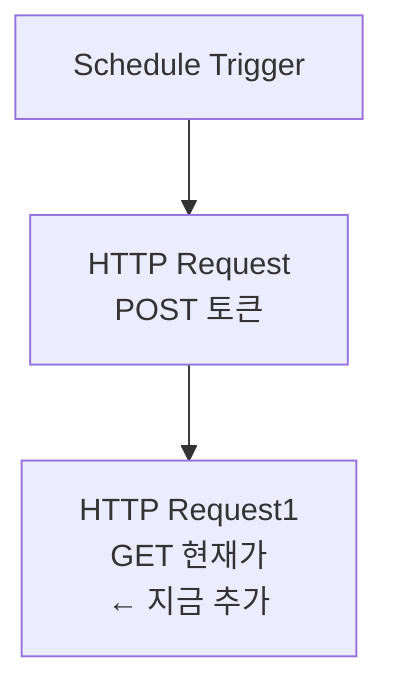

---

## 3. Method와 URL 설정

### 3.1 Method를 GET으로

| 필드 | 값 |
|------|-----|
| Method | `GET` |

토큰 발급(POST)과 달리 **시세 조회는 데이터를 가져오는 동작**이라 GET을 사용합니다.

### 3.2 URL 입력

> 🔀 **환경별 URL**
> 모듈 2에서 선택한 환경에 맞는 URL을 사용하세요. 도메인·포트만 다르고 경로(`/uapi/domestic-stock/...`)는 동일합니다.

| 환경 | URL |
|------|-----|
| 🟢 **실전** | `https://openapi.koreainvestment.com:9443/uapi/domestic-stock/v1/quotations/inquire-price` |
| 🟡 **모의** | `https://openapivts.koreainvestment.com:29443/uapi/domestic-stock/v1/quotations/inquire-price` |

### 3.3 URL 구조 분해

```mermaid
flowchart TD
    A[전체 URL] --> B[Domain<br/>openapi.koreainvestment.com:9443]
    A --> C[경로]
    C --> D[/uapi/domestic-stock]
    C --> E[/v1]
    C --> F[/quotations]
    C --> G[/inquire-price]
```

| 경로 부분 | 의미 |
|-----------|------|
| `/uapi` | Open API 진입점 |
| `/domestic-stock` | 국내 주식 카테고리 |
| `/v1` | API 버전 |
| `/quotations` | 시세 관련 |
| `/inquire-price` | 현재가 조회 엔드포인트 |

이 구조 덕분에 다른 시세 API의 URL도 짐작이 가능합니다. 예를 들어 모듈 4의 기간별 시세는 `/inquire-daily-itemchartprice`로 끝납니다.

### 3.4 Authentication 유지

| 필드 | 값 |
|------|-----|
| Authentication | `None` |

모듈 2와 마찬가지로 **None**입니다. 인증은 헤더에 토큰을 넣어 처리합니다.

---

## 4. Query Parameters 설정

### 4.1 Query Parameters란?

URL 끝에 `?key=value&key2=value2` 형태로 붙는 조회 조건입니다. n8n은 별도 입력 필드로 받아서 자동으로 URL 끝에 붙여줍니다.

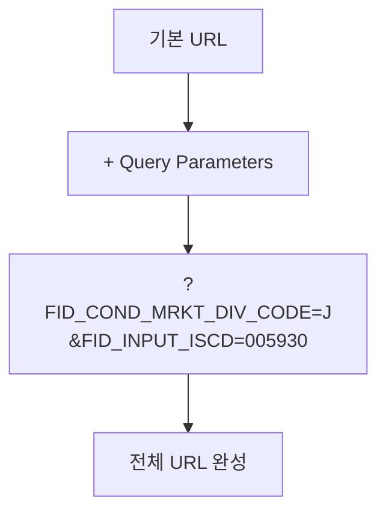

### 4.2 Send Query Parameters 토글 ON

기본은 비활성입니다. 토글을 ON으로 바꿉니다.

### 4.3 Specify Query Parameters 방식

| 필드 | 값 |
|------|-----|
| Specify Query Parameters | `Using Fields Below` |

폼처럼 Name·Value 쌍으로 입력합니다.

### 4.4 [Add Parameter]로 2개 필드 만들기

**[Add Parameter]** 버튼을 2번 눌러 다음 2개 필드를 만듭니다.

| # | Name | Value | 의미 |
|---|------|-------|------|
| 1 | `FID_COND_MRKT_DIV_CODE` | `J` | 시장 분류 코드 |
| 2 | `FID_INPUT_ISCD` | `005930` | 종목코드 |

### 4.5 시장 분류 코드 J·NX·UN

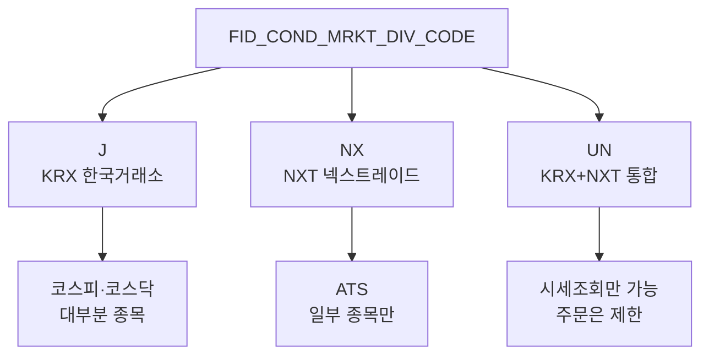

| 코드 | 의미 | 사용 빈도 |
|------|------|-----------|
| `J` | KRX (한국거래소·코스피·코스닥) | **본 강의 기본** |
| `NX` | NXT (넥스트레이드·ATS 대체거래소) | 일부 종목만 |
| `UN` | KRX + NXT 통합 | 통합 시세 조회용 |

> 💡 일반 개인 투자자가 보는 코스피·코스닥 종목은 모두 `J`입니다. NXT는 2025년 등장한 대체거래소로, 일부 종목에 한해 거래되며, 일반적인 종목 모니터링에는 거의 사용하지 않습니다.

### 4.6 종목 코드 입력

`FID_INPUT_ISCD`는 6자리 종목 코드입니다.

| 종목 | 코드 |
|------|------|
| 삼성전자 | `005930` |
| SK하이닉스 | `000660` |
| LG에너지솔루션 | `373220` |
| 카카오 | `035720` |
| 네이버 | `035420` |

> ⚠️ **함정 — 앞 0 누락**
> 종목코드는 **항상 6자리**입니다. 삼성전자를 `5930`으로 입력하면 오류납니다. 반드시 `005930`처럼 앞에 0을 채워주세요.

> 💡 **ETN 종목 입력**
> ETN은 6자리 코드 앞에 `Q`를 붙여 7자리로 입력합니다(예: `Q500001`). 본 강의는 일반 주식만 다루므로 신경 쓸 필요 없습니다.

> ✅ **체크포인트 3-1**
> Query Parameters 영역에 2개 필드(`FID_COND_MRKT_DIV_CODE=J`, `FID_INPUT_ISCD=005930`)가 채워졌나요?

---

## 5. Headers 설정 — 가장 중요한 단계

### 5.1 왜 Header가 중요한가?

이전 노드(토큰 발급)에서 받은 **`access_token`을 이 노드의 헤더에 전달**하는 것이 본 모듈의 핵심입니다. 이 연결이 안 되면 다음 모든 모듈이 작동하지 않습니다.

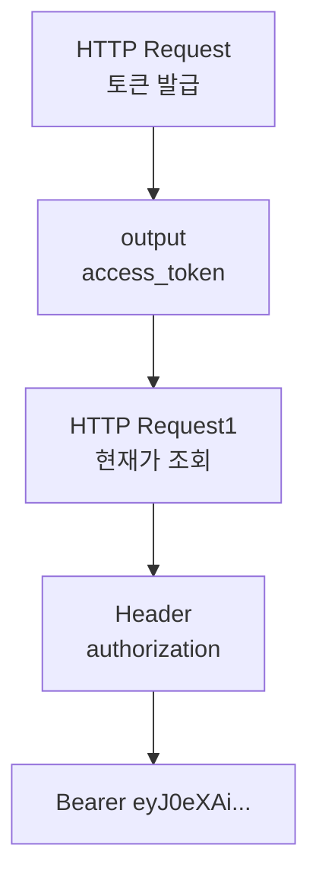

### 5.2 Send Headers 토글 ON

토글을 ON으로 바꿉니다.

| 필드 | 값 |
|------|-----|
| Specify Headers | `Using Fields Below` |

### 5.3 [Add Parameter]로 6개 필드 만들기

문서에서 Required = **Y**인 항목만 입력합니다. 총 6개입니다.

| # | Name | Value | 비고 |
|---|------|-------|------|
| 1 | `content-type` | `application/json; charset=utf-8` | 문서 명시값 그대로 |
| 2 | `authorization` | `Bearer {{ $node["HTTP Request"].json["access_token"] }}` | 표현식 — 다음 절 상세 |
| 3 | `appkey` | (App Key) | 모듈 1에서 발급받은 값 |
| 4 | `appsecret` | (App Secret) | 모듈 1에서 발급받은 값 |
| 5 | `tr_id` | `FHKST01010100` | 실전·모의 공통 |
| 6 | `custtype` | `P` | P=개인, B=법인 |

### 5.4 `authorization` 필드 상세 — 표현식 첫 등장

이 강의에서 처음 등장하는 **n8n 표현식**입니다. 차분히 읽어주세요.

#### 5.4.1 입력해야 할 정확한 값

```
Bearer {{ $node["HTTP Request"].json["access_token"] }}
```

> ⚠️ **하나도 빠뜨리지 마세요**
> - `Bearer` 다음에 **공백 한 칸**
> - `{{ ... }}` 중괄호 두 개씩
> - `$node` 앞에 **달러 기호** 필수
> - `"HTTP Request"` 양쪽 **쌍따옴표**
> - 문자열 사이에 공백·줄바꿈 없음

#### 5.4.2 각 부분의 의미

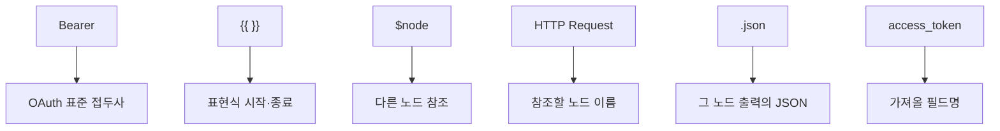

| 부분 | 의미 |
|------|------|
| `Bearer` | OAuth 표준 인증 스키마 — 이 토큰을 가진 사람을 인증된 사용자로 간주 |
| `{{ }}` | n8n 표현식 구분자. 중괄호 안은 JavaScript 코드처럼 평가됨 |
| `$node` | 다른 노드의 출력을 참조하는 키워드 |
| `["HTTP Request"]` | 참조할 노드의 **이름** |
| `.json` | 노드 출력의 JSON 본문 |
| `["access_token"]` | JSON에서 꺼낼 키 |

#### 5.4.3 Fixed mode와 Expression mode

n8n의 Value 입력 칸은 두 모드가 있습니다.

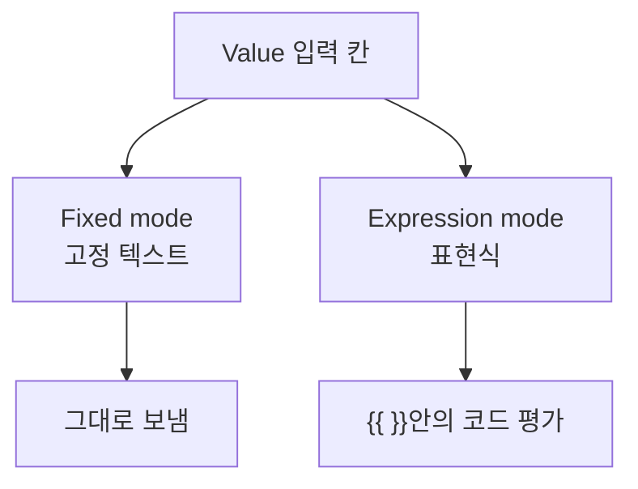

| 모드 | 표시 | 사용 |
|------|------|------|
| Fixed | 일반 텍스트 입력 | 정적 값 (App Key 등) |
| Expression | `fx` 아이콘 표시 | 동적 값 (토큰 등) |

`authorization` Value 칸 좌측의 **fx** 아이콘을 클릭하면 Expression mode로 전환됩니다. Expression mode 상태에서 위 표현식을 입력하세요. 정상 인식되면 입력 칸 아래에 **현재 평가된 결과**가 회색으로 미리 보입니다.

```
Bearer eyJ0eXAiOiJKV1QiLCJhbGciOiJIUzI1NiJ9...
```

#### 5.4.4 더 짧은 버전도 가능

다음 두 표현식은 **결과가 동일**합니다.

```
{{ $node["HTTP Request"].json["access_token"] }}
{{ $node["HTTP Request"].json.access_token }}
```

| 형태 | 특징 |
|------|------|
| `["access_token"]` | 키에 특수문자·공백이 있어도 안전 |
| `.access_token` | 짧고 읽기 좋음 |

본 강의는 가독성을 위해 **점 표기**(`.access_token`)를 권장합니다.

> ✅ **체크포인트 3-2**
> `authorization` 필드 아래에 `Bearer eyJ0eXAi...`로 시작하는 회색 미리보기가 표시되나요? 표시되면 표현식이 정상입니다.

### 5.5 나머지 5개 필드

#### 5.5.1 content-type

```
application/json; charset=utf-8
```

`;` 다음 공백 한 칸을 지우지 마세요. 문서 명시값 그대로입니다.

#### 5.5.2 appkey·appsecret

모듈 1에서 발급받은 값을 그대로 입력합니다. **Fixed mode**입니다.

#### 5.5.3 tr_id

| 환경 | 값 |
|------|-----|
| 🟢 실전 | `FHKST01010100` |
| 🟡 모의 | `FHKST01010100` |

> 💡 **현재가 조회는 환경 공통**
> 시세 조회 API의 TR ID는 실전·모의가 동일합니다. 모듈 4(기간별 시세)도 동일하지만, 주문·잔고 등 거래 API는 환경별로 다릅니다. 본 강의의 시세 조회 범위에서는 환경 간 TR ID 차이가 없습니다.

#### 5.5.4 custtype

| 값 | 의미 |
|----|------|
| `P` | 개인 (Personal) |
| `B` | 법인 (Business) |

본 강의는 개인 계좌 기준이므로 **P**입니다.

---

## 6. 노드 실행과 응답 해석

### 6.1 [Execute step] 클릭

설정이 모두 끝났으면 노드 패널 우측 상단의 **[Execute step]**을 클릭합니다.

### 6.2 정상 응답의 모양

OUTPUT의 **Schema** 탭에서 다음 구조를 확인할 수 있습니다.

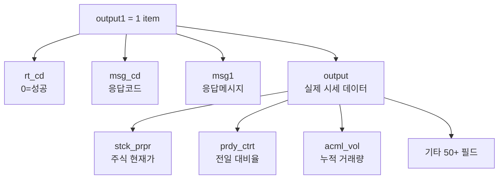

### 6.3 응답 필드가 너무 많아서 당황하지 마세요

응답에는 **50개 이상의 필드**가 있습니다. 모두 알 필요는 없습니다. 본 강의에서 사용하는 것은 다음 4개뿐입니다.

| 응답 필드 | 한글명 | 우리가 만들 이름 |
|-----------|--------|-------------------|
| `output.stck_shrn_iscd` | 종목 단축 코드 | 종목코드 |
| `output.stck_prpr` | 주식 현재가 | 현재가 |
| `output.prdy_ctrt` | 전일 대비율 | 등락률 |
| `output.acml_vol` | 누적 거래량 | 오늘거래량 |

### 6.4 응답 필드 이름 해독법

한투 API 응답 필드는 **약어**로 되어 있어 처음엔 어렵습니다. 패턴을 알면 추측할 수 있습니다.

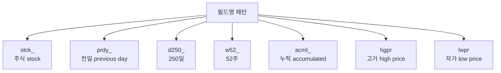

| 약어 | 뜻 |
|------|-----|
| `stck` | stock (주식) |
| `prpr` | present price (현재가) |
| `prdy` | previous day (전일) |
| `ctrt` | contract rate (등락률) |
| `acml` | accumulated (누적) |
| `vol` | volume (거래량) |
| `hgpr` | high price (고가) |
| `lwpr` | low price (저가) |
| `d250` | 250일 |
| `w52` | 52주 |

조합 예시:
- `stck_prpr` = stock present price = 현재가
- `prdy_ctrt` = previous day contract rate = 전일 대비 등락률
- `w52_hgpr` = 52주 고가
- `acml_vol` = 누적 거래량

응답 필드 이름이 외계어처럼 보였다면, 이 패턴을 한 번만 외워두면 됩니다.

### 6.5 응답에서 가장 자주 쓰는 필드들

| 필드 | 의미 | 단위 |
|------|------|------|
| `stck_prpr` | 현재가 | 원 |
| `prdy_vrss` | 전일 대비 (가격) | 원 |
| `prdy_vrss_sign` | 등락 부호 (1=상한, 2=상승, 3=보합, 4=하한, 5=하락) | - |
| `prdy_ctrt` | 전일 대비율 | % |
| `acml_vol` | 누적 거래량 | 주 |
| `acml_tr_pbmn` | 누적 거래 대금 | 원 |
| `stck_oprc` | 시가 | 원 |
| `stck_hgpr` | 당일 고가 | 원 |
| `stck_lwpr` | 당일 저가 | 원 |
| `per` | PER | 배 |
| `pbr` | PBR | 배 |
| `eps` | EPS | 원 |
| `bps` | BPS | 원 |

본 강의 범위 밖이지만, **PER·PBR·EPS·BPS**도 응답에 포함되어 있어 확장 분석에 활용 가능합니다.

### 6.6 검증 체크리스트

> ✅ **체크포인트 3-3**
> 다음 4가지가 모두 충족되면 호출이 정상입니다.
> - [ ] OUTPUT에 `output1`이 표시된다
> - [ ] `rt_cd` 값이 `0`이다 (성공)
> - [ ] `msg1` 값이 `정상처리되었습니다.` 류이다
> - [ ] `output.stck_prpr`에 현재가가 들어 있다

### 6.7 시간대에 따른 값 차이

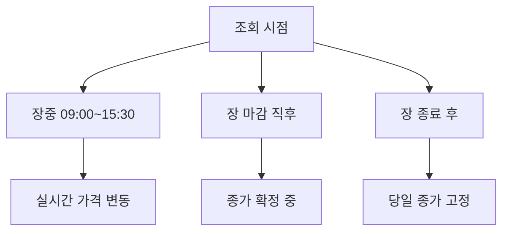

| 시점 | `stck_prpr`의 의미 |
|------|---------------------|
| 장중 | 마지막 체결가 (실시간 변동) |
| 장 마감 후 | 당일 종가 |
| 다음 날 장 시작 전 | 어제 종가 |

본 강의 워크플로는 16:00에 호출하므로 **당일 종가**를 받게 됩니다.

---

## 7. Edit Fields 노드 추가 — 응답 정제

### 7.1 왜 정제가 필요한가?

응답에 50개 이상의 필드가 있어 그대로 다음 노드로 흘려보내면 워크플로가 복잡해집니다. **필요한 5개만 골라 깔끔한 형태**로 만들어 다음 모듈에 넘깁니다.

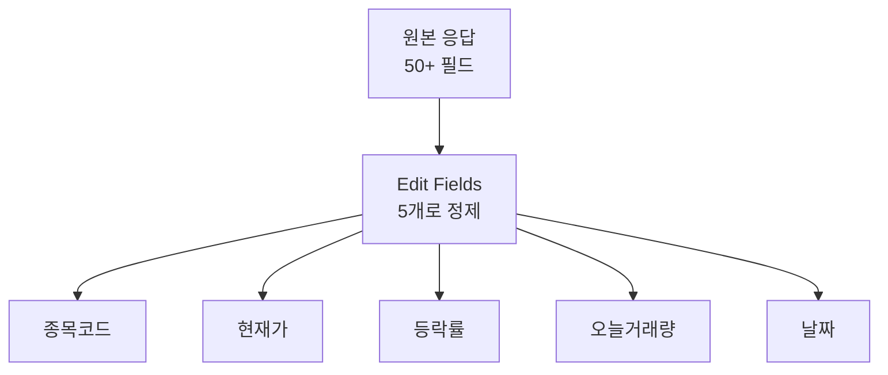

### 7.2 노드 추가

HTTP Request1 우측 **[+]** → 검색 `edit fields` → **[Edit Fields]** 선택. n8n 버전에 따라 **Set**이라는 이름일 수도 있습니다(같은 노드).

### 7.3 Mode 설정

| 필드 | 값 |
|------|-----|
| Mode | `Manual Mapping` |

### 7.4 [Add Field]로 5개 필드 만들기

각 필드는 **이름(Name)**, **타입(Type)**, **값(Value)** 3가지로 구성됩니다.

| # | Name | Type | Value (Expression) |
|---|------|------|---------------------|
| 1 | 종목코드 | `String` | `{{ $json.output.stck_shrn_iscd }}` |
| 2 | 현재가 | `Number` | `{{ $json.output.stck_prpr }}` |
| 3 | 등락률 | `Number` | `{{ $json.output.prdy_ctrt }}` |
| 4 | 오늘거래량 | `Number` | `{{ $json.output.acml_vol }}` |
| 5 | 날짜 | `String` | `{{ new Date().toISOString().slice(0, 10) }}` |

### 7.5 표현식 변형 — `$node` vs `$json`

지난 절(Header 설정)에서 `$node["HTTP Request"]`를 썼는데, 여기서는 `$json`만 씁니다. 차이는 다음과 같습니다.

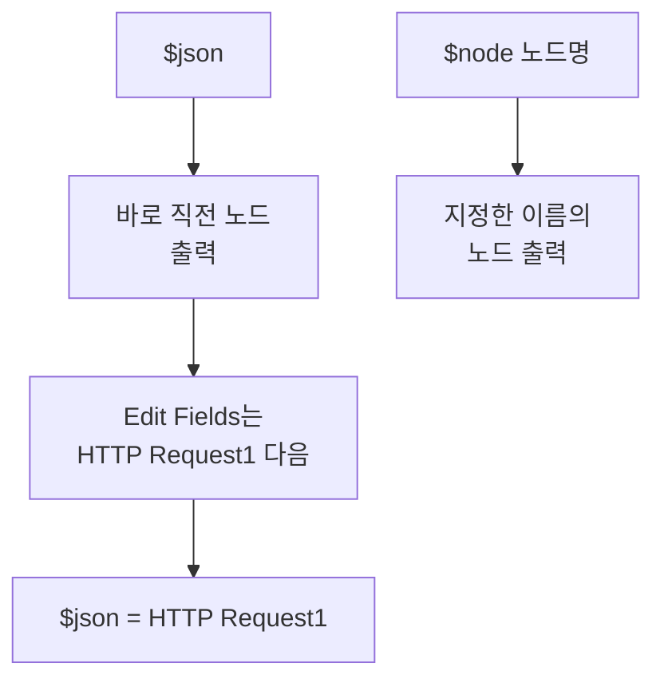

| 표현식 | 의미 | 사용 시점 |
|--------|------|-----------|
| `$json` | **바로 직전** 노드의 출력 | 일반적 |
| `$node["이름"]` | **특정 이름**의 노드 출력 | 직전이 아닌 다른 노드 참조 시 |

Edit Fields 노드의 직전 노드는 **HTTP Request1**(현재가 조회)이므로 `$json`은 그 출력을 가리킵니다.

> ⚠️ **함정 — 같은 표현식이 모듈 2 토큰을 가리키지 않습니다**
> 토큰을 참조하려면 직전이 아니므로 `$node["HTTP Request"]`를 써야 합니다. 본 모듈에서는 토큰 참조가 필요 없으므로 `$json`만 씁니다.

### 7.6 타입을 Number로 지정해야 하는 이유

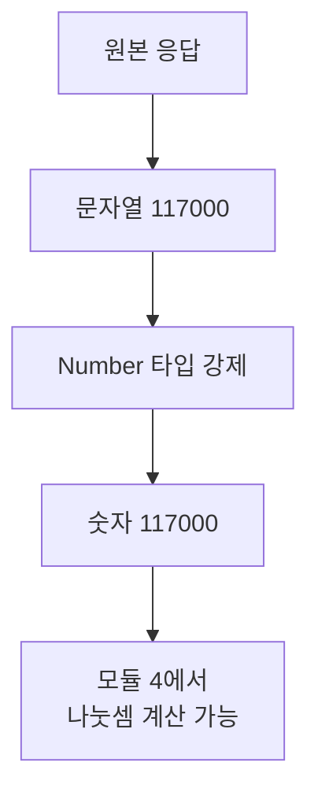

응답의 `stck_prpr`는 **문자열로 옵니다**(`"117000"`). 그대로 두면 다음 모듈에서 **나누기·곱하기 같은 산술 연산이 안 되거나** 문자열 결합으로 처리됩니다.

| 필드 | 타입 | 이유 |
|------|------|------|
| 종목코드 | String | `005930`의 앞 0이 보존되려면 문자열 |
| 현재가 | Number | 차후 비교·계산 |
| 등락률 | Number | 차후 비교·계산 |
| 오늘거래량 | Number | **모듈 4에서 평균거래량과 나눗셈** |
| 날짜 | String | `2026-05-03` 같은 텍스트 |

**오늘거래량을 Number로 지정하지 않으면 모듈 5의 거래량 비율 계산이 동작하지 않습니다.** 가장 자주 빠뜨리는 함정입니다.

### 7.7 날짜 표현식 풀이

```javascript
{{ new Date().toISOString().slice(0, 10) }}
```

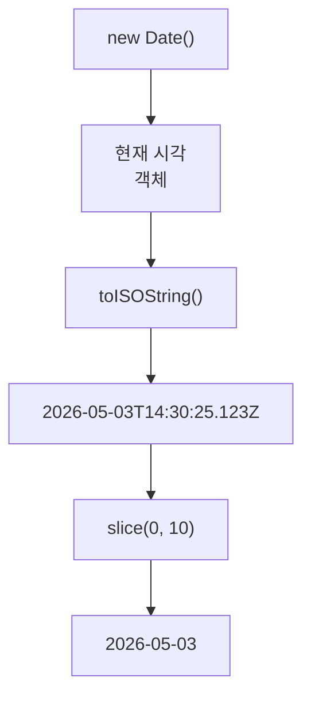

| 단계 | 결과 예시 |
|------|----------|
| `new Date()` | 현재 시각 객체 |
| `.toISOString()` | `2026-05-03T14:30:25.123Z` |
| `.slice(0, 10)` | `2026-05-03` |

**왜 ISO 문자열인가?** 정렬 가능하고, 나라마다 형식이 달라 혼란스러운 `5/3/26` 같은 표현 대신 표준 형식(`YYYY-MM-DD`)을 쓰기 위함입니다.

> ⚠️ **함정 — UTC 자정 부근**
> `toISOString()`은 **UTC 기준**입니다. 한국 시간 09:00 이전이면 UTC 기준 어제 날짜가 나올 수 있습니다. 본 강의 워크플로는 16:00 실행이라 문제없지만, 새벽에 수동 실행하면 어제 날짜가 잡힐 수 있습니다.

### 7.8 [Execute step] 후 결과

| 필드 | 예시 값 |
|------|---------|
| 종목코드 | `005930` |
| 현재가 | `117000` |
| 등락률 | `5.31` |
| 오늘거래량 | `34018174` |
| 날짜 | `2026-05-03` |

> ✅ **체크포인트 3-4**
> Edit Fields의 OUTPUT에 정확히 5개 필드가 표시되고, 현재가·등락률·오늘거래량 옆에 **#** 아이콘(Number 타입 표시)이 보이나요? 종목코드·날짜 옆은 **AB**(String) 아이콘이어야 합니다.

---

## 8. 워크플로 현재 상태

이 모듈을 완료하면 워크플로는 4개 노드입니다.

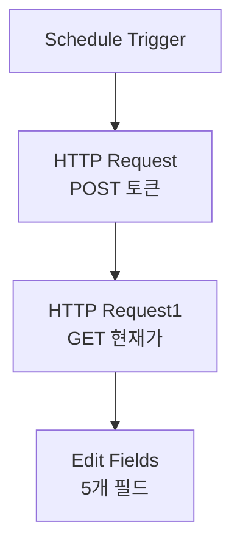

다음 모듈에서 Edit Fields 뒤에 **HTTP Request2**(기간별 시세 35일)와 **Code in JavaScript**(평균거래량 계산)를 붙입니다.

---

## 9. 다른 종목으로 바꿔보기 — 학습 도전

### 9.1 1분 도전

**Query Parameters의 `FID_INPUT_ISCD` 값만 바꾸고** [Execute step]을 다시 누르면 다른 종목 시세가 즉시 조회됩니다.

| 종목 | 코드 | 예상 현재가 (참고용) |
|------|------|----------------------|
| SK하이닉스 | `000660` | 시점에 따라 변동 |
| LG에너지솔루션 | `373220` | 시점에 따라 변동 |
| 카카오 | `035720` | 시점에 따라 변동 |
| 네이버 | `035420` | 시점에 따라 변동 |
| 셀트리온 | `068270` | 시점에 따라 변동 |

### 9.2 종목 코드 찾는 법

한국거래소 또는 증권사 HTS의 종목 검색에서 6자리 코드를 확인할 수 있습니다. 또는 `Q + 종목명` 검색으로 빠르게 찾을 수 있습니다.

> 💡 **검증 팁**
> 익숙한 종목으로 호출해보고, 응답의 현재가가 실제 시세(네이버 금융·다음 금융 등)와 일치하는지 확인하면 워크플로가 제대로 동작하는지 빠르게 검증할 수 있습니다.

---

## 10. 자주 발생하는 오류

| 증상 | 원인 | 해결 |
|------|------|------|
| `401 Unauthorized` | 토큰 누락·만료, Bearer 누락 | Header `authorization` 필드와 표현식 재확인 |
| `403 Forbidden` | App Key·Secret 헤더 누락 | appkey·appsecret 필드 추가 |
| `EGW00123` 응답 | tr_id 잘못됨 | `FHKST01010100` 정확히 입력 |
| `output`이 비어있음 | 종목코드 잘못 (0 누락 등) | 6자리 코드 확인 |
| Number 타입인데 NaN | 응답 필드 경로 오타 | `$json.output.stck_prpr` 경로 확인 |
| `날짜`가 어제로 나옴 | UTC 기준 자정 이전 실행 | 실제 운영 시간(16:00)에는 문제없음 |
| 종목코드가 `5930`으로 표시 | Number 타입으로 지정해 앞 0 손실 | String 타입으로 변경 |
| 표현식 미리보기에 `[Object: ...]` | 경로가 객체를 가리킴 | 마지막 키까지 다 적었는지 확인 |

### 10.1 401 발생 시 추가 체크

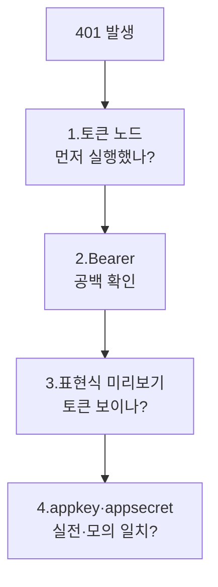

순서가 중요합니다. **HTTP Request 노드(토큰)를 먼저 실행하지 않으면 그 출력이 없으므로 표현식이 빈 값으로 평가**됩니다. 캔버스에서 한 번에 모두 실행하거나, 두 노드를 순차적으로 [Execute step] 하세요.

---

## 11. 30초 점검 — 모듈 4로 넘어갈 자격

| # | 체크 항목 | ✅/❌ |
|---|-----------|------|
| 3-1 | HTTP Request1 노드의 Method=GET, URL이 정확하다 | |
| 3-2 | Query Parameters에 시장 코드와 종목 코드를 입력했다 | |
| 3-3 | Headers에 6개 필수 항목을 모두 입력했다 | |
| 3-4 | `authorization` 표현식 미리보기에 `Bearer eyJ...`가 보인다 | |
| 3-5 | [Execute step] 후 OUTPUT에 `stck_prpr`가 표시된다 | |
| 3-6 | Edit Fields로 5개 필드(종목코드·현재가·등락률·오늘거래량·날짜)가 정제됐다 | |
| 3-7 | 현재가·등락률·오늘거래량은 Number, 종목코드·날짜는 String 타입이다 | |

---

## 12. 자주 묻는 질문

**Q1. 토큰 표현식을 `$node["HTTP Request"]` 대신 더 짧게 쓸 수 있나요?**
바로 직전 노드라면 `$json.access_token`도 가능합니다. 단 본 모듈에서 HTTP Request1의 직전은 토큰 노드이므로 `$json`이 작동하지만, 모듈 4에서는 직전이 Edit Fields가 되어 토큰을 참조하려면 반드시 `$node["HTTP Request"]`로 명시해야 합니다. 헷갈림을 피하려면 **토큰 참조는 항상 `$node["HTTP Request"]`로 통일**하는 것이 안전합니다.

**Q2. 응답 필드를 더 추가하고 싶어요. 예를 들어 PER도 받아오려면?**
Edit Fields에 새 필드 `PER`을 추가하고 Type=Number, Value=`{{ $json.output.per }}`로 입력하면 됩니다. 응답에는 PER·PBR·EPS·BPS·52주 고저가 등 다양한 정보가 이미 들어 있어 추가 호출 없이 활용 가능합니다.

**Q3. 매번 [Execute step]을 누르기 번거로워요.**
캔버스 우측 상단의 **[Execute Workflow]** 버튼을 누르면 트리거부터 끝까지 한 번에 실행됩니다. 다만 Schedule Trigger가 있는 워크플로는 수동 실행도 트리거에서 시작됩니다.

**Q4. 종목명도 응답에 있나요?**
직접적인 한글 종목명 필드는 없습니다. 대신 별도의 [상품기본조회] API를 호출하면 종목명을 받을 수 있습니다. 본 강의는 종목코드만 사용하지만, 실제 알림 메시지에는 한글명이 보이는 것이 좋아 모듈 6에서 다시 다룹니다.

**Q5. Number 타입인데 응답값이 너무 커서 정확도를 잃지 않나요?**
JavaScript의 Number는 약 9,007조까지 정수를 정확히 표현합니다. 거래량(수천만~수억)·금액(수십억)은 모두 안전 범위입니다.

**Q6. tr_id 표는 어디서 보나요?**
한투 개발자센터의 각 API 문서 페이지 상단에 명시되어 있습니다. 시세 API는 실전·모의가 같지만, 주문·잔고는 다릅니다. 의심스러우면 항상 문서에서 재확인하세요.

---

## 13. 다음 모듈 미리보기

**모듈 4 — 기간별 시세 + 평균거래량 계산**

다음 모듈에서는 **HTTP Request2**(기간별 시세 35일)와 **Code in JavaScript**(평균거래량 계산) 두 노드를 추가합니다. 동적 날짜 계산(오늘 기준 35일 전), output1과 output2의 차이, JavaScript 코드로 배열 처리하는 패턴을 학습합니다.

```mermaid
flowchart TD
    A[모듈 3<br/>현재가 정제 완료] --> B[모듈 4<br/>HTTP Request2]
    B --> C[GET 기간별 시세]
    C --> D[35일치 일봉 데이터]
    D --> E[Code in JavaScript]
    E --> F[최근 20일<br/>평균거래량]
```

준비가 되었다면 모듈 4로 이동하세요.


