# 모듈 4 — 기간별 시세 + 평균거래량 계산

> **이 모듈에서 할 일**
> 같은 종목의 **최근 35일치 일봉 데이터**를 조회하고, JavaScript 코드 노드로 **최근 20영업일의 평균 거래량**을 계산합니다. 이 평균값이 모듈 5에서 "오늘 거래량이 평소 대비 몇 배인가"를 판정하는 기준선이 됩니다.


<!-- INFOGRAPHIC -->
<div class="infographic-wrap">
  
  <p class="infographic-caption">기간별 시세에서 평균 거래량 계산</p>
</div>


---

## 0. 이 모듈의 흐름

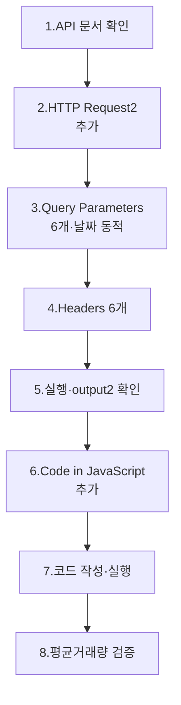

이번 모듈을 마치면 워크플로는 6개 노드가 됩니다.

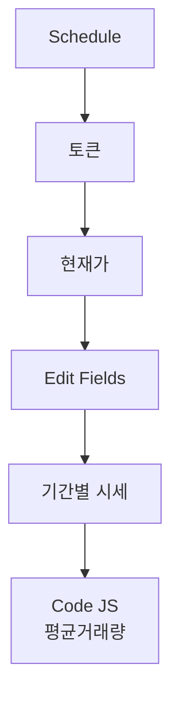

---

## 1. 왜 기간별 시세인가?

### 1.1 모듈 3에서 만든 것 vs 모듈 4에서 만들 것

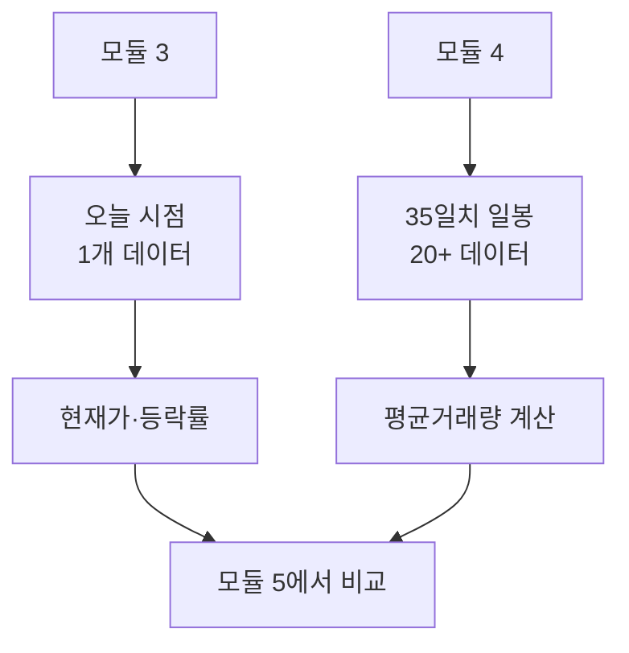

| 항목 | 모듈 3 | 모듈 4 |
|------|--------|--------|
| API | 주식현재가 시세 (`inquire-price`) | 국내주식기간별시세 (`inquire-daily-itemchartprice`) |
| 데이터 | 오늘 1개 시점 | 최근 35일치 일봉 |
| 사용처 | 오늘 거래량 확보 | 평소 거래량 평균 산출 |
| Method | GET | GET |
| 필수 헤더 | 6개 | 6개 |
| 필수 쿼리 | 2개 | **6개** |

### 1.2 평균거래량이 필요한 이유

거래량은 **종목마다 절대 규모가 다릅니다**. 삼성전자는 하루 수천만 주, 작은 종목은 수십만 주입니다. 절대값을 보고 "오늘 거래량이 많다·적다"를 판단할 수 없습니다.

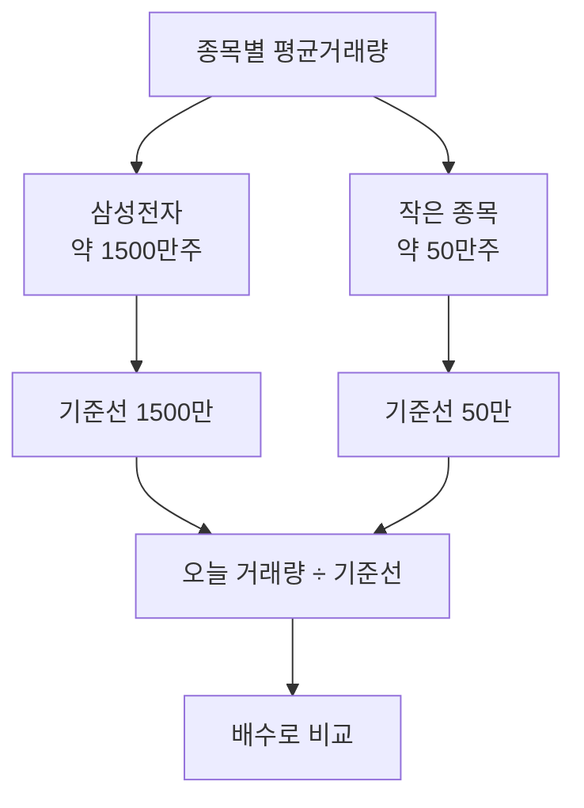

따라서 **각 종목의 평소 거래량을 기준선으로 잡고, 오늘 거래량이 그 몇 배인지**를 봅니다. 이 기준선이 평균거래량입니다.

### 1.3 왜 20영업일인가?

| 기간 | 의미 | 노이즈 |
|------|------|--------|
| 5영업일 | 1주 | 변동성 큼 |
| **20영업일** | **약 1개월** | **균형** |
| 60영업일 | 약 3개월 | 추세 변화 반영 늦음 |
| 250영업일 | 1년 | 장기 추세 |

20영업일은 **금융업계에서 가장 흔히 쓰는 단기 기준**입니다. 약 1개월의 거래 패턴을 반영하면서도 최근 트렌드를 놓치지 않는 길이입니다.

---

## 2. API 문서 확인

### 2.1 어디로 가나요?

> 🌐 한국투자 Open API 개발자센터: `apiportal.koreainvestment.com`

```
[API 문서] → [국내주식] 기본시세 → [국내주식기간별시세(일/주/월/년)]
```

문서 코드는 `v1_국내주식-016`입니다.

### 2.2 핵심 정보 확인

| 항목 | 값 |
|------|-----|
| Method | `GET` |
| 경로 | `/uapi/domestic-stock/v1/quotations/inquire-daily-itemchartprice` |
| TR ID | `FHKST03010100` (실전·모의 공통) |
| 한 번에 조회 가능 건수 | 최대 100건 |

전체 URL은 환경에 따라 도메인·포트만 다릅니다.

| 환경 | 전체 URL |
|------|----------|
| 🟢 **실전** | `https://openapi.koreainvestment.com:9443/uapi/domestic-stock/v1/quotations/inquire-daily-itemchartprice` |
| 🟡 **모의** | `https://openapivts.koreainvestment.com:29443/uapi/domestic-stock/v1/quotations/inquire-daily-itemchartprice` |

> 💡 **모듈 3과 다른 점**
> - URL 끝이 `inquire-price` → `inquire-daily-itemchartprice`로 길어짐
> - TR ID가 `FHKST01010100` → `FHKST03010100`으로 바뀜

> ⚠️ **함정 — TR ID 그대로 두기**
> 모듈 3의 노드를 복사해 만들고 싶을 수 있는데, 그러면 TR ID를 잊고 그대로 둘 위험이 있습니다. **반드시 새 노드로 만들어** 처음부터 입력하는 것이 안전합니다.

---

## 3. HTTP Request2 노드 추가

### 3.1 어디에 추가하나요?

캔버스에서 **Edit Fields** 노드 우측 **[+]** 아이콘을 클릭합니다.

```
검색창에 "http" 입력 → [HTTP Request] 선택
```

n8n이 자동으로 노드 이름을 **HTTP Request2**로 부여합니다.

### 3.2 워크플로 위치

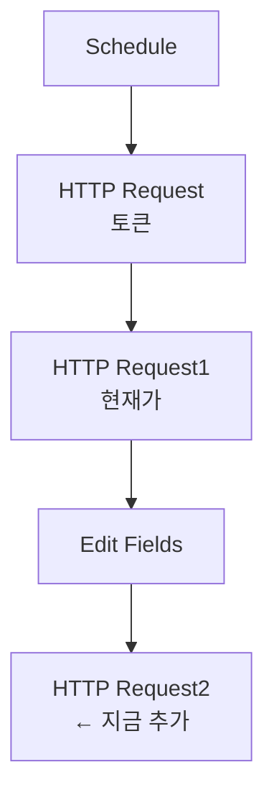

### 3.3 Method와 URL

| 필드 | 값 |
|------|-----|
| Method | `GET` |
| Authentication | `None` |

URL은 본인 환경에 맞게 입력합니다(2.2 절의 표 참고).

| 환경 | URL |
|------|-----|
| 🟢 **실전** | `https://openapi.koreainvestment.com:9443/uapi/domestic-stock/v1/quotations/inquire-daily-itemchartprice` |
| 🟡 **모의** | `https://openapivts.koreainvestment.com:29443/uapi/domestic-stock/v1/quotations/inquire-daily-itemchartprice` |

---

## 4. Query Parameters 설정 — 6개 필드

### 4.1 Send Query Parameters 토글 ON

| 필드 | 값 |
|------|-----|
| Send Query Parameters | ON |
| Specify Query Parameters | `Using Fields Below` |

### 4.2 [Add Parameter]로 6개 필드 만들기

| # | Name | Value | 설명 |
|---|------|-------|------|
| 1 | `FID_COND_MRKT_DIV_CODE` | `J` | 시장 분류 (KRX) |
| 2 | `FID_INPUT_ISCD` | `005930` | 종목코드 |
| 3 | `FID_INPUT_DATE_1` | (35일 전 동적) | 시작일자 (YYYYMMDD) |
| 4 | `FID_INPUT_DATE_2` | (오늘 동적) | 종료일자 (YYYYMMDD) |
| 5 | `FID_PERIOD_DIV_CODE` | `D` | 기간 분류 (일봉) |
| 6 | `FID_ORG_ADJ_PRC` | `0` | 0=수정주가, 1=원주가 |

### 4.3 FID_PERIOD_DIV_CODE — 기간 분류

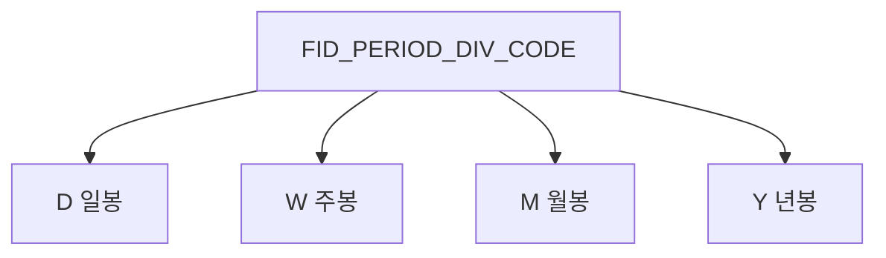

| 값 | 의미 |
|----|------|
| `D` | 일봉 (Daily) — **본 강의 사용** |
| `W` | 주봉 (Weekly) |
| `M` | 월봉 (Monthly) |
| `Y` | 년봉 (Yearly) |

평균거래량을 일별 평균으로 계산할 것이므로 **D**입니다.

### 4.4 FID_ORG_ADJ_PRC — 수정주가 여부

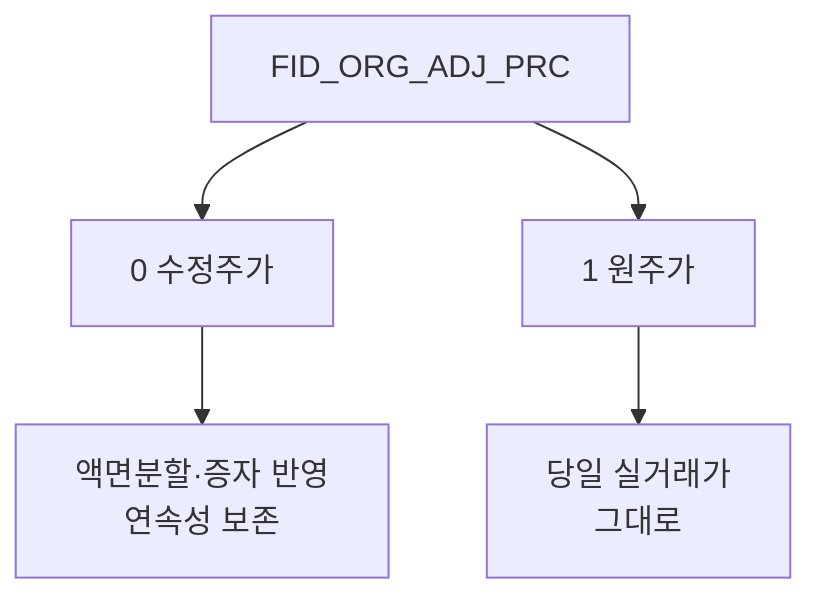

| 값 | 의미 | 사용 시점 |
|----|------|-----------|
| `0` | 수정주가 | **시계열 분석용 (기본)** |
| `1` | 원주가 | 그날의 실거래가만 보고 싶을 때 |

> 💡 **수정주가란?**
> 액면분할·무상증자·주식병합 등이 발생하면 가격이 갑자기 점프합니다. 수정주가는 이런 이벤트 이전 가격을 보정해 **연속된 시계열로** 만든 값입니다. 평균·차트·비교 분석에는 항상 수정주가(`0`)를 씁니다.

본 강의는 **거래량** 평균만 계산하므로 사실 어느 쪽이든 결과가 비슷하지만, 향후 가격 분석으로 확장할 때를 대비해 `0`을 표준으로 둡니다.

### 4.5 동적 날짜 표현식 — FID_INPUT_DATE_1 (시작일)

이 부분이 본 모듈에서 새로 등장하는 **표현식 응용편**입니다.

#### 4.5.1 입력해야 할 정확한 표현식

```javascript
{{
  (() => {
    const d = new Date();
    d.setDate(d.getDate() - 35);
    return d.toISOString().slice(0,10).replaceAll('-', '');
  })()
}}
```

> ⚠️ **n8n 표현식 입력 시 주의**
> 위 코드를 **줄바꿈 없이 한 줄로** 입력해도 됩니다(가독성을 위해 줄바꿈한 형태). 입력 칸 좌측의 **fx** 아이콘을 클릭해 **Expression mode**로 전환한 뒤 붙여넣으세요.

#### 4.5.2 코드 라인별 해설

| 라인 | 코드 | 설명 |
|------|------|------|
| 1 | `(() => { ... })()` | 즉시 실행 화살표 함수. 함수를 만들자마자 호출 |
| 2 | `const d = new Date();` | 현재 시각을 d에 저장 |
| 3 | `d.setDate(d.getDate() - 35);` | d의 날짜를 35일 전으로 변경 |
| 4 | `return d.toISOString().slice(0,10).replaceAll('-', '');` | `2026-03-29` → `20260329`로 변환 후 반환 |

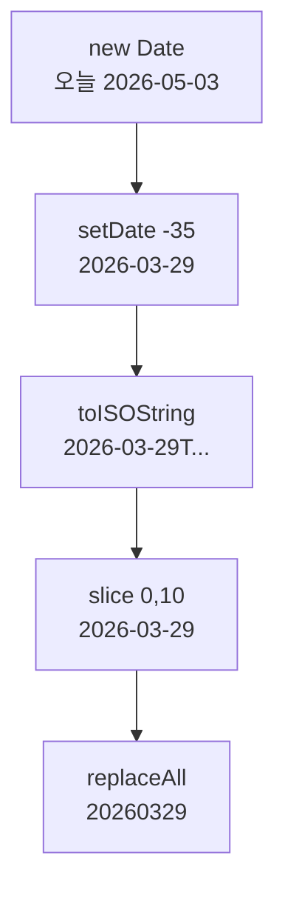

#### 4.5.3 왜 즉시 실행 함수가 필요한가?

n8n 표현식 `{{ }}` 안은 **단일 표현식**만 평가됩니다. 여러 줄의 코드(변수 선언·연산·반환)를 쓰려면 **함수 안에 넣고 즉시 호출**하는 패턴이 필요합니다.

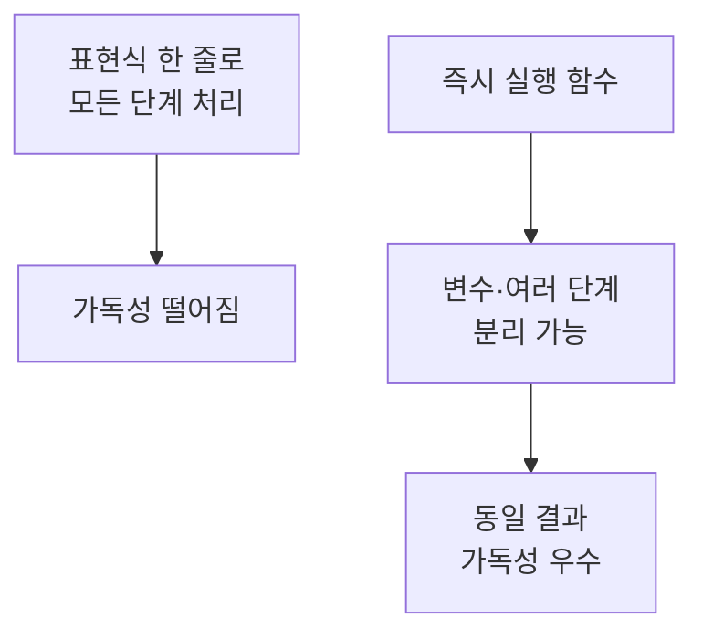

대안 — 한 줄로 작성:

```javascript
{{ new Date(Date.now() - 35*24*60*60*1000).toISOString().slice(0,10).replaceAll('-','') }}
```

같은 결과지만 가독성이 떨어집니다. 본 강의는 즉시 실행 함수 패턴을 권장합니다.

#### 4.5.4 왜 35일 전인가?

이미 모듈 0~3에서 잠깐 다뤘지만, 다시 정리합니다.

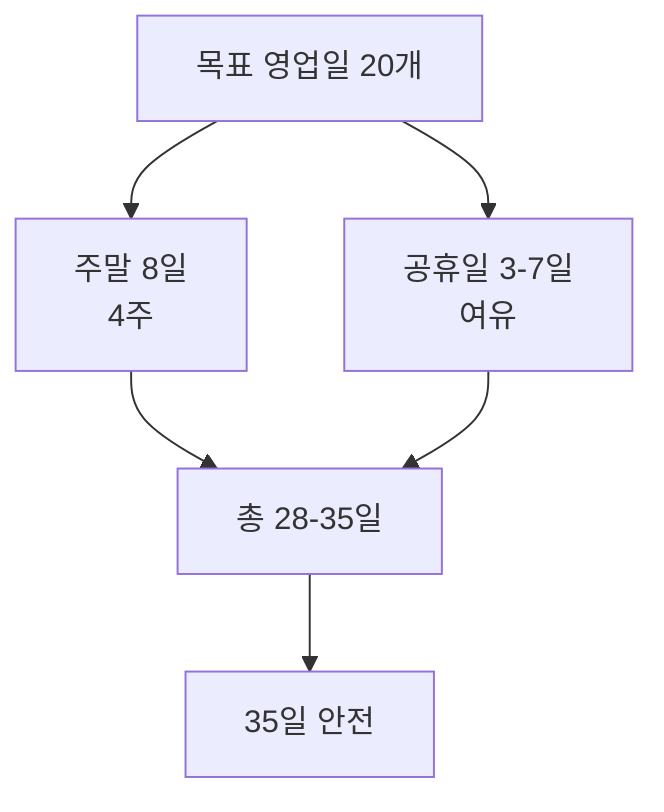

| 가정 | 일수 |
|------|------|
| 영업일 20일 확보 목표 | 20일 |
| 주말 8일 (4주 × 2일) | +8일 |
| 공휴일 여유 (설·추석 등) | +5~7일 |
| **합계** | **약 33~35일** |

35일이면 어떤 시점에 호출해도 **20영업일 확보가 거의 보장**됩니다. 너무 길게 잡으면 응답 데이터가 불필요하게 커지고, 너무 짧으면 영업일 부족으로 평균 계산이 부정확해집니다.

### 4.6 동적 날짜 표현식 — FID_INPUT_DATE_2 (종료일)

#### 4.6.1 입력 표현식

```javascript
{{ new Date().toISOString().slice(0,10).replaceAll('-', '') }}
```

오늘 날짜를 `YYYYMMDD` 형식으로 변환합니다. 즉시 실행 함수가 필요 없으니 한 줄로 끝납니다.

#### 4.6.2 라인 해설

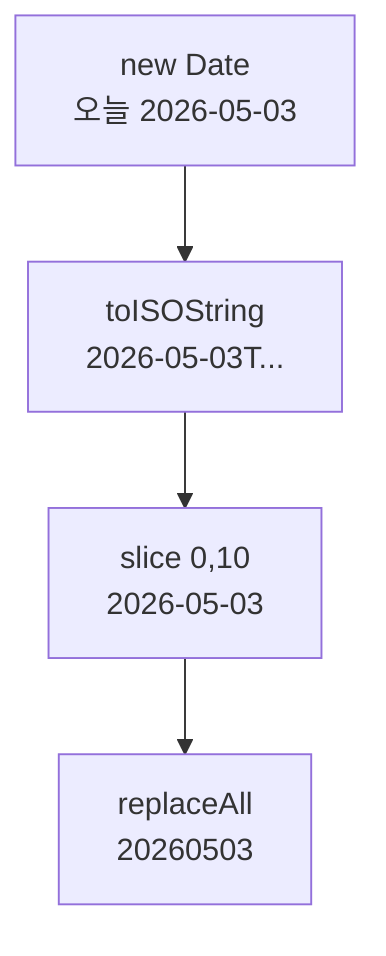

| 단계 | 결과 |
|------|------|
| `new Date()` | 현재 시각 객체 |
| `.toISOString()` | `2026-05-03T14:30:25.123Z` |
| `.slice(0,10)` | `2026-05-03` |
| `.replaceAll('-', '')` | `20260503` |

> ⚠️ **함정 — 한투 API의 날짜 형식**
> 일반적으로 `YYYY-MM-DD` 표기가 표준이지만, 한투 API는 **하이픈 없는 8자리 숫자**(`YYYYMMDD`)를 요구합니다. `replaceAll('-', '')`로 하이픈을 제거하는 단계가 필수입니다.

> ✅ **체크포인트 4-1**
> Query Parameters에 6개 필드가 모두 채워졌고, FID_INPUT_DATE_1·DATE_2의 표현식 미리보기에 8자리 숫자(예: `20260329`, `20260503`)가 표시되나요?

---

## 5. Headers 설정 — 6개 필드

### 5.1 Send Headers 토글 ON

| 필드 | 값 |
|------|-----|
| Send Headers | ON |
| Specify Headers | `Using Fields Below` |

### 5.2 [Add Parameter]로 6개 필드 만들기

내용은 모듈 3 Headers와 거의 동일합니다. **단 한 가지, `tr_id`만 다릅니다.**

| # | Name | Value | 비고 |
|---|------|-------|------|
| 1 | `content-type` | `application/json; charset=utf-8` | 그대로 |
| 2 | `authorization` | `Bearer {{ $node["HTTP Request"].json.access_token }}` | 그대로 |
| 3 | `appkey` | (App Key) | 그대로 |
| 4 | `appsecret` | (App Secret) | 그대로 |
| 5 | `tr_id` | **`FHKST03010100`** | **모듈 3과 다름** |
| 6 | `custtype` | `P` | 그대로 |

### 5.3 토큰 표현식의 미묘한 차이

모듈 3에서 `authorization` 표현식의 직전 노드는 **HTTP Request**(토큰)였습니다. 하지만 모듈 4에서 HTTP Request2의 직전은 **Edit Fields**입니다.

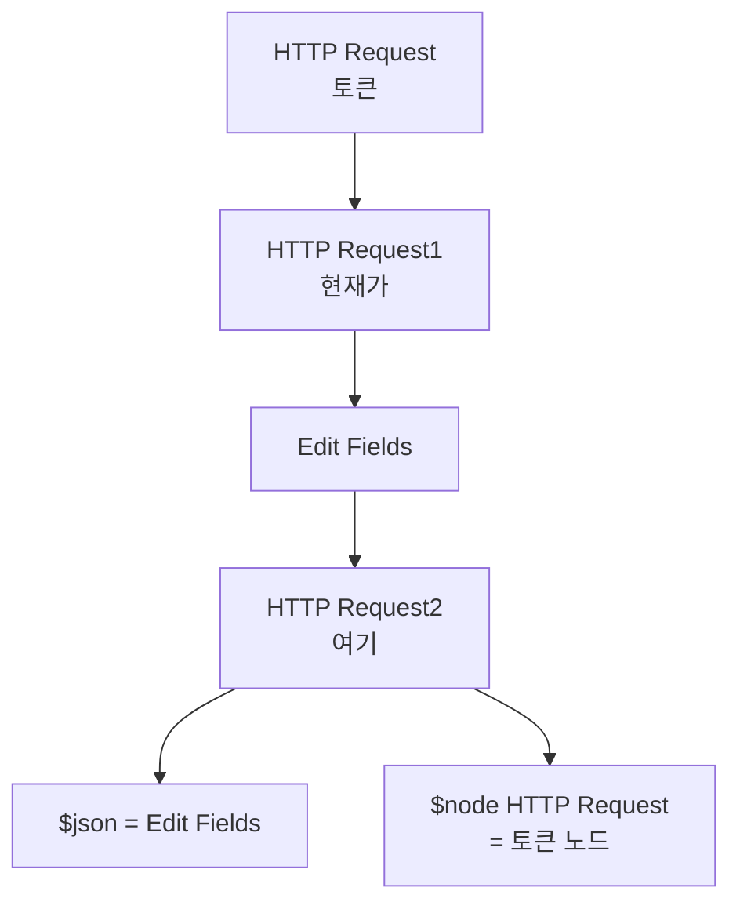

| 표현식 | Edit Fields 직후에서의 평가 |
|--------|---------------------------|
| `{{ $json.access_token }}` | ❌ Edit Fields에 access_token 없음 |
| `{{ $node["HTTP Request"].json.access_token }}` | ✅ 토큰 노드의 출력 참조 |

> ⚠️ **함정 — `$json` 사용 금지**
> 모듈 3에서 무심코 `{{ $json.access_token }}`을 썼다면 우연히 작동했을 겁니다(직전이 토큰 노드였으니까). 모듈 4부터는 **반드시 `$node["HTTP Request"]`로 노드 이름 명시**해야 합니다.

> 💡 **권장 패턴**
> 토큰 참조는 항상 `$node["HTTP Request"].json.access_token`으로 통일하세요. 이렇게 하면 노드 위치가 어떻게 바뀌어도 일관되게 동작합니다.

> ✅ **체크포인트 4-2**
> `authorization` 표현식 미리보기에 `Bearer eyJ0eXAi...`가 보이나요?

---

## 6. 노드 실행과 응답 해석 — output1 vs output2

### 6.1 [Execute step] 클릭

OUTPUT 패널의 **Schema** 탭을 확인합니다. 모듈 3과는 사뭇 다른 구조가 보입니다.

### 6.2 응답의 두 갈래 — output1 / output2

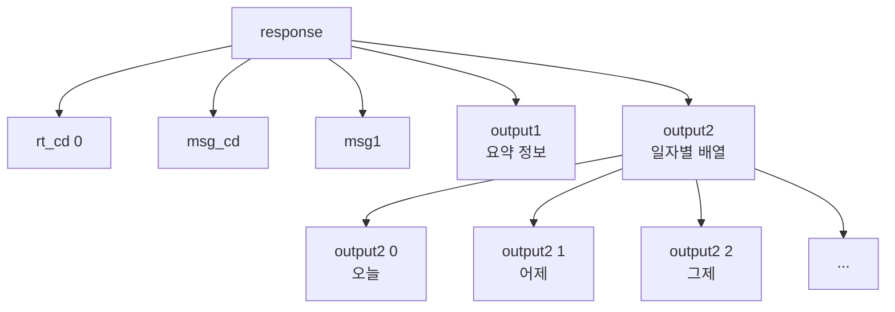

| 영역 | 내용 |
|------|------|
| `output1` | **종합 요약** — 종목명, 상장 주식 수, 시가총액 등 (1개 객체) |
| `output2` | **일자별 시세 배열** — 35일치 일봉 데이터 (배열) |

### 6.3 output2 한 항목의 구조

`output2[0]`을 펼치면 다음 필드들이 보입니다.

| 필드 | 의미 |
|------|------|
| `stck_bsop_date` | 영업일자 (YYYYMMDD) |
| `stck_clpr` | 종가 (close price) |
| `stck_oprc` | 시가 (open price) |
| `stck_hgpr` | 고가 (high) |
| `stck_lwpr` | 저가 (low) |
| `acml_vol` | 누적 거래량 ← **이걸 사용** |
| `acml_tr_pbmn` | 누적 거래 대금 |
| `flng_cls_code` | 락 구분 (액면분할 등) |
| `prtt_rate` | 분할 비율 |

### 6.4 왜 두 갈래로 나뉘는가?

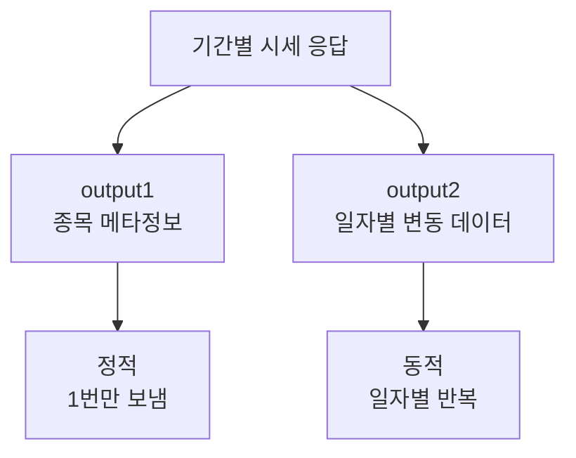

종목 정보(상장 주식 수 등)는 매일 동일하므로 한 번만 보내고, 일별 변동 데이터(시고저종·거래량)는 배열로 보내는 효율적 설계입니다.

### 6.5 검증 체크리스트

> ✅ **체크포인트 4-3**
> - [ ] OUTPUT에 `output1`과 `output2`가 모두 표시된다
> - [ ] `output2`를 펼치면 `output2[0]`, `output2[1]`, ... 식으로 항목이 여러 개 보인다
> - [ ] `output2[0]`의 `stck_bsop_date`가 오늘 또는 직전 영업일인가
> - [ ] `output2[0].acml_vol`에 거래량이 들어 있다

### 6.6 항목 수가 20개 미만이면?

다음을 점검합니다.

| 증상 | 원인 | 해결 |
|------|------|------|
| output2가 10개 미만 | 시작일자가 너무 가까움 | -35 → -40으로 늘리기 |
| output2가 비어있음 | 시작일자가 종료일자보다 미래 | 표현식 부호 확인 |
| 항목은 있지만 acml_vol이 0 | 정지 종목 | 다른 종목 시도 |

---

## 7. Code in JavaScript 노드 추가

### 7.1 왜 코드 노드가 필요한가?

지금까지의 노드(Edit Fields, 표현식)는 **단일 값을 가공**하는 데 적합합니다. 하지만 평균거래량 계산은 다음을 해야 합니다.

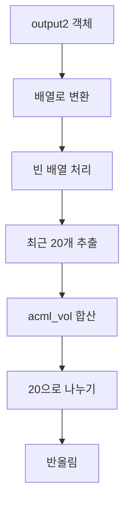

이런 다단계 처리는 표현식 한 줄로 어렵습니다. **JavaScript 코드로 풀어쓰는 것이 가장 명확**합니다.

### 7.2 노드 추가

HTTP Request2 우측 **[+]** → 검색 `code` → **[Code]** 또는 **[Code in JavaScript]** 선택.

n8n 버전에 따라 이름이 다를 수 있습니다. JavaScript를 지원하는 코드 노드면 모두 가능합니다.

### 7.3 워크플로 위치

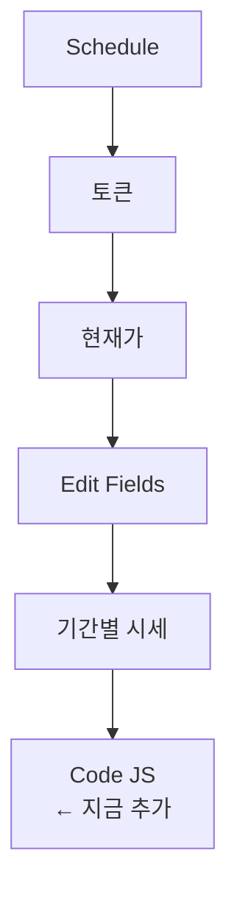

### 7.4 Mode 설정

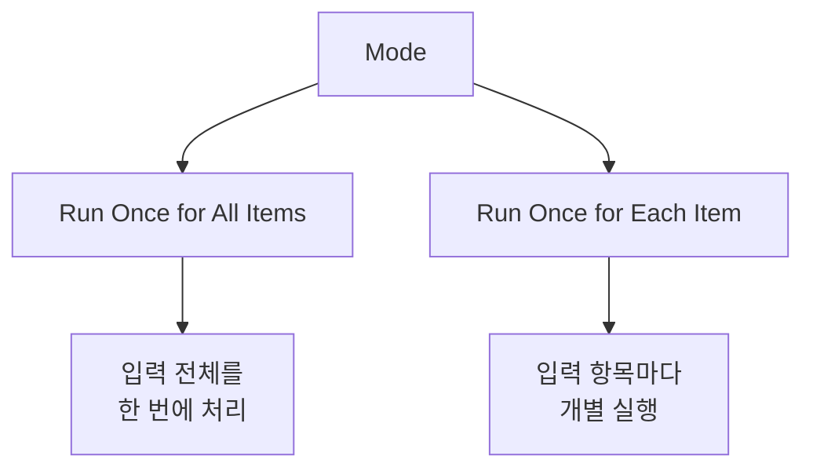

| Mode | 동작 | 본 강의 |
|------|------|---------|
| Run Once for All Items | 입력 전체를 한 번에 처리. `$json`은 첫 번째 항목 | ✅ |
| Run Once for Each Item | 입력 항목별로 코드 반복 실행 | ❌ |

| 필드 | 값 |
|------|-----|
| Mode | `Run Once for All Items` |
| Language | `JavaScript` |

> 💡 **왜 All Items인가?**
> 본 워크플로는 종목 1개를 모니터링하므로 입력 항목이 1개입니다. 어느 모드든 결과가 같지만, **All Items가 표준이고 다종목 확장 시에도 코드 변경이 적습니다.**

---

## 8. JavaScript 코드 작성

### 8.1 전체 코드

JavaScript 입력 칸에 다음을 그대로 입력합니다.

```javascript
// 1. output2를 배열로 변환
const rows = Object.values($json.output2 || {});

// 2. 데이터 없으면 null 반환
if (rows.length === 0) {
  return {
    ...$json,
    평균거래량: null,
  };
}

// 3. 최근 20개만 추출
const recent = rows.slice(0, 20);

// 4. 평균 거래량 계산
const avgVolume =
  recent.reduce((sum, item) => sum + Number(item.acml_vol), 0) /
  recent.length;

// 5. 결과 반환
return {
  ...$json,
  평균거래량: Math.round(avgVolume),
};
```

### 8.2 단계별 해설

#### 8.2.1 Step 1 — 배열로 변환

```javascript
const rows = Object.values($json.output2 || {});
```

| 부분 | 의미 |
|------|------|
| `$json.output2` | 직전 노드(HTTP Request2) 출력의 output2 |
| `\|\| {}` | output2가 없으면 빈 객체 사용 (안전장치) |
| `Object.values(...)` | 객체의 값들만 배열로 추출 |
| `rows` | 일자별 데이터의 배열 |

> 🤔 **왜 `Object.values`인가?**
> n8n 응답에서 output2는 종종 `{0: ..., 1: ..., 2: ...}` 형태의 **숫자 키 객체**로 오기도 하고, **순수 배열** `[...]`로 오기도 합니다. `Object.values()`를 쓰면 둘 다 안전하게 배열로 변환됩니다.

#### 8.2.2 Step 2 — 빈 데이터 안전장치

```javascript
if (rows.length === 0) {
  return {
    ...$json,
    평균거래량: null,
  };
}
```

| 부분 | 의미 |
|------|------|
| `rows.length === 0` | 배열이 비어있음 (응답 실패 등) |
| `...$json` | 직전 노드의 모든 필드를 그대로 유지 (전개 연산자) |
| `평균거래량: null` | 계산 불가를 명시 |
| `return` | 함수 종료 |

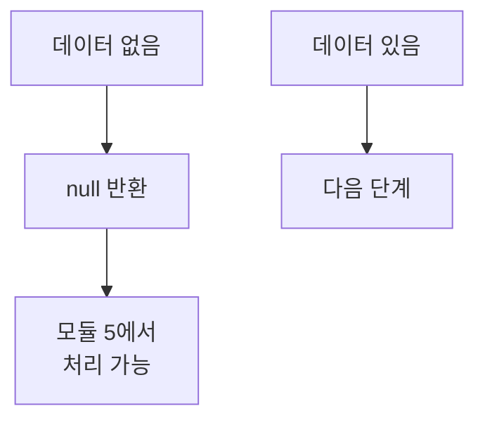

> 💡 **왜 안전장치가 필요한가?**
> API 호출이 실패해 output2가 비어 와도 워크플로가 멈추지 않게 하기 위함입니다. null이 들어가면 모듈 5의 IF 조건에서 자연스럽게 false 분기로 빠집니다.

#### 8.2.3 Step 3 — 최근 20개 추출

```javascript
const recent = rows.slice(0, 20);
```

| 부분 | 의미 |
|------|------|
| `slice(0, 20)` | 0번째부터 19번째까지 (최대 20개) |
| `recent` | 최근 20개의 배열 |

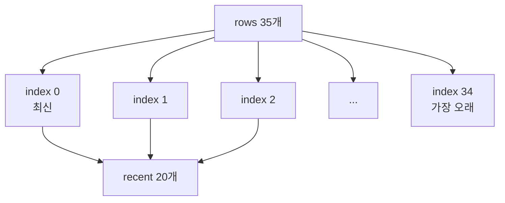

> 💡 **순서 주의**
> 한투 API의 output2는 **최신 데이터가 0번 인덱스**에 옵니다. `slice(0, 20)`은 최신 20개를 가져오는 동작입니다. 만약 거꾸로 정렬되어 온다면 `slice(-20)`을 써야 합니다(본 강의는 한투 표준 동작 기준).

#### 8.2.4 Step 4 — 평균 계산

```javascript
const avgVolume =
  recent.reduce((sum, item) => sum + Number(item.acml_vol), 0) /
  recent.length;
```

| 부분 | 의미 |
|------|------|
| `reduce((sum, item) => ..., 0)` | 누적 합계 계산. 초기값 0 |
| `Number(item.acml_vol)` | 응답이 문자열이라 숫자로 변환 |
| `/ recent.length` | 항목 수로 나눠 평균 |

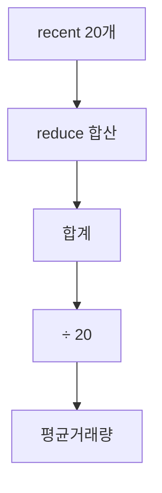

> ⚠️ **함정 — `Number()` 변환 누락**
> `acml_vol`은 응답에서 **문자열**로 옵니다(`"15234567"`). 변환하지 않고 더하면 문자열이 이어붙어 `"1523456710234567..."` 같은 결과가 나옵니다. 반드시 `Number()`로 감쌉니다.

#### 8.2.5 Step 5 — 결과 반환

```javascript
return {
  ...$json,
  평균거래량: Math.round(avgVolume),
};
```

| 부분 | 의미 |
|------|------|
| `...$json` | 직전 노드의 모든 필드 유지 (output1, output2 포함) |
| `평균거래량` | 새로 추가하는 한글 필드 |
| `Math.round(avgVolume)` | 소수점 반올림 → 정수 |

> 💡 **왜 모든 필드를 유지하는가?**
> 모듈 5의 IF 노드는 직전 노드의 데이터를 본다. 만약 `평균거래량`만 반환하면 다른 필드(output 등)가 사라져 모듈 5에서 참조할 수 없게 됩니다.

### 8.3 코드 한 줄 요약

> 한 줄로 표현하면: "**output2를 배열로 만들어, 빈 배열이 아니면 최근 20개의 acml_vol 평균을 평균거래량 필드로 추가**"

---

## 9. 코드 노드 실행과 검증

### 9.1 [Execute step] 클릭

### 9.2 OUTPUT 확인

응답값이 모듈 4 시작 전과 거의 같아 보일 수 있습니다. **output1·output2를 숨기면** 가장 마지막에 `평균거래량` 필드가 추가된 것을 볼 수 있습니다.

```mermaid
flowchart TD
    A[OUTPUT] --> B[output1<br/>그대로]
    A --> C[output2<br/>그대로]
    A --> D[rt_cd, msg_cd, msg1<br/>그대로]
    A --> E[평균거래량<br/>← 새로 추가]
```

| 필드 | 값 예시 |
|------|---------|
| 평균거래량 | `18244898` |

### 9.3 값의 합리성 점검

평균거래량이 합리적인지 종목별로 확인합니다.

| 종목 | 정상 범위 (참고) |
|------|------------------|
| 삼성전자 (005930) | 약 1,000만~3,000만 |
| SK하이닉스 (000660) | 약 200만~500만 |
| 카카오 (035720) | 약 100만~300만 |

> ⚠️ **함정 — 결과가 0 또는 NaN**
> - 0이면: 종목이 거래 정지 중이거나 코드 오타
> - NaN이면: `Number()` 변환 누락 또는 `acml_vol` 필드명 오타

> ✅ **체크포인트 4-4**
> Code 노드 OUTPUT에 `평균거래량` 필드가 추가되었고, 정수 값이 표시되나요?

---

## 10. 워크플로 현재 상태

이 모듈을 완료하면 워크플로는 6개 노드입니다.

```mermaid
flowchart TD
    A[Schedule] --> B[HTTP Request<br/>토큰]
    B --> C[HTTP Request1<br/>현재가]
    C --> D[Edit Fields<br/>5개 필드]
    D --> E[HTTP Request2<br/>기간별 35일]
    E --> F[Code JS<br/>평균거래량]
```

다음 모듈에서 이 뒤에 **Edit Fields1**(거래량 비율 계산)와 **IF**(분기)를 붙입니다.

---

## 11. 자주 발생하는 오류

| 증상 | 원인 | 해결 |
|------|------|------|
| `400 Bad Request` | 시작일자가 종료일자보다 큼 | DATE_1, DATE_2 표현식 부호·순서 확인 |
| output2가 비어있음 | 너무 가까운 날짜 또는 종목 정지 | -35 유지, 다른 종목 시도 |
| `평균거래량: null` | output2 비어옴 (정상 안전장치 동작) | 위 항목 점검 |
| `평균거래량: NaN` | Number 변환 누락 | `Number(item.acml_vol)` 확인 |
| 평균이 비정상적으로 큼 | 문자열 결합 발생 | Number 변환 누락 |
| `Cannot read properties of undefined` | output2 경로 오타 | `$json.output2` 정확히 |
| 코드는 실행되나 평균거래량이 노출되지 않음 | `...$json` 누락 또는 위치 오류 | return 객체 구조 확인 |

### 11.1 디버깅 팁 — `console.log()` 활용

코드 중간에 다음을 넣으면 n8n 실행 로그(브라우저 콘솔)에서 값을 확인할 수 있습니다.

```javascript
console.log("rows length:", rows.length);
console.log("first row:", rows[0]);
console.log("avgVolume:", avgVolume);
```

문제 진단이 끝나면 콘솔 로그는 제거하세요.

---

## 12. 30초 점검 — 모듈 5로 넘어갈 자격

| # | 체크 항목 | ✅/❌ |
|---|-----------|------|
| 4-1 | HTTP Request2의 6개 Query Parameters를 모두 입력했다 | |
| 4-2 | DATE_1·DATE_2 표현식 미리보기에 8자리 숫자가 보인다 | |
| 4-3 | tr_id에 `FHKST03010100`을 입력했다 (모듈 3과 다른 값) | |
| 4-4 | OUTPUT에 output1과 output2 두 영역이 모두 보인다 | |
| 4-5 | output2 항목이 20개 이상이다 | |
| 4-6 | Code 노드의 Mode가 `Run Once for All Items`이다 | |
| 4-7 | Code 실행 후 OUTPUT에 `평균거래량` 정수가 추가됐다 | |

---

## 13. 자주 묻는 질문

**Q1. 35일 대신 60일·90일을 쓰면 안 되나요?**
가능합니다. `setDate(d.getDate() - 60)`처럼 숫자만 바꾸면 됩니다. 다만 한투 API는 한 번에 **최대 100건**까지만 반환하므로 100일을 넘기지 마세요.

**Q2. 평균이 아니라 중앙값을 쓰고 싶어요.**
배열을 정렬한 뒤 중간 값을 가져오면 됩니다.
```javascript
const sorted = recent.map(r => Number(r.acml_vol)).sort((a,b) => a-b);
const median = sorted[Math.floor(sorted.length / 2)];
```
중앙값은 거래량 폭발일이 평균을 끌어올리는 효과를 완화해 더 안정적인 기준선을 줍니다.

**Q3. 거래량뿐 아니라 종가 평균(이동평균선)도 같이 계산하려면?**
같은 reduce 패턴을 종가에도 적용하면 됩니다.
```javascript
const avgClose = recent.reduce((s, i) => s + Number(i.stck_clpr), 0) / recent.length;
return { ...$json, 평균거래량: Math.round(avgVolume), 평균종가: Math.round(avgClose) };
```
이렇게 하면 모듈 5에서 "거래량 + 종가 이격" 같은 복합 조건도 만들 수 있습니다.

**Q4. n8n 표현식과 Code 노드는 어떻게 다른가요?**
표현식 `{{ }}`은 단일 값 평가용으로, **간단한 한 줄 변환**에 적합합니다. Code 노드는 **여러 줄·반복문·조건문**이 필요한 처리에 적합합니다. 본 강의는 둘 다 사용합니다.

**Q5. `Object.values` 대신 `output2`를 직접 배열로 쓰면 안 되나요?**
가능합니다. n8n이 응답을 정상 배열로 파싱한 경우라면 `const rows = $json.output2;`만으로도 동작합니다. 단 응답 형식이 환경별로 다를 수 있어 `Object.values()`로 감싸는 것이 안전합니다.

**Q6. 평균거래량을 매일 시트에 누적해 별도 추세를 보고 싶어요.**
모듈 6에서 구글 시트 적재를 다룹니다. 시트에 매일 평균거래량 컬럼이 쌓이면, 시트 자체에서 추세 차트를 그릴 수 있습니다.

---

## 14. 다음 모듈 미리보기

**모듈 5 — 거래량 비율 조건 분기**

다음 모듈에서는 **Edit Fields1**(거래량 비율 계산)과 **IF**(분기) 노드를 추가합니다. 모듈 3에서 만든 오늘거래량과 모듈 4에서 만든 평균거래량을 나눠 **거래량비율**을 산출하고, 1.5배를 임계값으로 분기합니다.

```mermaid
flowchart TD
    A[모듈 4<br/>평균거래량 완료] --> B[모듈 5<br/>Edit Fields1]
    B --> C[거래량비율<br/>= 오늘 ÷ 평균]
    C --> D[IF 노드]
    D --> E[true 1.5배 초과]
    D --> F[false 평범]
```

준비가 되었다면 모듈 5로 이동하세요.


