# 모듈 5 — 거래량 비율 조건 분기

> **이 모듈에서 할 일**
> 모듈 3의 **오늘거래량**과 모듈 4의 **평균거래량**을 나눠 **거래량비율**을 산출합니다. 그리고 이 비율이 1.5배를 넘으면 알림을 보내는 분기 흐름을 만듭니다. 워크플로 전체에서 가장 짧은 모듈이지만, **두 노드의 데이터를 한 식 안에서 동시에 참조하는 새로운 표현식 패턴**이 처음 등장합니다.


<!-- INFOGRAPHIC -->
<div class="infographic-wrap">
  
  <p class="infographic-caption">거래량 비율 계산과 IF 분기 플로우</p>
</div>

---

## 0. 이 모듈의 흐름

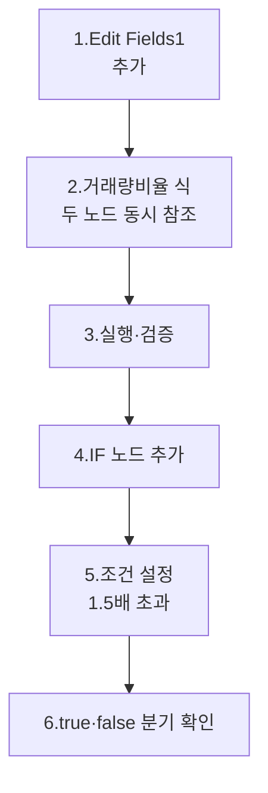

이번 모듈을 마치면 워크플로는 8개 노드입니다.

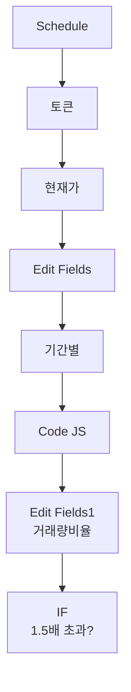

---

## 1. 무엇을 계산하는가?

### 1.1 거래량비율의 정의

> **거래량비율 = 오늘거래량 ÷ 평균거래량(최근 20영업일)**

| 값 | 의미 |
|----|------|
| 1.0 | 평소와 동일 |
| 0.5 | 평소의 절반 |
| 1.5 | 평소의 1.5배 |
| 2.0 | 평소의 2배 |
| 5.0 | 평소의 5배 (이상 거래) |

### 1.2 왜 비율인가?

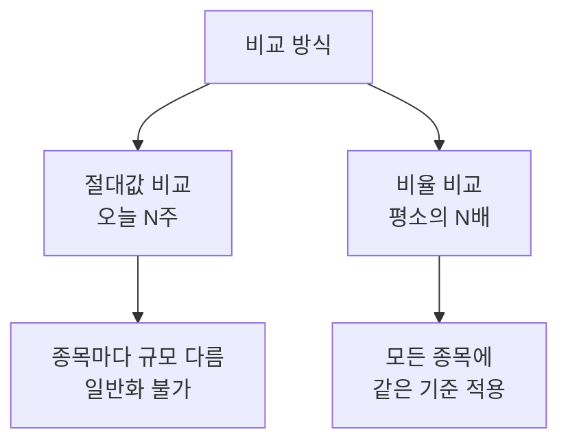

| 종목 | 평균거래량 | 오늘거래량 | 절대 비교 | 비율 비교 |
|------|-----------|-----------|----------|-----------|
| 삼성전자 | 1,500만 | 2,000만 | "많음" | 1.33배 |
| 작은 종목 | 50만 | 200만 | "적음" | **4.0배** |

절대값으로는 삼성전자가 더 많아 보이지만, **비율로 보면 작은 종목이 평소 대비 훨씬 비정상**입니다. 거래량 급증 신호 포착에는 비율이 정답입니다.

### 1.3 1.5배가 의미하는 것

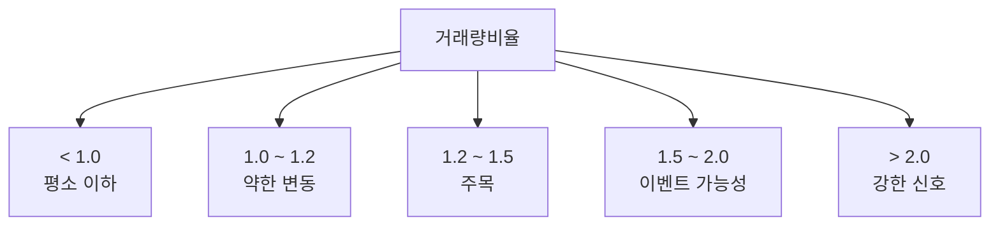

| 임계값 | 의미 | 알림 빈도 |
|--------|------|-----------|
| 1.2배 | 약한 신호 | 자주 발생 (노이즈 많음) |
| **1.5배** | **중간 신호** | **권장 — 본 강의** |
| 2.0배 | 강한 신호 | 드물게 발생 |
| 3.0배 | 이상 거래 | 매우 드물게 |

1.5배는 **노이즈를 거르면서 의미 있는 신호를 놓치지 않는** 균형점입니다. 처음 운영해보고 알림이 너무 많으면 2.0으로, 너무 적으면 1.3으로 조정하면 됩니다.

---

## 2. Edit Fields1 노드 추가

### 2.1 노드 추가

캔버스에서 **Code in JavaScript** 노드 우측 **[+]** 아이콘을 클릭합니다.

```
검색창에 "edit fields" 입력 → [Edit Fields] 선택
```

n8n이 자동으로 노드 이름을 **Edit Fields1**로 부여합니다(첫 번째 Edit Fields 노드는 그대로 "Edit Fields").

### 2.2 워크플로 위치

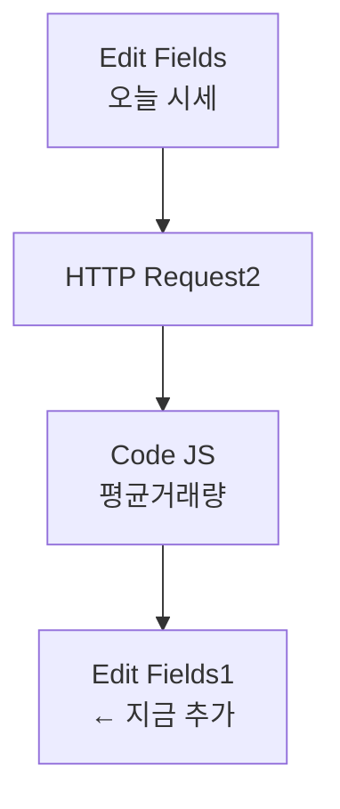

### 2.3 Mode 설정

| 필드 | 값 |
|------|-----|
| Mode | `Manual Mapping` |

---

## 3. 거래량비율 필드 — 새로운 표현식 패턴

### 3.1 [Add Field]로 1개 필드 추가

| Name | Type | Value |
|------|------|-------|
| 거래량비율 | `Number` | (다음 표현식) |

### 3.2 입력해야 할 표현식

```javascript
{{
  $('Edit Fields').item.json['오늘거래량']
  /
  Number($json['평균거래량'])
}}
```

> ⚠️ **n8n 표현식 입력**
> Value 칸 좌측의 **fx** 아이콘을 클릭해 Expression mode로 전환 후 위 표현식을 붙여넣으세요. 줄바꿈 없이 한 줄로 입력해도 동작합니다.

### 3.3 새로운 패턴 — `$('노드명').item.json`

여기서 처음 등장하는 표현식 형태입니다.

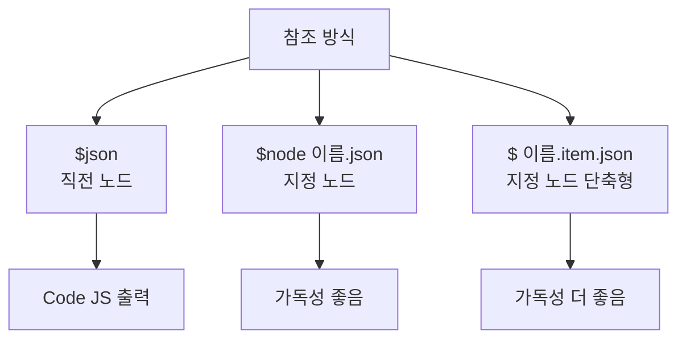

| 형태 | 의미 | 본 강의 사용 |
|------|------|--------------|
| `$json.X` | 직전 노드의 X | 일반적 (모듈 3) |
| `$node["이름"].json.X` | 지정 노드의 X | 토큰 참조 (모듈 3·4) |
| `$('이름').item.json.X` | 지정 노드의 X (단축형) | **이번 모듈** |

`$('이름')`은 `$node["이름"]`과 동일한 동작을 합니다. **더 짧고 읽기 쉬운 형태**라 표현식 안에 다른 노드 참조가 여러 번 등장할 때 유리합니다.

### 3.4 표현식 분해

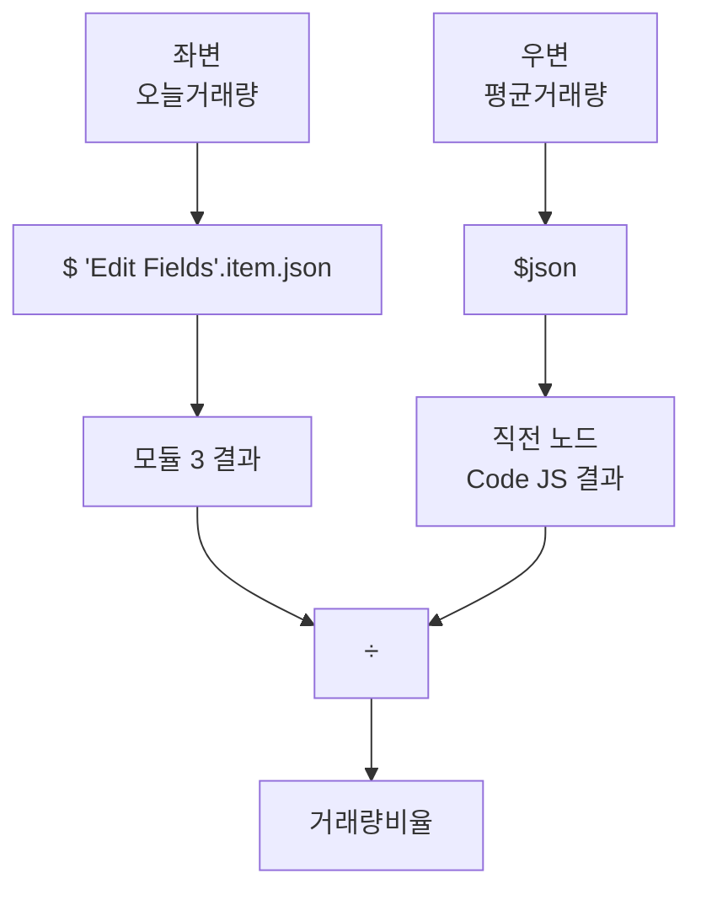

| 부분 | 평가 결과 |
|------|----------|
| `$('Edit Fields').item.json['오늘거래량']` | 모듈 3에서 만든 오늘거래량 (예: 34,018,174) |
| `$json['평균거래량']` | 직전 노드(Code JS)의 평균거래량 (예: 18,244,898) |
| 두 값을 나눔 | 1.864... (예시 값) |

### 3.5 왜 두 노드를 동시에 참조해야 하는가?

지금 **Edit Fields1의 직전 노드는 Code JS**입니다. 직전 노드에는 평균거래량이 있지만, **오늘거래량은 모듈 3 Edit Fields에 있습니다.**

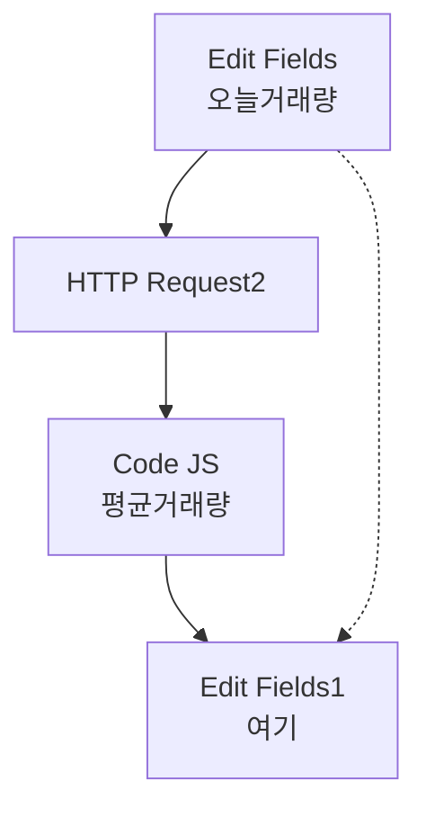

따라서 식 안에서 **두 노드를 모두 참조**해야 비율 계산이 가능합니다. 이때 `$('Edit Fields')` 단축 표기법이 빛을 발합니다.

### 3.6 우변에 `Number()`로 감싼 이유

```javascript
Number($json['평균거래량'])
```

평균거래량은 모듈 4의 Code 노드에서 `Math.round()`로 정수로 만들었지만, n8n이 노드 간 직렬화 과정에서 문자열로 변환할 가능성이 있습니다. **방어적으로 `Number()` 변환**을 한 번 더 거는 것이 안전합니다.

> 💡 **함정 — Number 변환 없으면**
> 평균거래량이 문자열로 평가되면 나눗셈이 NaN을 반환합니다. 한 번의 `Number()`로 막을 수 있는 흔한 실수입니다.

### 3.7 좌변에 `Number()`가 없는 이유

좌변(오늘거래량)은 모듈 3의 Edit Fields에서 **이미 Number 타입으로 지정**했습니다. 따라서 추가 변환이 불필요합니다. 만약 모듈 3에서 Number 타입을 빠뜨렸다면 여기서도 `Number()`를 감싸주세요.

> ✅ **체크포인트 5-1**
> 표현식 미리보기 아래에 회색으로 결과 값(예: `1.864...`)이 표시되나요? `NaN`이나 `Infinity`가 보인다면 다음을 점검하세요.
> - `오늘거래량` 또는 `평균거래량` 필드명 오타
> - 모듈 3에서 오늘거래량의 타입이 String이었는지

---

## 4. 노드 실행과 검증

### 4.1 [Execute step] 클릭

### 4.2 OUTPUT 확인

이전 노드의 모든 필드가 그대로 이어진 상태에서 마지막에 **거래량비율** 필드가 추가됩니다.

| 필드 | 예시 값 |
|------|---------|
| 종목코드 | `005930` |
| 현재가 | `117000` |
| 등락률 | `5.31` |
| 오늘거래량 | `34018174` |
| 날짜 | `2026-05-03` |
| 평균거래량 | `18244898` |
| **거래량비율** | **`1.864506...`** |

> 💡 **소수점 자리수**
> n8n은 기본적으로 소수점을 다 표시합니다. 시트나 알림에서 보기 좋게 자르려면 모듈 6에서 `toFixed(2)` 같은 처리를 추가합니다.

> ✅ **체크포인트 5-2**
> 거래량비율 값이 표시되고, 정상 범위(0.1 ~ 10 정도)에 있나요? 100배가 넘는 비정상 값이라면 두 필드의 단위가 안 맞는 것입니다(평균거래량을 다른 필드와 혼동했는지 확인).

---

## 5. IF 노드 추가

### 5.1 IF 노드란?

n8n에서 **조건에 따라 워크플로를 두 갈래로 분기**시키는 노드입니다. 조건이 true면 **윗 갈래**로, false면 **아래 갈래**로 데이터가 흐릅니다.

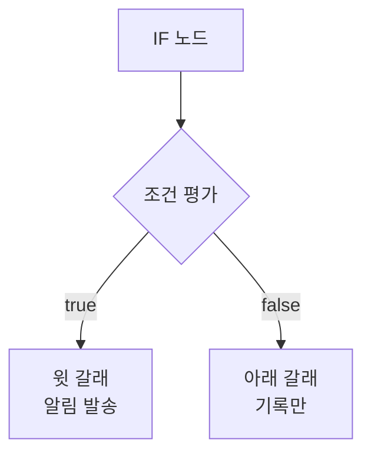

### 5.2 노드 추가

Edit Fields1 우측 **[+]** 아이콘 → 검색 `if` → **[IF]** 선택.

### 5.3 워크플로 위치

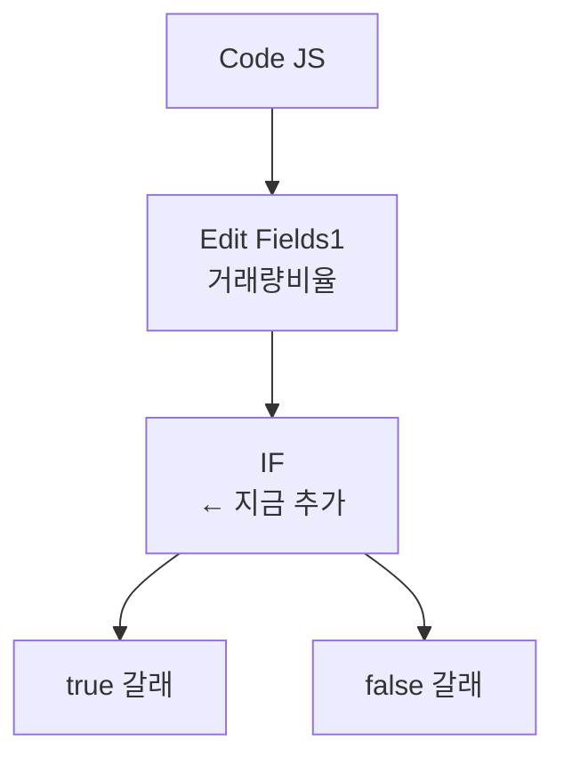

---

## 6. IF 조건 설정

### 6.1 Conditions 영역 구성

IF 노드의 **Conditions** 영역에 한 줄짜리 비교식이 있습니다. 좌측 값·비교 연산자·우측 값 세 가지를 채웁니다.

### 6.2 좌측 값 — 거래량비율 참조

좌측 입력 칸 좌측의 **fx** 아이콘을 클릭해 Expression mode로 전환 후 다음을 입력합니다.

```javascript
{{ $json['거래량비율'] }}
```

| 부분 | 의미 |
|------|------|
| `$json` | 직전 노드(Edit Fields1)의 출력 |
| `['거래량비율']` | 방금 만든 필드 참조 |

### 6.3 비교 연산자 선택

드롭다운에서 **`Number → is greater than`** 을 선택합니다.

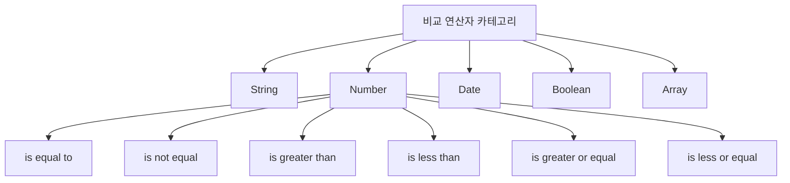

| 카테고리 | 사용 시점 |
|----------|-----------|
| String | 텍스트 비교 (포함·일치) |
| **Number** | **숫자 비교 — 본 강의** |
| Date | 날짜 비교 |
| Boolean | 참/거짓 |

> ⚠️ **함정 — 카테고리 잘못 선택**
> 좌측이 숫자인데 String 카테고리의 `is equal to`를 쓰면 `1.5`와 `1.50`을 다르게 판단합니다. 반드시 **Number 카테고리**를 선택하세요.

### 6.4 우측 값 — 임계값

| 필드 | 값 |
|------|-----|
| 우측 값 | `1.5` |

이때 우측 값은 **Fixed mode**(`fx` 아이콘 비활성)에서 단순히 `1.5`만 입력하면 됩니다.

### 6.5 최종 조건식 요약

```
{{ $json['거래량비율'] }}  is greater than (Number)  1.5
```

이 조건이 true면 거래량 급증으로 판정합니다.

> ✅ **체크포인트 5-3**
> IF 노드 패널 하단의 결과 표시(true·false)가 거래량비율 값에 맞게 동작하나요?

---

## 7. IF 노드 실행과 분기 확인

### 7.1 [Execute step] 클릭

### 7.2 분기 결과 시각화

캔버스에서 IF 노드는 **두 개의 출력 포트**를 가집니다.

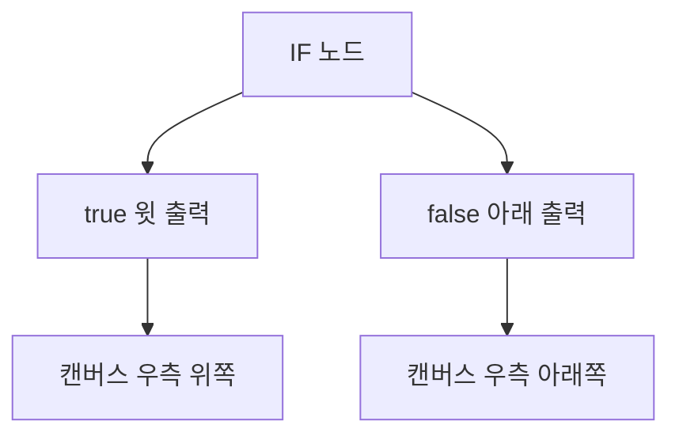

캔버스에서 IF 노드 우측을 보면 **두 개의 [+] 아이콘**이 위·아래로 표시됩니다. 각각 true·false 분기로 이어집니다.

### 7.3 어느 분기로 흘렀는가?

OUTPUT 패널에서 활성화된 분기를 확인할 수 있습니다.

| 거래량비율 | 분기 | 패널 표시 |
|-----------|------|-----------|
| 1.864 | true | "1 item" 표시 |
| 0.84 | false | "1 item" 표시 |

> 💡 **테스트 팁**
> 임계값을 일시적으로 0.5나 100으로 바꿔 양쪽 분기가 모두 작동하는지 확인하세요. 정상 동작 확인 후 1.5로 되돌립니다.

### 7.4 두 분기 모두 다음 노드를 붙일 수 있다

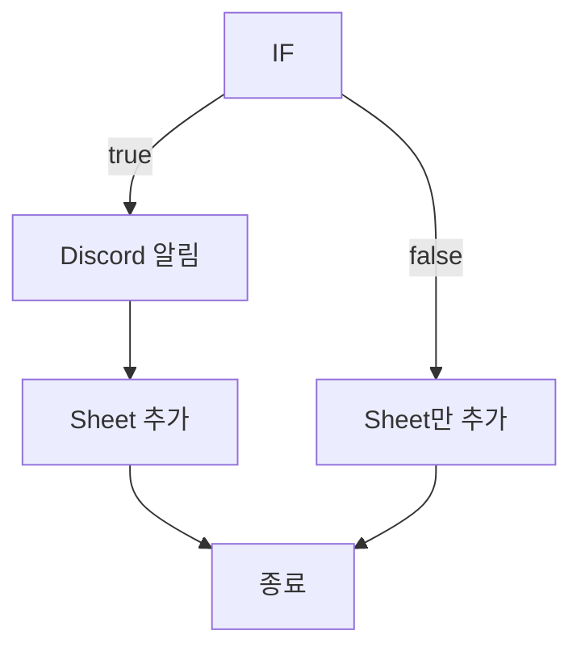

모듈 6에서:
- **true 갈래**에는 디스코드 알림 + 시트 추가
- **false 갈래**에는 시트 추가만

이렇게 두 갈래를 다르게 처리합니다.

---

## 8. 표현식 디버깅 — 자주 막히는 지점

### 8.1 노드 이름이 바뀌면 표현식이 깨진다

> ⚠️ **함정 — 노드 이름 변경 시 모든 식 깨짐**
> 만약 모듈 3의 Edit Fields 이름을 "오늘 시세"로 바꾸면, 본 모듈의 표현식 `$('Edit Fields')`는 **즉시 작동 중단**됩니다. 이름을 바꿨다면 식도 함께 `$('오늘 시세')`로 수정해야 합니다.

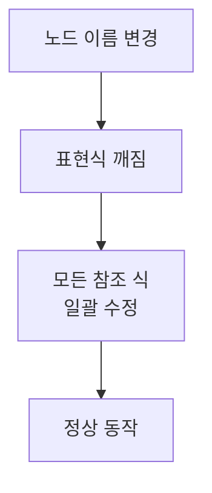

대안: **노드 이름을 처음부터 의미 있게 정하고, 그 후 절대 바꾸지 않는다.**

### 8.2 따옴표 종류 주의

```javascript
$('Edit Fields')        // ✅ 작은따옴표
$("Edit Fields")        // ✅ 큰따옴표 (둘 다 동작)
$('Edit Fields')['오늘거래량']  // ✅
$('Edit Fields').오늘거래량     // ⚠️ 가능하나 한글 키엔 권장 X
```

n8n 표현식은 작은따옴표·큰따옴표 모두 허용합니다. 단 한글 키 접근은 **대괄호 표기**(`['오늘거래량']`)가 안전합니다. 점 표기(`.오늘거래량`)도 동작하지만 환경에 따라 인식 차이가 있습니다.

### 8.3 식 안에서 식이 또 들어갈 때

`Number($json['평균거래량'])`처럼 함수 호출 안에 또 다른 참조가 들어갈 수 있습니다. 괄호 짝이 맞는지가 가장 중요합니다.

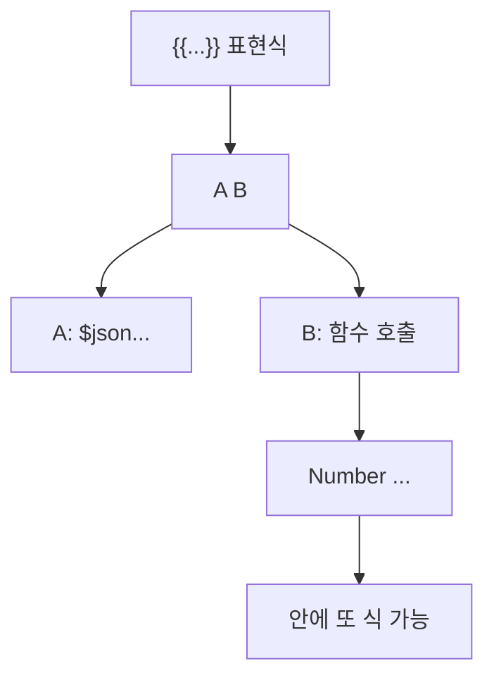

---

## 9. 워크플로 현재 상태

이 모듈을 완료하면 워크플로는 8개 노드입니다.

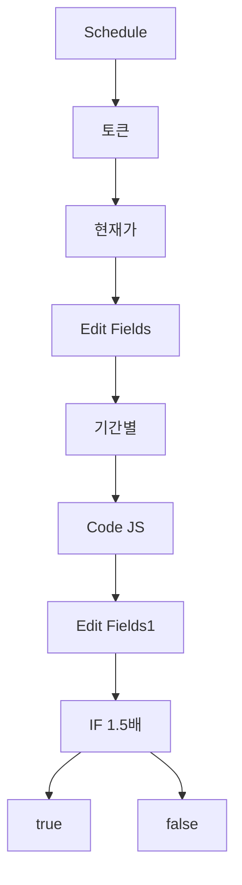

다음 모듈에서 true·false 두 갈래에 각각 **Discord 노드**와 **Google Sheets 노드**를 붙입니다.

---

## 10. 임계값을 동적으로 바꾸는 응용 (선택)

### 10.1 종목별로 다른 임계값 사용

거래가 활발한 대형주는 1.5배도 자주 나오지만, 거래량이 적은 소형주는 같은 1.5배도 의미가 큽니다. 종목별 다른 임계값을 쓰고 싶다면 **별도 임계값 필드를 도입**합니다.

#### 10.1.1 Edit Fields1에 임계값 필드 추가

| Name | Type | Value |
|------|------|-------|
| 임계값 | `Number` | `2.0` (또는 종목별 표현식) |

#### 10.1.2 IF 우측 값을 표현식으로 변경

| 좌측 | 비교 | 우측 |
|------|------|------|
| `{{ $json['거래량비율'] }}` | is greater than | `{{ $json['임계값'] }}` |

이렇게 하면 종목별 룩업 테이블을 만들어 임계값을 동적으로 정할 수 있습니다.

### 10.2 복합 조건 만들기

거래량 + 등락률 두 조건을 동시에 보고 싶다면 IF 노드의 **[Add Condition]**으로 두 번째 조건을 추가합니다.

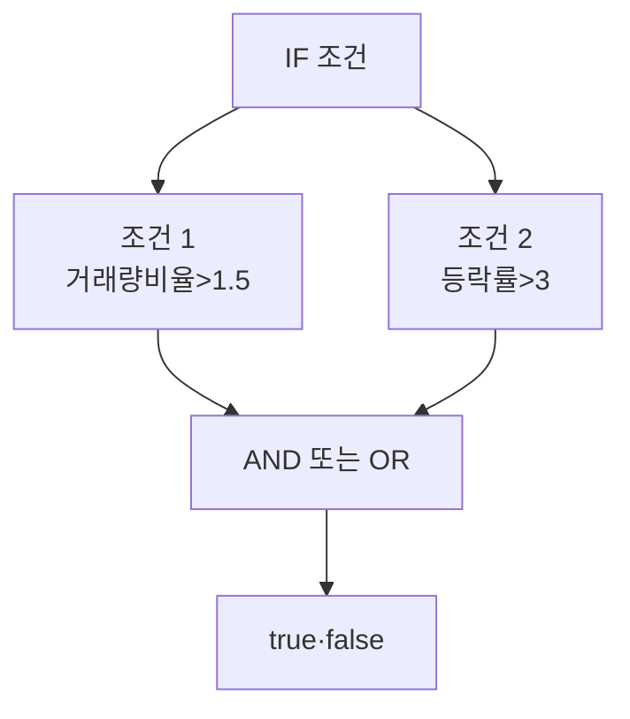

| 결합 | 의미 |
|------|------|
| AND (모두 만족) | 거래량 + 등락 동시 발생만 알림 |
| OR (하나만 만족) | 둘 중 하나만 발생해도 알림 |

본 강의는 단일 조건으로 진행하지만, 운영에 들어가면 **AND**가 노이즈를 더 잘 거릅니다.

---

## 11. 자주 발생하는 오류

| 증상 | 원인 | 해결 |
|------|------|------|
| 표현식 미리보기 `NaN` | 두 값 중 하나가 문자열·undefined | Number() 변환·필드명 확인 |
| 표현식 미리보기 `Infinity` | 평균거래량이 0 | 종목 정지·output2 비어옴 점검 |
| 거래량비율이 `null` | 모듈 4에서 null 반환됨 | output2 데이터 확인 |
| `$('Edit Fields')` 인식 안 됨 | 노드 이름 다름 | 노드 이름 정확히 확인 |
| IF가 항상 false만 나옴 | String 카테고리로 잘못 비교 | Number 카테고리 선택 |
| IF 결과가 예상과 반대 | `is greater than` 대신 `is less than` 선택 | 비교식 재확인 |
| true·false 분기 모두 빈 출력 | IF 노드 자체가 실행 전 | [Execute step] 클릭 |

### 11.1 NaN 진단 5단계

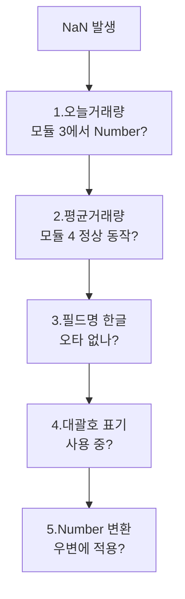

---

## 12. 30초 점검 — 모듈 6으로 넘어갈 자격

| # | 체크 항목 | ✅/❌ |
|---|-----------|------|
| 5-1 | Edit Fields1 노드를 추가했고 Mode가 Manual Mapping이다 | |
| 5-2 | 거래량비율 필드의 Type이 Number이다 | |
| 5-3 | 표현식이 `$('Edit Fields').item.json['오늘거래량'] / Number($json['평균거래량'])` 형태이다 | |
| 5-4 | 표현식 미리보기에 정상 숫자(NaN·Infinity 아님)가 표시된다 | |
| 5-5 | IF 노드의 카테고리가 Number이고 비교가 `is greater than`이다 | |
| 5-6 | IF 우측 값이 `1.5`로 입력되어 있다 | |
| 5-7 | [Execute step] 후 true 또는 false 한쪽 분기가 활성화됐다 | |

---

## 13. 자주 묻는 질문

**Q1. 거래량비율을 소수점 2자리로 자르고 싶어요.**
표현식을 다음처럼 바꿉니다.
```javascript
{{ Number(($('Edit Fields').item.json['오늘거래량'] / Number($json['평균거래량'])).toFixed(2)) }}
```
`.toFixed(2)`는 문자열을 반환하므로 다시 `Number()`로 감싸 숫자 타입을 유지합니다. 보기는 깔끔해지지만, 일반적으로 모듈 6에서 출력 시점에 자르는 것이 더 깔끔합니다.

**Q2. 1.5배 미만이어도 등락률이 크면 알림 받고 싶어요.**
IF 노드에 두 번째 조건을 추가하고 OR로 결합합니다. 또는 IF를 두 개 연결해 한쪽 분기 안에서 다시 분기할 수도 있습니다.

**Q3. 거래량 급증뿐 아니라 급감도 알고 싶어요.**
IF 조건을 두 개로 나눠 OR로 결합합니다.
- 조건 1: 거래량비율 > 1.5
- 조건 2: 거래량비율 < 0.3

또는 별도 IF 노드를 직렬로 연결합니다.

**Q4. 비율 대신 표준편차(σ) 기준으로 이상치를 판정하고 싶어요.**
모듈 4의 Code 노드에서 평균과 함께 표준편차도 계산해 별도 필드로 반환하면 됩니다. IF 조건은 `오늘거래량 > 평균 + 2σ` 같은 식으로 구성합니다.

**Q5. IF의 true·false 두 갈래 모두에 같은 노드를 연결하고 싶어요.**
가능합니다. 두 갈래에서 같은 다음 노드로 화살표를 그리면 됩니다. 단 그렇게 할 거면 IF 자체가 불필요한 경우가 많습니다. 본 강의는 모듈 6에서 두 갈래를 **다르게** 처리합니다(true는 알림+시트, false는 시트만).

**Q6. 평균거래량과 오늘거래량 중 하나만 결측이면 어떻게 처리되나요?**
표현식이 NaN을 반환하고, IF의 Number 비교는 NaN을 false로 처리합니다. 결과적으로 false 분기로 흘러 알림 없이 시트만 기록됩니다. 이 동작이 자연스러운 안전장치입니다.

---

## 14. 다음 모듈 미리보기

**모듈 6 — 디스코드 알림 + 구글 시트 연동**

다음 모듈에서는 IF 노드의 **두 갈래에 각각 다른 노드를 연결**합니다.
- **true 갈래** → Discord Webhook 노드 (알림 발송) → Google Sheets 노드 (기록)
- **false 갈래** → Google Sheets 노드 (기록만)

디스코드 서버를 새로 만들어 웹훅 URL을 발급받고, 구글 시트 헤더를 설계하는 절차를 함께 진행합니다.

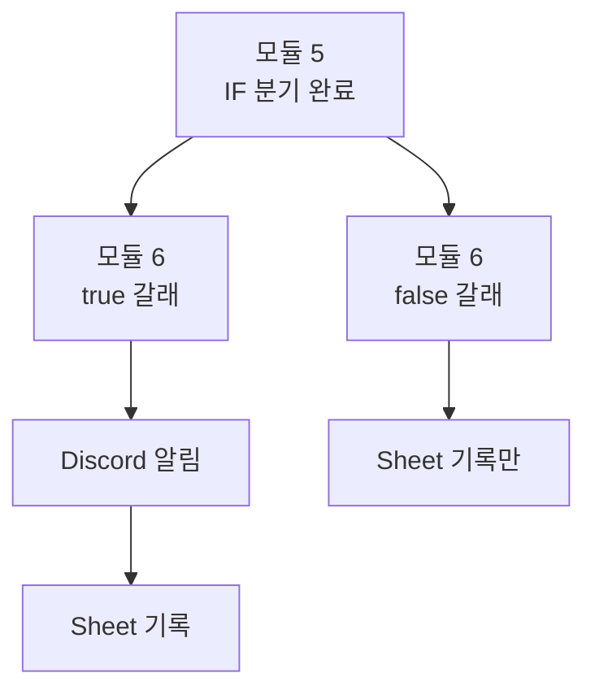

준비가 되었다면 모듈 6으로 이동하세요.
