# 모듈 6 — 디스코드 알림 + 구글 시트 연동

> **이 모듈에서 할 일**
> IF 노드의 두 갈래에 외부 서비스를 연결합니다. **true 갈래**에는 Discord Webhook으로 알림을 보내고 시트에 기록합니다. **false 갈래**에는 시트에만 기록합니다. 마지막에 워크플로를 활성화해 매일 자동으로 실행되도록 만듭니다. 이 모듈을 마치면 모니터링 시스템이 완성됩니다.


<!-- INFOGRAPHIC -->
<div class="infographic-wrap">
  
  <p class="infographic-caption">완성된 알림 파이프라인 — 모든 모듈의 결합</p>
</div>


---

## 0. 이 모듈의 흐름

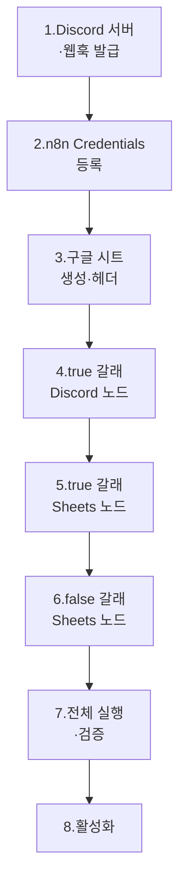

이번 모듈을 마치면 워크플로는 11개 노드입니다.

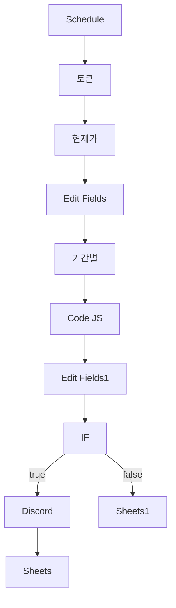

---

## 1. 디스코드 서버와 웹훅 발급

### 1.1 디스코드 로그인

> 🌐 **디스코드 홈페이지**: `discord.com`

우측 상단 **[Log In]** 버튼을 눌러 로그인합니다(모듈 0에서 가입한 계정 사용).

### 1.2 새 서버 만들기

좌측 사이드바 가장 아래쪽의 **[+]**(서버 추가하기) 버튼을 클릭합니다.

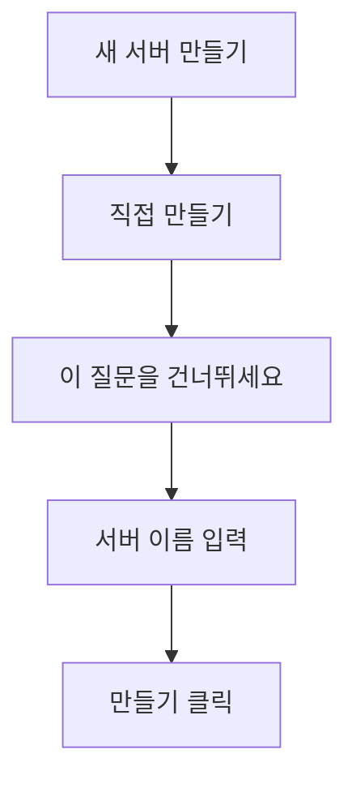

| 단계 | 선택 |
|------|------|
| 시작 옵션 | **[직접 만들기]** |
| "이 서버에 대해 더 자세히..." | **[이 질문을 건너뛰세요]** |
| 서버 이름 | `n8n 테스트용 서버` (자유) |
| 아이콘 업로드 | 생략 가능 |

> 💡 **왜 서버를 만들어야 하나?**
> 디스코드 웹훅은 **서버의 채널**에 메시지를 보내는 방식입니다. 개인 메시지에는 웹훅을 만들 수 없으므로, 본인만 사용할 서버를 하나 새로 만드는 것이 가장 간단합니다.

### 1.3 채널 설정 들어가기

서버를 만들면 좌측에 **[#일반]** 채널이 기본 생성되어 있습니다. **[#일반] 채널 옆 톱니바퀴(⚙️) 아이콘**을 클릭해 채널 편집창으로 들어갑니다.

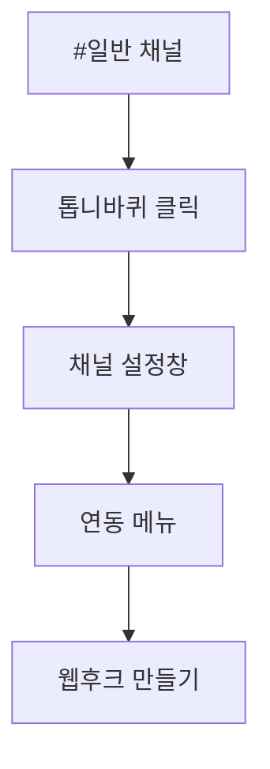

### 1.4 웹훅 만들기

| 단계 | 클릭 |
|------|------|
| 좌측 메뉴 | **[연동]** |
| 우측 영역 | **[웹후크 만들기]** |

기본적으로 **Spidey Bot**이라는 이름의 웹훅이 자동 생성됩니다(이름은 그대로 두어도 됩니다).

### 1.5 웹훅 URL 복사

생성된 Spidey Bot 박스를 클릭해 펼친 뒤 **[웹후크 URL 복사]** 버튼을 클릭합니다.

URL은 다음 형태입니다.

```
https://discord.com/api/webhooks/123456789/abcXYZ...
```

> ⚠️ **함정 — 웹훅 URL은 사실상 비밀번호**
> 이 URL을 가진 사람은 **누구나** 채널에 메시지를 보낼 수 있습니다. App Key·Secret만큼은 아니어도 **공개 저장소·SNS에 노출 금지**입니다. 노출되면 디스코드에서 [웹후크 삭제]로 즉시 무효화하고 새로 만들 수 있습니다.

> ✅ **체크포인트 6-1**
> 클립보드에 `https://discord.com/api/webhooks/...` 형태의 URL이 담겨 있나요?

---

## 2. n8n에 디스코드 자격증명 등록

### 2.1 Credentials 메뉴로 이동

n8n 좌측 메뉴에서 **[Credentials]** 클릭 → 우측 상단 **[+ Create Credential]**.

### 2.2 Discord Webhook 선택

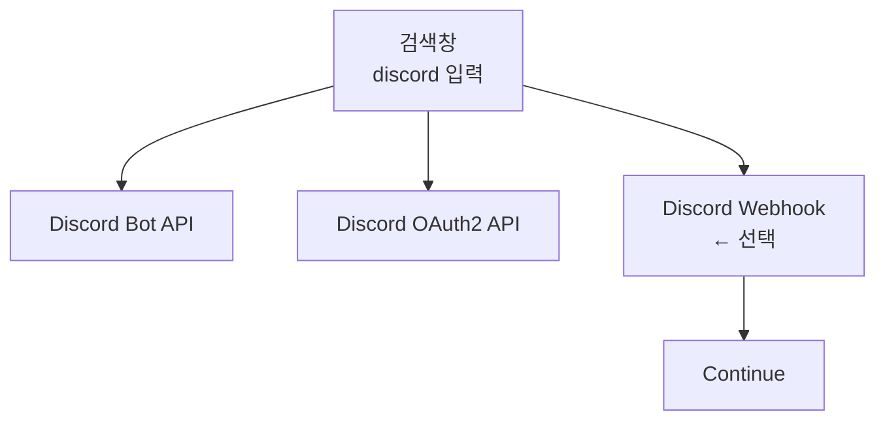

| 옵션 | 설명 | 본 강의 |
|------|------|---------|
| Discord Bot API | 봇으로 동작 (복잡한 인증) | ❌ |
| Discord OAuth2 API | 사용자 단위 인증 | ❌ |
| **Discord Webhook** | **URL만으로 메시지 발송** | **✅** |

가장 단순한 **Discord Webhook**을 선택하고 **[Continue]**를 클릭합니다.

### 2.3 Webhook URL 입력

| 필드 | 값 |
|------|-----|
| Webhook URL | (방금 복사한 URL 붙여넣기) |

우측 상단 **[Save]** 버튼 클릭으로 등록 완료.

> 💡 **왜 Webhook이 가장 쉬운가?**
> OAuth 인증·토큰 갱신·디스코드 계정 연동 같은 복잡한 절차가 모두 생략됩니다. URL 하나로 끝나므로 입문자에게 가장 친절한 방식입니다.

> ✅ **체크포인트 6-2**
> Credentials 목록에 "Discord webhook account"(또는 본인이 정한 이름)이 추가되었나요?

---

## 3. 구글 시트 생성과 헤더 설계

### 3.1 새 시트 만들기

> 🌐 `sheets.google.com` 접속 → **[+ 새 스프레드시트]** 클릭

빈 시트가 열립니다.

### 3.2 시트 이름 변경

좌측 상단의 "제목 없는 스프레드시트"를 클릭해 이름을 변경합니다.

> 📝 **권장 이름**: `주식 모니터링`

### 3.3 헤더 행 입력

첫 번째 행(1행)에 다음 7개 컬럼을 입력합니다.

| A | B | C | D | E | F | G |
|---|---|---|---|---|---|---|
| 종목명 | 종목코드 | 현재가 | 오늘거래량 | 거래량비율 | 등락률 | 날짜 |

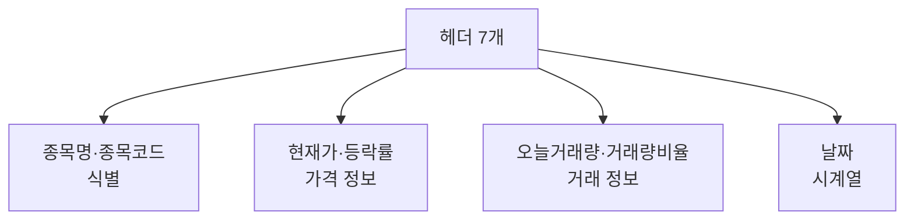

### 3.4 헤더 설계 의도

| 컬럼 | 의미 | 데이터 소스 |
|------|------|--------------|
| 종목명 | 한글 회사명 | (수동 또는 별도 API) |
| 종목코드 | 6자리 코드 | 모듈 3 Edit Fields |
| 현재가 | 종가(원) | 모듈 3 Edit Fields |
| 오늘거래량 | 누적 거래량 | 모듈 3 Edit Fields |
| 거래량비율 | 평균 대비 배수 | 모듈 5 Edit Fields1 |
| 등락률 | 전일 대비(%) | 모듈 3 Edit Fields |
| 날짜 | YYYY-MM-DD | 모듈 3 Edit Fields |

> 💡 **종목명은 어떻게 채우나?**
> 본 강의는 단일 종목 모니터링이라 종목명을 **수동 입력하거나 비워두는 방식**으로 진행합니다. 다종목 확장 시에는 별도 매핑 테이블이나 [상품기본조회] API 호출을 추가합니다.

### 3.5 시트의 위치를 기억해두세요

다음 단계에서 n8n이 이 시트를 찾을 수 있도록 **시트 ID**(URL의 긴 문자열) 또는 **시트 이름**을 기억해둡니다.

```
https://docs.google.com/spreadsheets/d/[이 부분이 시트 ID]/edit
```

> ✅ **체크포인트 6-3**
> 시트 1행에 7개 헤더가 정확히 입력되었고, 시트 이름이 "주식 모니터링"인가요?

---

## 4. n8n에 구글 자격증명 등록

### 4.1 Credentials 추가

n8n **[Credentials]** → **[+ Create Credential]** → 검색 `google sheets` → **[Google Sheets OAuth2 API]** 선택.

### 4.2 OAuth 로그인

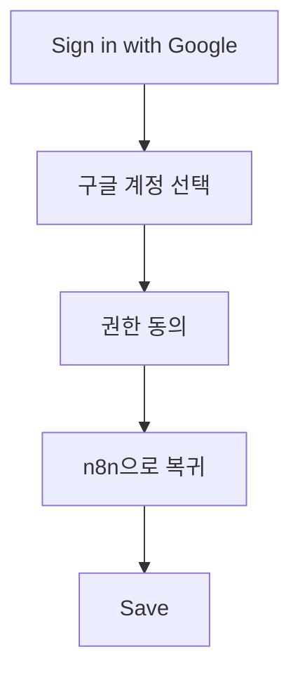

| 단계 | 동작 |
|------|------|
| **[Sign in with Google]** 클릭 | 구글 로그인 창 열림 |
| 계정 선택 | 시트가 있는 계정 |
| 권한 동의 | "스프레드시트에 액세스" 허용 |
| n8n 복귀 후 [Save] | 등록 완료 |

> ⚠️ **함정 — 다른 계정에 로그인됨**
> 브라우저에 여러 구글 계정이 로그인된 상태라면, 시트를 만든 계정과 다른 계정으로 인증될 수 있습니다. 인증 단계에서 **시트가 있는 계정**을 명확히 선택하세요.

> 💡 **Self-hosted n8n 사용자**
> Self-hosted 환경에서는 OAuth 콜백 URL 등록 등 추가 설정이 필요할 수 있습니다. n8n 공식 문서의 Google Sheets 연동 가이드를 참고하세요. n8n Cloud 사용자는 추가 설정 없이 바로 작동합니다.

> ✅ **체크포인트 6-4**
> Credentials 목록에 "Google Sheets account"(또는 자동 생성된 이름)가 추가되었나요?

---

## 5. true 갈래 — Discord 노드 추가

### 5.1 노드 추가

캔버스에서 **IF 노드의 true 출력(윗쪽)** 옆 **[+]** 아이콘을 클릭합니다.

```
검색창에 "discord" 입력 → [Discord] 선택
```

### 5.2 Credential 연결

노드 패널 상단의 **Credential to connect with** 드롭다운에서 방금 등록한 **Discord webhook account**를 선택합니다.

### 5.3 Resource·Operation 설정

n8n 버전에 따라 메뉴 구성이 다를 수 있습니다. Webhook 방식 기준으로 다음을 선택합니다.

| 필드 | 값 |
|------|-----|
| Authentication | `Webhook` |
| Resource | `Message` |
| Operation | `Send` |

### 5.4 메시지 본문 — Content 필드

알림 메시지의 본문을 작성합니다. **fx** 아이콘으로 Expression mode 전환 후 다음을 입력합니다.

```javascript
🚨 거래량 급증 감지

• 종목코드: {{ $json['종목코드'] }}
• 현재가: {{ $json['현재가'] }}원
• 등락률: {{ $json['등락률'] }}%
• 오늘거래량: {{ $json['오늘거래량'] }}주
• 평균거래량: {{ $json['평균거래량'] }}주
• 거래량비율: {{ Number($json['거래량비율']).toFixed(2) }}배
• 날짜: {{ $json['날짜'] }}
```

### 5.5 메시지 표현식 분해

```mermaid
flowchart TD
    A[메시지 텍스트] --> B[고정 문구<br/>거래량 급증 감지]
    A --> C[변수 부분<br/>{{ ... }}]
    C --> D["$json['종목코드']"]
    C --> E[".toFixed(2)<br/>소수점 정리"]
```

| 표현식 부분 | 의미 |
|------------|------|
| `{{ $json['종목코드'] }}` | 직전 노드(IF) 입력의 종목코드 |
| `{{ Number($json['거래량비율']).toFixed(2) }}` | 거래량비율을 소수점 둘째 자리까지 |
| `🚨` 이모지 | 시각적 강조 (생략 가능) |

> 💡 **toFixed(2)의 효과**
> 원본 값 `1.864506...` → 표시 `1.86`. 알림 가독성이 크게 좋아집니다.

> ⚠️ **함정 — 따옴표 안에 변수 못 넣음**
> n8n 표현식은 큰 따옴표·작은 따옴표 안에 직접 변수를 못 넣습니다. 표현식은 항상 **`{{ }}` 중괄호 형식**이어야 합니다.

### 5.6 [Execute step]으로 테스트 발송

> ⚠️ **함정 — IF 노드 결과가 false면 입력이 비어있음**
> 거래량비율이 1.5 미만이면 IF의 true 갈래로 데이터가 흐르지 않으므로, 이 노드도 입력이 없어 실행 불가합니다. 테스트하려면 모듈 5의 IF 임계값을 일시적으로 0.1로 낮춰 강제로 true가 되게 한 뒤, 테스트가 끝나면 1.5로 되돌립니다.

테스트 발송 후 디스코드 채널을 확인하면 다음과 같은 메시지가 보입니다.

```
🚨 거래량 급증 감지

• 종목코드: 005930
• 현재가: 117000원
• 등락률: 5.31%
• 오늘거래량: 34018174주
• 평균거래량: 18244898주
• 거래량비율: 1.86배
• 날짜: 2026-05-03
```

> ✅ **체크포인트 6-5**
> 디스코드 채널에 위와 같은 메시지가 도착했나요?

---

## 6. true 갈래 — Google Sheets 노드 추가

### 6.1 노드 추가

방금 만든 Discord 노드 우측 **[+]** 아이콘을 클릭합니다.

```
검색창에 "google sheets" 입력 → [Google Sheets] 선택
```

### 6.2 Credential·Resource·Operation 설정

| 필드 | 값 |
|------|-----|
| Credential | (등록한 Google Sheets account) |
| Resource | `Sheet Within Document` |
| Operation | `Append Row` |

`Append Row`는 시트 마지막 행에 한 줄을 추가하는 동작입니다.

### 6.3 시트와 워크시트 선택

| 필드 | 값 |
|------|-----|
| Document | 드롭다운에서 `주식 모니터링` 시트 선택 |
| Sheet | `시트1` (또는 본인이 만든 워크시트) |

n8n이 시트의 헤더를 자동으로 인식해 Mapping 영역에 7개 컬럼을 표시합니다.

### 6.4 Mapping Column Mode

| 필드 | 값 |
|------|-----|
| Mapping Column Mode | `Map Each Column Manually` |

수동으로 각 컬럼에 어떤 값을 넣을지 지정합니다.

### 6.5 컬럼별 매핑 표현식

| 컬럼 | 표현식 |
|------|--------|
| 종목명 | `삼성전자` (Fixed) 또는 비워두기 |
| 종목코드 | `{{ $json['종목코드'] }}` |
| 현재가 | `{{ $json['현재가'] }}` |
| 오늘거래량 | `{{ $json['오늘거래량'] }}` |
| 거래량비율 | `{{ Number($json['거래량비율']).toFixed(2) }}` |
| 등락률 | `{{ $json['등락률'] }}` |
| 날짜 | `{{ $json['날짜'] }}` |

> 💡 **종목명을 동적으로 채우려면?**
> 종목코드 → 종목명 매핑 테이블을 시트의 다른 탭에 만들고 VLOOKUP을 사용하거나, 모듈 3에 [상품기본조회] API 호출을 추가하는 방법이 있습니다. 본 강의는 단일 종목이라 Fixed로 두어도 충분합니다.

### 6.6 [Execute step]으로 테스트

테스트 후 시트를 새로 고치면 **2행에 데이터가 한 줄 추가**되어 있어야 합니다.

> ✅ **체크포인트 6-6**
> 시트 2행에 종목코드·현재가·오늘거래량·거래량비율 등이 정확히 적혔나요?

---

## 7. false 갈래 — Google Sheets 노드 추가

### 7.1 노드 추가

캔버스에서 **IF 노드의 false 출력(아래쪽)** 옆 **[+]** 아이콘을 클릭합니다.

```
검색창에 "google sheets" 입력 → [Google Sheets] 선택
```

이름은 자동으로 **Google Sheets1**이 됩니다.

### 7.2 설정 복사 — true 갈래 노드와 동일

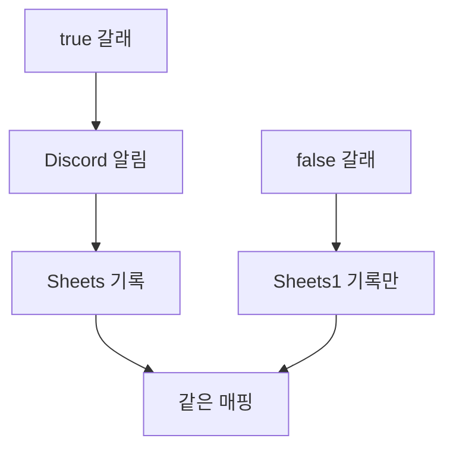

| 필드 | 값 |
|------|-----|
| Credential | (Google Sheets account) |
| Resource | `Sheet Within Document` |
| Operation | `Append Row` |
| Document | `주식 모니터링` |
| Sheet | `시트1` |
| Mapping Column Mode | `Map Each Column Manually` |

7개 컬럼 매핑도 6.5와 **완전히 동일**합니다.

### 7.3 두 노드의 차이는 단 하나

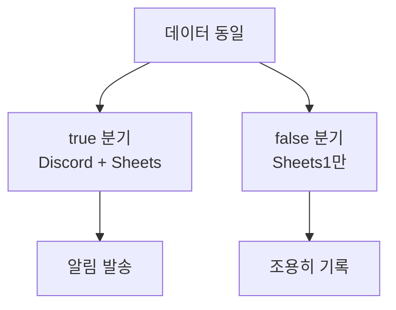

분기 자체가 차이를 만들기 때문에, 두 시트 노드의 **설정은 같아도 됩니다**. true에서 거래량 급증을 알리고, false에서는 평범한 날의 데이터를 묵묵히 누적합니다.

### 7.4 효율적인 노드 복사 팁

캔버스에서 true 갈래의 Sheets 노드를 우클릭 → **[Duplicate]**(또는 `Ctrl+D`)로 복제한 뒤, false 갈래로 드래그해 연결하면 매핑을 다시 입력할 필요가 없습니다.

> ✅ **체크포인트 6-7**
> false 갈래에도 Google Sheets1 노드가 IF 노드 아래쪽에 연결되어 있나요?

---

## 8. 전체 워크플로 통합 실행

### 8.1 [Execute Workflow] 클릭

지금까지는 노드별 [Execute step]만 사용했지만, 이제 캔버스 우측 상단의 **[Execute Workflow]**(또는 **[Test Workflow]**) 버튼으로 트리거부터 끝까지 한 번에 실행합니다.


### 8.2 모든 노드에 체크 표시 확인

정상 동작하면 각 노드 좌측 상단에 **녹색 체크(✓)** 아이콘이 표시됩니다.

### 8.3 시트 + 디스코드 동시 검증

| 검증 항목 | 확인 방법 |
|-----------|-----------|
| 시트에 새 행 추가 | 시트 새로 고침 후 마지막 행 |
| (true인 경우) 디스코드 메시지 | 채널 확인 |
| 노드별 OUTPUT | 캔버스에서 각 노드 클릭 |

> ✅ **체크포인트 6-8**
> 모든 노드에 녹색 체크가 떴고, 시트에 새 행이 추가됐나요?

---

## 9. 워크플로 활성화 — 자동 실행 시작

### 9.1 [Inactive → Active] 토글

화면 우측 상단의 **[Inactive ↔ Active]** 토글을 **Active**로 변경합니다.

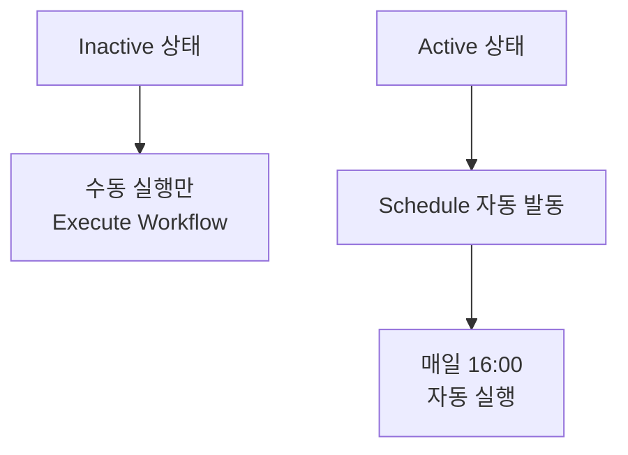

### 9.2 활성화 시 주의사항

> ⚠️ **함정 — 노드 매개변수 미완성 상태로 활성화**
> 활성화하면 다음 16:00에 자동 실행됩니다. 미완성 노드가 있으면 그 시간에 오류가 발생합니다. **모든 [Execute step]·[Execute Workflow]가 정상 통과**한 후 활성화하세요.

> ⚠️ **함정 — n8n이 꺼져 있으면 실행 안 됨**
> Desktop App이나 Self-hosted 환경에서는 n8n 프로세스가 켜져 있어야 16:00에 트리거가 발동합니다. n8n Cloud는 항상 켜져 있어 문제없습니다.

### 9.3 첫 자동 실행 검증

활성화 후 다음 영업일 16:00에 다음 두 가지를 확인합니다.

| 검증 | 방법 |
|------|------|
| 시트에 새 행 추가 | 16:00 직후 시트 확인 |
| (true 시) 디스코드 알림 | 채널 확인 |
| 워크플로 실행 이력 | 캔버스 좌측 [Executions] 메뉴 |

> 💡 **Executions 메뉴**
> 자동 실행된 워크플로의 결과를 모두 보관합니다. 실패한 실행은 빨간색으로 표시되며, 클릭하면 어느 노드에서 실패했는지 정확히 보입니다.

> ✅ **체크포인트 6-9 (최종)**
> 워크플로가 Active 상태이며, 다음 영업일 16:00에 자동 실행될 준비가 완료됐나요?

---

## 10. 운영 팁 — 처음 1주일

### 10.1 실행 이력 모니터링

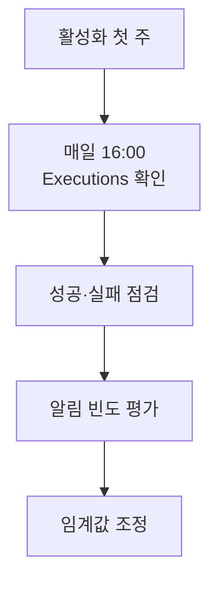

| 항목 | 점검 |
|------|------|
| 실행 이력 (Executions) | 매일 1회 성공했는가 |
| 시트 누적 | 매일 한 행씩 늘어나는가 |
| 디스코드 알림 빈도 | 너무 많거나 적지 않은가 |

### 10.2 임계값 조정

처음 1주 운영 결과로 임계값을 조정합니다.

| 관찰 | 조치 |
|------|------|
| 알림이 일주일에 5번 이상 | 임계값을 1.5 → 2.0으로 |
| 일주일 내내 알림 없음 | 임계값을 1.5 → 1.3으로 |
| 알림이 의미 있는 이벤트와 일치 | 그대로 유지 |

### 10.3 토큰 관련 문제

토큰은 24시간 후 만료되므로 매일 새로 발급됩니다. 만약 401 오류가 누적된다면 다음을 의심합니다.

| 증상 | 원인 |
|------|------|
| 401이 가끔 발생 | n8n 시간대와 한국 시간 불일치 (UTC 문제) |
| 401이 매일 발생 | App Key·Secret 만료 또는 재발급 필요 |
| 갑자기 401 시작 | 한투 키 자동 재발급 또는 정책 변경 |

---

## 11. 자주 발생하는 오류

| 증상 | 원인 | 해결 |
|------|------|------|
| Discord 메시지 미수신 | 웹훅 URL 오타 | Credentials에서 URL 재입력 |
| Discord 401 | 웹훅이 디스코드에서 삭제됨 | 디스코드에서 웹훅 재생성 |
| Sheets "Permission denied" | OAuth가 다른 계정으로 됨 | Credentials 삭제 후 재인증 |
| Sheets 컬럼이 잘못 채워짐 | 헤더 순서·매핑 불일치 | 시트 헤더와 매핑 컬럼명 일치시키기 |
| 시트에 행 추가는 되나 비어있음 | 표현식 평가 결과가 undefined | 표현식 미리보기로 값 확인 |
| 매번 새 시트가 생김 | Operation을 Create로 잘못 선택 | Append Row로 변경 |
| 활성화했는데 16:00에 안 돌아감 | 시간대 불일치 또는 n8n 꺼짐 | Workflow Settings에서 Timezone 확인 |

### 11.1 시간대 디버깅

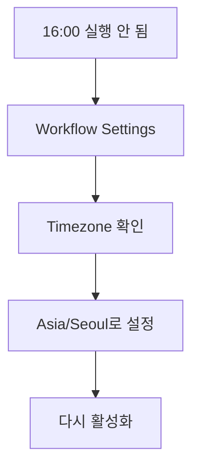

n8n 우측 상단 **[…] → [Settings] → [Timezone]**에서 워크플로 단위로 시간대를 `Asia/Seoul`로 변경할 수 있습니다.

---

## 12. 30초 점검 — 시스템 완성

| # | 체크 항목 | ✅/❌ |
|---|-----------|------|
| 6-1 | 디스코드 서버를 만들고 #일반 채널의 웹훅 URL을 발급받았다 | |
| 6-2 | n8n Credentials에 Discord webhook account를 등록했다 | |
| 6-3 | 구글 시트를 만들고 7개 헤더를 입력했다 | |
| 6-4 | n8n Credentials에 Google Sheets account를 등록했다 | |
| 6-5 | true 갈래의 Discord 노드 테스트로 메시지를 받았다 | |
| 6-6 | true 갈래의 Sheets 노드로 시트에 행이 추가됐다 | |
| 6-7 | false 갈래에도 Sheets1 노드를 추가했다 | |
| 6-8 | [Execute Workflow]로 모든 노드가 정상 실행됐다 | |
| 6-9 | 워크플로를 Active로 전환했다 | |

---

## 13. 자주 묻는 질문

**Q1. 메시지에 종목명을 한글로 표시하려면?**
가장 간단한 방법은 모듈 3의 Edit Fields에 종목명 필드를 String으로 추가하고 Fixed로 `삼성전자`처럼 입력하는 것입니다. 다종목 운영 시에는 종목코드→종목명 매핑 객체를 Code 노드에서 정의하거나 [상품기본조회] API를 추가합니다.

**Q2. 디스코드 메시지에 차트 이미지를 첨부할 수 있나요?**
가능합니다. QuickChart 같은 무료 차트 생성 API에 데이터를 보내 이미지 URL을 받고, 그 URL을 디스코드 메시지에 포함하면 인라인 차트가 표시됩니다. 다만 이는 본 강의 범위 밖이며, 별도 응용 과제로 도전해보세요.

**Q3. 슬랙·텔레그램으로 알림을 보내려면?**
true 갈래의 Discord 노드를 슬랙 노드 또는 텔레그램 노드로 교체하면 됩니다. 메시지 본문(Content) 표현식은 거의 그대로 재사용 가능합니다.

**Q4. 종목 여러 개를 모니터링하려면?**
모듈 3의 종목코드를 변수화하고, **Loop / Split In Batches** 노드로 여러 종목을 순회 처리합니다. 각 종목마다 토큰은 재발급할 필요 없이 한 번 발급한 것을 재사용하면 됩니다(6시간 룰).

**Q5. 시트에 누적된 데이터로 분석하고 싶어요.**
시트 자체에서 차트·피벗테이블·필터로 분석 가능합니다. 더 본격적으로는 시트를 BigQuery·Looker Studio에 연동하거나, 별도 백테스트 스크립트로 거래량 급증 시그널의 사후 수익률을 검증할 수 있습니다.

**Q6. 알림 메시지를 더 보기 좋게 꾸미고 싶어요.**
디스코드는 **Embed** 형식의 카드형 메시지를 지원합니다. n8n Discord 노드의 Embeds 옵션에서 제목·색상·필드·이미지 URL 등을 지정하면 깔끔한 카드가 만들어집니다. 본 강의의 텍스트 메시지가 동작 검증된 후 도전해보세요.

**Q7. 워크플로가 Inactive로 자동 변경됐어요.**
n8n에서 워크플로가 연속 실패하면 자동으로 Inactive가 될 수 있습니다. Executions에서 실패 원인을 확인하고 수정 후 다시 Active로 전환하세요.

---

## 14. 전체 과정 마무리 — 무엇을 만들었나?

### 14.1 완성된 시스템 요약

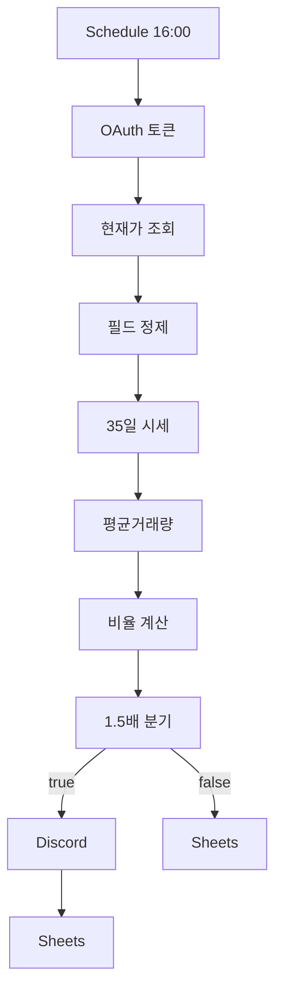

11개 노드, 7가지 외부 서비스(KIS·Discord·Google·OAuth·Webhook·JavaScript·Schedule)가 결합된 자동화 시스템을 완성했습니다.

### 14.2 학습한 핵심 개념

| 개념 | 어디서 배웠나 |
|------|---------------|
| OAuth 2-legged 인증 | 모듈 1·2 |
| 토큰 자동 발급·24시간 유효 | 모듈 2 |
| API 문서 읽기 (Method·URL·TR ID·Header) | 모듈 3 |
| n8n 표현식 3가지 (`$json`·`$node`·`$('이름')`) | 모듈 3·4·5 |
| 동적 날짜 계산 | 모듈 4 |
| JavaScript reduce·전개 연산자 | 모듈 4 |
| IF 노드 분기 (Number 비교) | 모듈 5 |
| Webhook과 OAuth 연동 차이 | 모듈 6 |

### 14.3 응용 가능한 분야

이 시스템의 변형으로 다음을 만들 수 있습니다.

| 응용 | 변경점 |
|------|--------|
| 환율 모니터링 | 한투 API → 한국은행 ECOS API |
| 코인 가격 모니터링 | 한투 API → 업비트·빗썸 API |
| 뉴스 키워드 알림 | 시세 API → 뉴스 검색 API |
| 부동산 실거래가 추적 | 시세 API → 국토부 실거래가 API |

핵심 패턴(Schedule → API → 가공 → 분기 → 알림+적재)은 동일합니다.

---

## 15. 다음 단계 — 실습 챌린지

### 15.1 난이도별 도전 과제

| 난이도 | 과제 | 학습 포인트 |
|--------|------|-------------|
| ⭐ | 모니터링 종목을 SK하이닉스(000660)로 변경 | 종목코드 변경 지점 파악 |
| ⭐ | 임계값을 2.0으로 올려 1주일 운영 | 임계값 민감도 체험 |
| ⭐⭐ | 메시지에 한글 종목명 표시 | Edit Fields 추가·Fixed 매핑 |
| ⭐⭐ | 등락률 ±5% 조건도 OR로 추가 | IF 복합 조건 |
| ⭐⭐ | 디스코드 메시지를 Embed 카드로 변경 | 노드 옵션 심화 |
| ⭐⭐⭐ | 종목 3개를 동시에 모니터링 | Loop / Split In Batches |
| ⭐⭐⭐ | 시트 데이터로 거래량 급증 후 1주일 수익률 자동 계산 | 시트 함수·SUMIF |
| ⭐⭐⭐ | DART 공시 API와 결합해 알림에 최근 공시 포함 | 다중 API 결합 |

### 15.2 과제 진행 시 추천 접근

1. **워크플로를 복제**(우클릭 → Duplicate)해 원본은 보존
2. 복제본에서 한 가지 변경만 시도 → 검증 → 다음 변경
3. 잘 동작하면 원본을 업데이트, 잘 안 되면 원본은 그대로 두고 학습

---

## 16. 마무리

여기까지 따라오셨다면, 단순한 가이드 따라하기를 넘어 **외부 API·인증·데이터 가공·분기·외부 알림**을 모두 직접 구현해본 경험을 갖게 됐습니다. 같은 패턴은 거의 모든 자동화 워크플로에 재사용 가능합니다.

이 시스템을 1주일 정도 운영하면서 알림이 어떻게 들어오는지 관찰해보세요. 어떤 종목이 어떤 시점에 거래량이 급증하는지 직접 보면, 시장에 대한 감각이 데이터로 쌓여갑니다.

> 🎉 **수고하셨습니다.**
> 모듈 0부터 6까지의 여정이 마무리됐습니다. 막히는 지점이 있으면 각 모듈의 트러블슈팅 절을 다시 참고하세요. 더 도전하고 싶다면 위의 실습 챌린지로 확장해보세요.


