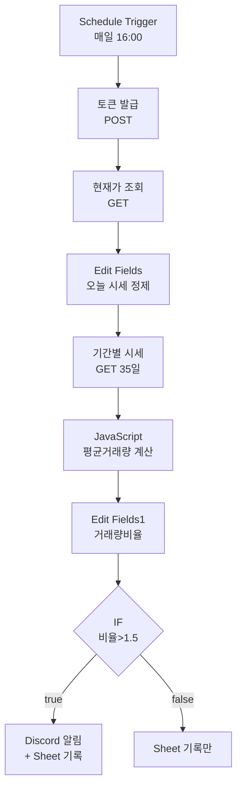
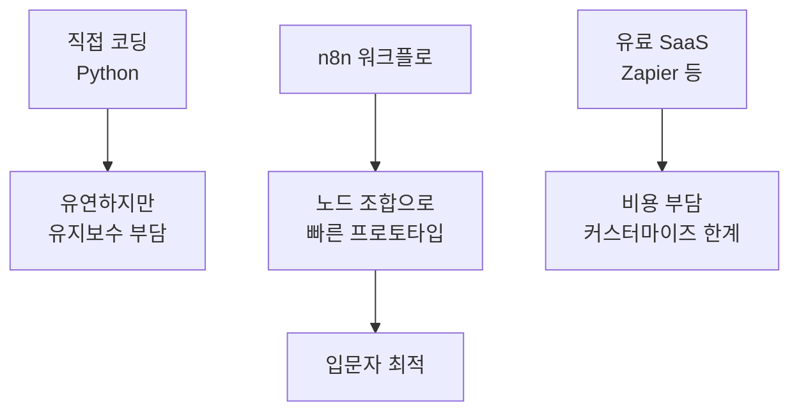
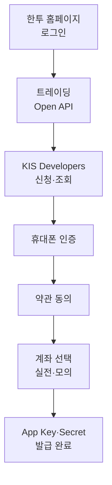
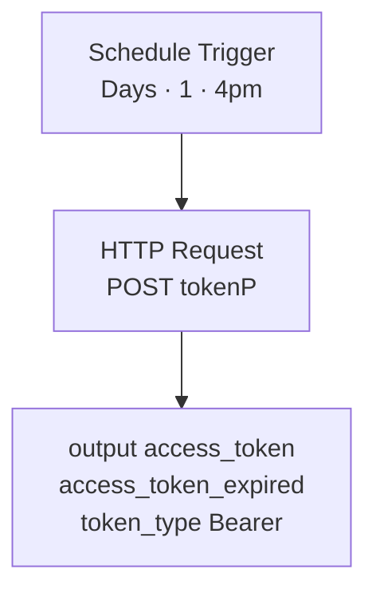
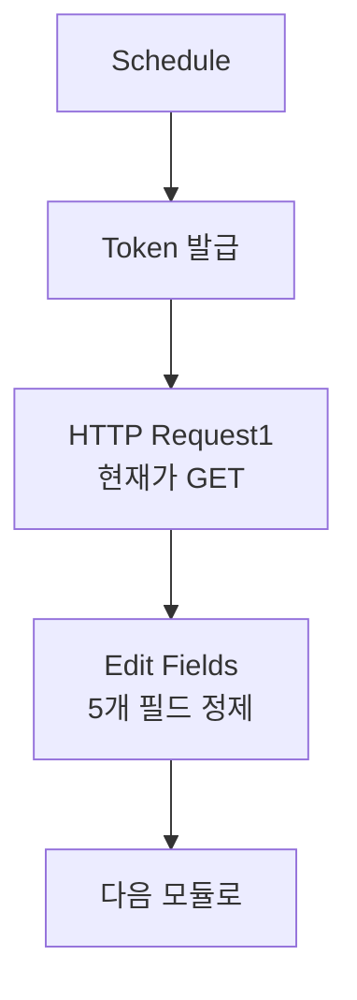
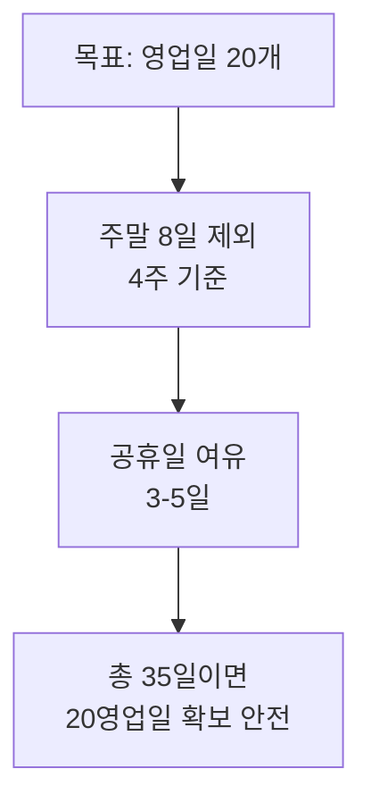
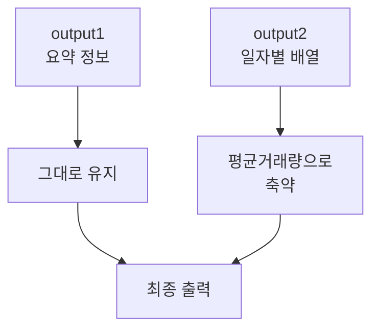
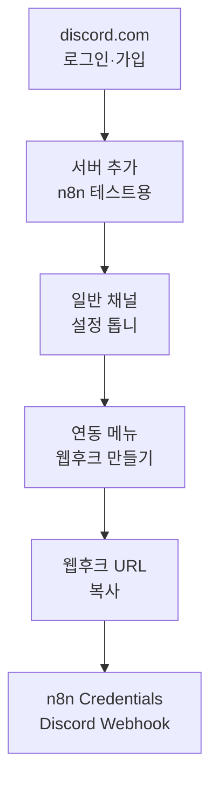
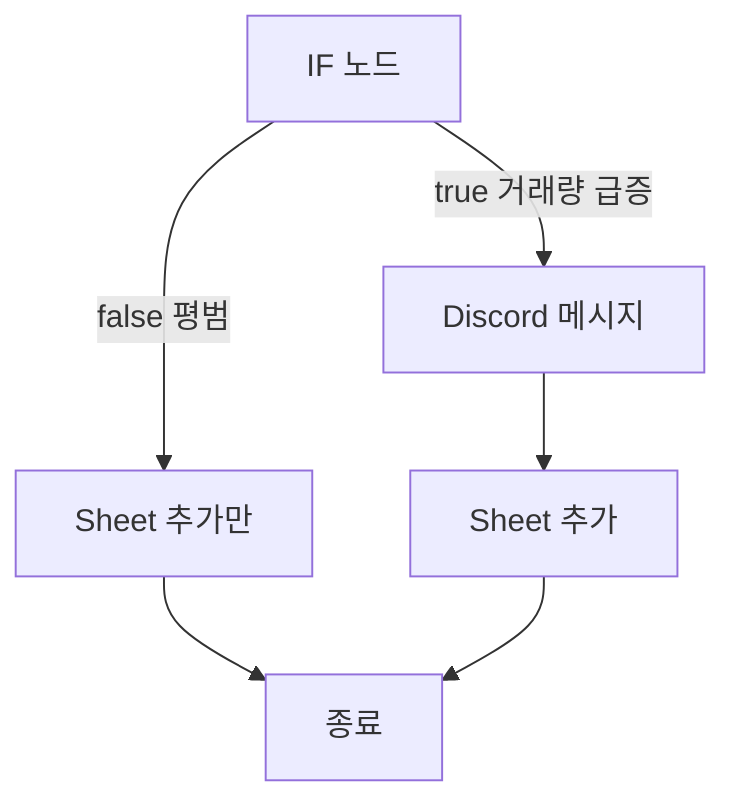


# 한국투자증권 Open API × n8n 주식 모니터링 자동화

> **이 강의는 무엇을 만드나요?**
> 매일 장 마감(오후 4시) 후 자동으로 삼성전자(또는 원하는 종목)의 시세·거래량을 조회하고, **거래량이 평균 대비 1.5배 이상 급증하면** 디스코드로 알림을 보내며, 결과를 구글 시트에 자동 기록하는 시스템을 만듭니다.

---

## 학습 목표

이 과정을 마치면 수강생은 다음을 할 수 있습니다.

1. 한국투자증권 KIS Developers에서 Open API를 신청하고 App Key·Secret을 발급받을 수 있다.
2. n8n 워크플로에서 OAuth 2.0 토큰을 자동으로 발급·갱신할 수 있다.
3. HTTP Request 노드로 시세·기간별 시세 API를 호출하고 응답을 해석할 수 있다.
4. JavaScript 노드와 Edit Fields 노드로 응답 데이터를 가공하여 평균 거래량·거래량 비율 같은 파생 지표를 만들 수 있다.
5. IF 노드로 조건 분기를 만들고, 디스코드 웹훅과 구글 시트 노드로 결과를 외부로 내보낼 수 있다.

---

## 전체 시스템 한눈에 보기



---

## 모듈 구성

| # | 모듈명 | 핵심 산출물 | 소요 시간 |
|---|--------|-------------|-----------|
| 0 | 사전 준비 | 한투증권 계좌, 디스코드 계정, 구글 계정 | 30분 |
| 1 | 한투증권 API 신청과 인증 이해 | App Key·App Secret 확보 | 45분 |
| 2 | OAuth 토큰 자동 발급 워크플로 | Schedule + HTTP(POST) 노드 | 45분 |
| 3 | 주식 현재가 시세 조회 | HTTP(GET) + Edit Fields | 60분 |
| 4 | 기간별 시세 + 평균거래량 계산 | HTTP(GET) + JavaScript | 60분 |
| 5 | 거래량 비율 조건 분기 | Edit Fields + IF | 30분 |
| 6 | 디스코드 알림 + 구글 시트 연동 | Discord Webhook + Google Sheets | 60분 |

---

## 모듈 0 — 사전 준비

### 0.1 무엇을 미리 준비해야 하나요?

이 강의는 **실제로 동작하는 시스템을 만드는 실습** 중심이라, 시작 전에 다음 3가지가 반드시 준비되어 있어야 합니다.

| 준비물 | 용도 | 비고 |
|--------|------|------|
| 한국투자증권 계좌 | API 신청 | 실전·모의 모두 가능 |
| 디스코드 계정 | 알림 수신 | 무료. 서버 1개 새로 만들 예정 |
| 구글 계정 | 데이터 적재 | 구글 시트 사용 |
| n8n 환경 | 워크플로 실행 | Cloud / Self-hosted 모두 가능 |

> 🔀 **실전·모의 모두 지원**
> 본 강의는 두 환경 모두를 지원합니다. 모듈 2·3·4의 핵심 단계에서 **[실전 / 모의] URL을 양쪽 병기**하므로 본인 환경에 맞는 줄만 따라가면 됩니다. 워크플로 구조와 매개변수는 두 환경이 동일합니다.
> - 🟢 **실전**: 만료 걱정 없이 장기 운영 가능, 신분증 인증 필요
> - 🟡 **모의**: 신분증 없이 빠른 시작, 일정 기간 후 재신청 필요

### 0.2 왜 n8n인가?



n8n은 **노드를 연결하는 시각적 자동화 도구**입니다. 코드 없이도 API 호출·조건 분기·메시지 발송을 조합할 수 있어, 금융 데이터 자동화의 첫 걸음으로 적합합니다.

---

## 모듈 1 — 한국투자증권 API 신청과 인증 이해

### 1.1 학습 포인트

- KIS Developers 서비스 신청 절차
- App Key / App Secret의 의미와 보관 원칙
- OAuth 2.0 Client Credentials (2-legged) 방식 이해
- 토큰 유효기간(24시간)과 갱신 주기

### 1.2 신청 절차 흐름



### 1.3 OAuth 2-legged 방식이란?

| 구분 | 2-legged (개인/일반법인) | 3-legged (제휴법인) |
|------|--------------------------|---------------------|
| 인증 단계 | App Key·Secret만으로 토큰 발급 | 최종 사용자 동의 코드 필요 |
| 토큰 유효기간 | 24시간 | Access 3개월 / Refresh 1년 |
| 재발급 | 6시간 이내 동일 토큰 반환 | 갱신 절차 별도 |
| 본 강의 사용 | ✅ | ❌ |

> 💡 **6시간 룰**: 토큰 발급 후 6시간 이내에 다시 요청하면 **같은 토큰**이 반환됩니다. 6시간 지나면 새 토큰으로 갱신됩니다. 매일 1회 발급 워크플로면 충분합니다.

### 1.4 보안 체크리스트

- [ ] App Key·Secret은 **공유 저장소·깃허브에 절대 올리지 않는다**
- [ ] n8n Credentials 또는 환경변수로 관리한다
- [ ] 키가 노출되면 KIS Developers에서 즉시 재발급한다

---

## 모듈 2 — OAuth 토큰 자동 발급 워크플로

### 2.1 학습 포인트

- Schedule Trigger 설정 (매일 16:00 자동 실행)
- HTTP Request 노드의 POST 메서드와 Body 구성
- 응답에서 `access_token` 추출 → 다음 노드에서 참조

### 2.2 워크플로 구조



### 2.3 핵심 매개변수 정리

| 항목 | 값 |
|------|-----|
| Method | POST |
| URL (실전) | `https://openapi.koreainvestment.com:9443/oauth2/tokenP` |
| URL (모의) | `https://openapivts.koreainvestment.com:29443/oauth2/tokenP` |
| Authentication | None |
| Body Content Type | JSON |
| Body fields | grant_type, appkey, appsecret |

### 2.4 Body 필드 값

| Name | Value |
|------|-------|
| grant_type | `client_credentials` |
| appkey | (발급받은 App Key) |
| appsecret | (발급받은 App Secret) |

> ⚠️ **함정 주의**: API 호출 시 토큰 앞에 반드시 `Bearer ` (공백 포함) 를 붙여야 합니다. `Bearer eyJ0eXAi...` 형태로 사용하세요.

---

## 모듈 3 — 주식 현재가 시세 조회

### 3.1 학습 포인트

- KIS API 문서 읽는 법 (Method·URL·TR ID·Header·Body)
- Header에 토큰을 동적으로 끼워 넣는 표현식 `{{ $json.access_token }}`
- 응답 JSON 구조 해석 (`output.stck_prpr` = 현재가)
- Edit Fields 노드로 필요한 필드만 추리기

### 3.2 워크플로 위치



### 3.3 HTTP Request1 매개변수

| 항목 | 값 |
|------|-----|
| Method | GET |
| URL (실전) | `https://openapi.koreainvestment.com:9443/uapi/domestic-stock/v1/quotations/inquire-price` |
| URL (모의) | `https://openapivts.koreainvestment.com:29443/uapi/domestic-stock/v1/quotations/inquire-price` |
| Authentication | None |
| Send Query Parameters | ON · Using Fields Below |
| Send Headers | ON · Using Fields Below |

**Query Parameters**

| Name | Value | 의미 |
|------|-------|------|
| FID_COND_MRKT_DIV_CODE | `J` | KRX(한국거래소) — 일반 종목은 항상 J |
| FID_INPUT_ISCD | `005930` | 종목코드 (삼성전자 예시) |

**Header Parameters**

| Name | Value |
|------|-------|
| content-type | `application/json; charset=utf-8` |
| authorization | `Bearer {{ $json.access_token }}` |
| appkey | (App Key) |
| appsecret | (App Secret) |
| tr_id | `FHKST01010100` (실전·모의 공통) |
| custtype | `P` (개인) |

### 3.4 시장 코드 J·NX·UN 비교

| 코드 | 의미 | 사용 빈도 |
|------|------|-----------|
| J | KRX (한국거래소·코스피/코스닥) | 대부분 사용 |
| NX | NXT (넥스트레이드·ATS) | 일부 종목만 |
| UN | KRX + NXT 통합 | 시세 조회만 가능 |

### 3.5 응답에서 우리가 쓸 필드

| n8n 필드명 | API 응답 키 | 의미 |
|------------|-------------|------|
| 종목코드 | `output.stck_shrn_iscd` | 종목 단축코드 |
| 현재가 | `output.stck_prpr` | 현재가(원) |
| 등락률 | `output.prdy_ctrt` | 전일 대비 등락률(%) |
| 오늘거래량 | `output.acml_vol` | 누적 거래량 |
| 날짜 | `new Date().toISOString().slice(0,10)` | YYYY-MM-DD |

> 💡 종목코드와 날짜는 **String**, 나머지 3개는 **Number** 타입으로 설정해야 다음 단계 계산이 정상 동작합니다.

---

## 모듈 4 — 기간별 시세 + 평균거래량 계산

### 4.1 학습 포인트

- 두 번째 시세 API(`inquire-daily-itemchartprice`) 호출
- 동적 날짜 계산 (오늘 기준 35일 전)
- output1 / output2 구조 이해 (output2는 일자별 배열)
- JavaScript 노드로 최근 20일 평균거래량 산출

### 4.2 왜 35일 전인가?



### 4.3 HTTP Request2 매개변수

| 항목 | 값 |
|------|-----|
| Method | GET |
| URL (실전) | `https://openapi.koreainvestment.com:9443/uapi/domestic-stock/v1/quotations/inquire-daily-itemchartprice` |
| URL (모의) | `https://openapivts.koreainvestment.com:29443/uapi/domestic-stock/v1/quotations/inquire-daily-itemchartprice` |
| tr_id | `FHKST03010100` (실전·모의 공통) |

**Query Parameters (총 6개)**

| Name | Value | 의미 |
|------|-------|------|
| FID_COND_MRKT_DIV_CODE | `J` | 시장 분류 |
| FID_INPUT_ISCD | `005930` | 종목코드 |
| FID_INPUT_DATE_1 | (35일 전 동적 계산) | 시작일자 |
| FID_INPUT_DATE_2 | (오늘 동적 계산) | 종료일자 |
| FID_PERIOD_DIV_CODE | `D` | 일/주/월/년 — D=일봉 |
| FID_ORG_ADJ_PRC | `0` | 0=수정주가, 1=원주가 |

**FID_INPUT_DATE_1 표현식 (n8n)**

```javascript
{{ (() => {
  const d = new Date();
  d.setDate(d.getDate() - 35);
  return d.toISOString().slice(0,10).replaceAll('-', '');
})() }}
```

**FID_INPUT_DATE_2 표현식**

```javascript
{{ new Date().toISOString().slice(0,10).replaceAll('-', '') }}
```

### 4.4 JavaScript 노드 — 평균거래량 계산

```javascript
// 1. output2를 배열로 변환
const rows = Object.values($json.output2 || {});

// 2. 데이터 없으면 null 반환
if (rows.length === 0) {
  return {
    ...$json,
    평균거래량: null,
  };
}

// 3. 최근 20개만 추출
const recent = rows.slice(0, 20);

// 4. 평균 거래량 계산
const avgVolume =
  recent.reduce((sum, item) => sum + Number(item.acml_vol), 0) /
  recent.length;

// 5. 결과 반환
return {
  ...$json,
  평균거래량: Math.round(avgVolume),
};
```

> 💡 Mode는 **Run Once for All Items**로 설정합니다.

### 4.5 산출 결과 확인 포인트



---

## 모듈 5 — 거래량 비율 조건 분기

### 5.1 학습 포인트

- 두 노드의 데이터를 식 안에서 동시에 참조 (`$('Edit Fields').item.json.오늘거래량`)
- 표현식의 노드 이름 의존성 (이름 변경 시 식도 변경 필요)
- IF 노드의 `Numbers > is greater than` 비교

### 5.2 거래량 비율 표현식

```javascript
{{
  $('Edit Fields').item.json['오늘거래량']
  /
  Number($json['평균거래량'])
}}
```

| 좌측 | 우측 | 의미 |
|------|------|------|
| 오늘거래량 | 평균거래량 | 비율 (1.0 = 평균과 같음) |

### 5.3 분기 임계값 가이드

| 임계값 | 의미 | 알림 빈도 |
|--------|------|-----------|
| 1.2배 | 약한 신호 | 자주 발생 |
| 1.5배 | 중간 신호 | 권장 — 본 강의 기본값 |
| 2.0배 | 강한 신호 | 드물게 발생 |
| 3.0배 | 이상 거래 | 매우 드물게 |

### 5.4 IF 노드 설정

| 항목 | 값 |
|------|-----|
| 좌측 (value 1) | `{{ $json['거래량비율'] }}` |
| 비교 | Numbers → is greater than |
| 우측 (value 2) | `1.5` |

---

## 모듈 6 — 디스코드 알림 + 구글 시트 연동

### 6.1 학습 포인트

- 디스코드 서버 생성 → 채널 웹훅 URL 확보
- Webhook 방식의 장점 (OAuth 인증 불필요, URL만으로 연동)
- n8n Credentials에 Discord Webhook 등록
- 구글 시트 헤더 설계와 자동 적재

### 6.2 디스코드 연동 흐름



### 6.3 구글 시트 헤더 설계

| 컬럼 | 의미 | 데이터 타입 |
|------|------|-------------|
| 종목명 | 회사 이름 | 문자열 |
| 종목코드 | 6자리 코드 | 문자열 |
| 현재가 | 종가(원) | 숫자 |
| 오늘거래량 | 누적 거래량 | 숫자 |
| 거래량비율 | 평균 대비 배수 | 숫자 |
| 등락률 | 전일 대비(%) | 숫자 |
| 날짜 | YYYY-MM-DD | 문자열 |

### 6.4 두 갈래 분기 후 처리



---

## 실습 챌린지 — 마지막 과제

수강생이 강의를 완주한 뒤 도전할 수 있는 단계별 과제입니다.

| 난이도 | 과제 | 핵심 학습 |
|--------|------|-----------|
| ⭐ | 종목을 SK하이닉스(`000660`)로 변경 | 종목코드 변경 지점 파악 |
| ⭐⭐ | 임계값을 2.0배로 상향 후 1주일 모니터링 | 임계값 민감도 체험 |
| ⭐⭐ | 종목 3개를 동시에 모니터링 | Loop / Split In Batches 노드 |
| ⭐⭐⭐ | DART 공시 API와 결합해 알림에 최근 공시 포함 | API 다중 결합 |
| ⭐⭐⭐ | 등락률 ±5% 이상도 함께 알림 조건 추가 | IF 노드의 OR/AND |

---

## 자주 발생하는 오류와 해결

| 증상 | 원인 | 해결 |
|------|------|------|
| 401 Unauthorized | 토큰 만료 또는 Bearer 누락 | `Bearer ` 접두사 확인, 토큰 재발급 |
| 401 또는 도메인 오류 | URL과 키의 환경 불일치 (실전 URL + 모의 키 등) | 두 환경의 URL과 키를 같은 환경으로 일치 |
| 평균거래량 = null | output2가 비어있음 | 시작일자가 너무 가까운지 확인 |
| 표현식 에러 | 노드 이름이 바뀜 | `$('노드명')` 안의 이름 동기화 |
| Discord 메시지 미수신 | 웹후크 URL 오타 | Credentials 재등록 |

---

## 참고 자료

- KIS Developers: https://apiportal.koreainvestment.com
- n8n 공식 문서 — HTTP Request 노드, Schedule Trigger, IF 노드
- Discord Developer 문서 — Webhooks
- DART Open API (확장 과제용)

---

## 다음 단계

이 과정을 마친 수강생은 다음 후속 과정으로 확장할 수 있습니다.

1. **다종목 포트폴리오 모니터링** — Loop 노드 + 종목 리스트 시트
2. **알림에 차트 이미지 첨부** — QuickChart 또는 Chart.js 렌더링
3. **이상 신호 분류 자동화** — Claude/GPT API 연동으로 알림에 해석 추가
4. **백테스트 연동** — 누적된 시트 데이터로 거래량 급증 시그널의 사후 수익률 검증


